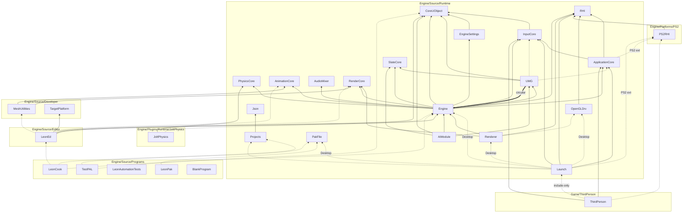

# LeonEngine — architecture

As-built module layout, dependencies and runtime flow. LeonEngine mirrors the **Unreal Engine 4.27**
source layout, module architecture and Epic naming, and is built with CMake through **LeonBuildTool**
(our UnrealBuildTool).

**Also:** [BUILD.md](BUILD.md) (LeonBuildTool reference) · [CODING_STANDARD.md](CODING_STANDARD.md) ·
[UnrealEngine427/](UnrealEngine427/README.md) (UE 4.27 knowledge base, [LeonMapping](UnrealEngine427/LeonMapping.md),
[NextSteps](UnrealEngine427/NextSteps.md)) · [SETUP.md](SETUP.md) · [TOOLS.md](TOOLS.md) · [LEVELS.md](LEVELS.md) ·
[ASSET_FORMATS.md](ASSET_FORMATS.md) · [LIBRARIES.md](LIBRARIES.md) · [TESTING.md](TESTING.md) · [README](../README.md)

---

## 1. Repository layout

```text
LeonEngine-PS2/
├── Engine/
│   ├── Build/                 # BatchFiles (Build, Clean, Rebuild, RunTests, Cook, BuildCookRun, FormatCode, Lint, …),
│   │                          #   Build.version
│   ├── Config/                # BaseEngine.ini, BaseGame.ini, BaseInput.ini, BaseEditor.ini (first config layer)
│   ├── Content/               # engine content: .lasset packages (EngineMaterials, EngineResources, BasicShapes),
│   │                          #   .lmap maps (Maps: Entry, Template_Default, AxisTest)
│   ├── SourceArt/             # source files of the imported engine assets + ImportList.ini (outside Content, as UE)
│   ├── Shaders/               # GLSL (desktop renderer)
│   ├── Source/
│   │   ├── Runtime/           # modules that ship in games
│   │   ├── Developer/         # tool-only modules (import, the cook's target platforms)
│   │   ├── Editor/            # editor modules: LeonEd (factories, commandlets)
│   │   ├── Programs/          # standalone programs + LeonBuildTool
│   │   ├── ThirdParty/        # external modules (<Lib>/<Lib>.Build.cmake)
│   │   └── LeonGame.Target.cmake
│   ├── Platforms/PS2/         # PS2 platform extension (Source, Build, Config, Documentation)
│   └── Plugins/Runtime/JoltPhysics/
├── Game/ThirdPerson/          # the PS2 game project (isolated; .lproj)
├── Game/ShooterGame/          # the Win64 shooter (P17: its own tests target, de_leon; README.md)
├── Docs/
├── Setup.bat / Setup.sh       # pinned third-party downloads
└── GenerateProjectFiles.bat / .sh
```

Every C++ module follows the UE anatomy: `<Module>/<Module>.Build.cmake`, `Public/` (headers other
modules may include), `Classes/` (public gameplay-class headers, UE convention), `Private/` (sources,
private headers, platform subfolders and `Tests/`). A module without those folders is *flat* (UE game
module style) — `Game/ThirdPerson/Source/ThirdPerson` is flat; `Game/ShooterGame/Source/ShooterGame` has
`Public/` and `Private/` (UE ShooterGame's layout).

---

## 2. Layers

| Layer | Folder | Contents | May depend on |
| --- | --- | --- | --- |
| **Runtime** | `Engine/Source/Runtime` | Core, HAL, application, RHI, rendering, gameplay framework, … | Runtime, ThirdParty |
| **Developer** | `Engine/Source/Developer` | `MeshUtilities` (DCC import to mesh data), `TargetPlatform` (the cook's platforms) | Runtime, Developer, ThirdParty |
| **Editor** | `Engine/Source/Editor` | `LeonEd` (factories, reimport, commandlets; UE: UnrealEd): `TYPE Editor`, desktop only, linked by programs and never by a game target (LeonBuildTool rejects it) | Runtime, Developer, Editor, ThirdParty |
| **Programs** | `Engine/Source/Programs` | `LeonCook`, `LeonPak`, `LeonAutomationTests`, `TestPAL`, `BlankProgram`, `LeonBuildTool` (CMake scripts, not a module) | anything |
| **ThirdParty** | `Engine/Source/ThirdParty` | External modules (`TYPE External`): GLFW, Glad, STB, MiniAudio, UFBX, CGLTF, TinyObjLoader | — |
| **Platform extension** | `Engine/Platforms/PS2` | PS2 halves of `Core`, `ApplicationCore`, `Launch` + the `PS2RHI` module; toolchain, Docker image, `PS2Engine.ini` | same as the module it extends |
| **Plugins** | `Engine/Plugins/Runtime/JoltPhysics` | `JoltPhysics` module + its third-party `JoltLib` (Win64 only) | Runtime |
| **Game** | `Game/ThirdPerson`, `Game/ShooterGame` | `ThirdPerson` (PS2) and `ShooterGame` (Win64) primary game modules + their `.Target.cmake` files | Runtime (never the other way) |

Rules:

- **No engine module references the game.** A project under `Game/` is only discovered when a build passes
  `-Project=…/<Project>.lproj`; engine sources never include its headers (the names appear only in usage lines and in
  the batch files that build the projects: `RunTests.bat`, `Lint.bat`, `SmokeTest.bat`).
- **Platform code lives in platform folders only**: `Private/Windows`, `Private/Linux`, `Private/Desktop`
  inside a module, or the extension under `Engine/Platforms/PS2`. LeonBuildTool drops source folders named
  after a platform or group that does not apply (a `Windows/` folder never compiles on PS2), and only
  discovers `Engine/Platforms/<P>/Source` when building for `<P>`.
- **Extension merge**: `Engine/Platforms/PS2/Source/Runtime/Core` is merged into `Engine/Source/Runtime/Core`
  (same relative path); its `Core_PS2.Build.cmake` uses `leon_module_extend(Core …)` to add PS2-only
  dependencies / system libraries. Extension `Public/` headers sit at the root of `Public/` (e.g.
  `PS2PlatformMemory.h`), which is what `COMPILED_PLATFORM_HEADER` expects for extensions.

---

## 3. Build model (summary)

Full reference: [BUILD.md](BUILD.md).

- `leon_module(<Name> …)` in `<Module>.Build.cmake` declares `PUBLIC_DEPENDENCIES`, `PRIVATE_DEPENDENCIES`,
  `CIRCULAR_DEPENDENCIES` (UE `CircularlyReferencedDependentModules`, propagated like public ones),
  `PLATFORMS` allow-list and `_<Platform|Group>` suffixed variants (`PRIVATE_DEPENDENCIES_Desktop`).
- Platforms: **Win64** (groups `Windows Microsoft Desktop`, C++17), **Linux** (`Unix Linux Desktop`, C++17,
  registered but not a verification gate), **PS2** (`PS2 Console`, C++17, extension, built in the pinned
  ps2dev Docker image).
- A module library's C++ standard is the **lowest** standard among the platforms it is allowed on, and the launch
  module compiled into an executable uses the platform's standard. Every platform registers C++17 (like UE 4.27), so
  every module and executable compiles as C++17.
- Linking is always **static** (`IS_MONOLITHIC=1`). For each target, LeonBuildTool resolves the module
  closure from `Core` + the launch module + `EXTRA_MODULE_NAMES` (+ enabled plugin modules), builds every
  module except the launch module as a static library `Module.<Name>`, compiles the **launch module straight
  into the executable** with the target macros (`WITH_ENGINE`, `IS_PROGRAM`, `WITH_DEV_AUTOMATION_TESTS`,
  `LEON_TARGET_NAME`, `LEON_PROJECT_NAME`), and generates `<Target>.ModuleInit.gen.cpp` (see §8).
- Shared module libraries never see target macros; only the launch module does.

### Targets

| Target | File | Type | Platforms | Launch module | Roots / notes |
| --- | --- | --- | --- | --- | --- |
| `LeonGame` | `Engine/Source/LeonGame.Target.cmake` | Game | Win64 | `Launch` | `Engine AIModule`; `WITH_ENGINE=1`; creates `GEngine` and opens a map (`LeonGame [<map>]`, `-map=<map>`) |
| `ThirdPerson` | `Game/ThirdPerson/Source/ThirdPerson.Target.cmake` | Game | PS2 | `Launch` | project module `ThirdPerson`; `COMPILE_AGAINST_ENGINE OFF` → `WITH_ENGINE=0` |
| `ShooterGame` | `Game/ShooterGame/Source/ShooterGame.Target.cmake` | Game | Win64 | `Launch` | project module `ShooterGame` (→ `Engine`, `AIModule`); `WITH_ENGINE=1`; opens `/Game/Maps/de_leon` |
| `ShooterGameTests` | `Game/ShooterGame/Source/ShooterGameTests.Target.cmake` | Program | Win64 | `LeonAutomationTests` | the engine's test runner + `ShooterGame`, `Renderer`, `LeonEd`; `COLLECT_AUTOMATION_TESTS` with `AUTOMATION_TEST_MODULES ShooterGame`: only the project's tests, run with the project's config |
| `LeonCook` | `Engine/Source/Programs/LeonCook/` | Program | Desktop | `LeonCook` | `Engine`, `LeonEd` (→ `TargetPlatform`), no renderer or RHI; `LeonCook [<Project>.lproj] -run=<Commandlet>` makes the `U<Name>Commandlet` class and calls `Main` (UE: `UE4Editor-Cmd`) |
| `LeonPak` | `Engine/Source/Programs/LeonPak/` | Program | Desktop | `LeonPak` | `PakFile`; creates, lists, tests and extracts `.lpak` files (UE: UnrealPak) |
| `LeonAutomationTests` | `Engine/Source/Programs/LeonAutomationTests/` | Program | Desktop | `LeonAutomationTests` | every desktop Runtime / Developer / Editor module except `Launch`, + `JoltPhysics` plugin; `COLLECT_AUTOMATION_TESTS` |
| `TestPAL` | `Engine/Source/Programs/TestPAL/` | Program | all | `TestPAL` | `Core`, `CoreUObject`, `Projects` (→ `Json`), `PakFile`; `COLLECT_AUTOMATION_TESTS`; runs their automation tests (PS2 included) and logs the reflection budget |
| `BlankProgram` | `Engine/Source/Programs/BlankProgram/` | Program | all | `BlankProgram` | starts the module table and prints the platform (CI builds it for PS2) |

Module closures in practice:

- **PS2 `ThirdPerson`**: `Core`, `CoreUObject` (through InputCore, P13), `Launch`, `ThirdPerson`, `InputCore`,
  `ApplicationCore`, `RHI`, `PS2RHI`, `Projects`, `Json`.
- **Win64 `LeonGame`**: everything reachable from `Launch` (desktop private deps `Engine` and `PakFile`) +
  `AIModule` — every desktop Runtime module (`CoreUObject`, `Json`, `Projects` and `PakFile` included), no Developer
  modules; plugins are disabled by default, so `JoltPhysics` is not linked.

---

## 4. Module dependency graph

Built from the `*.Build.cmake` files. Every module depends on **Core** (edges to Core omitted);
third-party modules are listed in the next table.



Solid = `PUBLIC_DEPENDENCIES`, dashed = `PRIVATE_DEPENDENCIES` (label = platform suffix or extension file),
thick = `CIRCULAR_DEPENDENCIES`. `Projects` (→ `Json`) is a private dependency of `Launch`, which loads the
`.lproj` in `PreInit`; every game target therefore links both, on every platform. `LeonAutomationTests` and
`BlankProgram` depend on Core only, `TestPAL`
on Core, CoreUObject and Projects; `LeonAutomationTests` links `CoreUObject` through its target's module list.
`PakFile` (P16) depends on Core only and builds for every platform; the desktop `Launch` links it to mount the paks
before the config loads, and `TestPAL` links it for its tests (the PS2 game does not yet). `TargetPlatform` (Developer)
depends on Core; `LeonEd` links it for the cook. `CoreUObject` depends on Core only; since P12 the gameplay modules are
reflected and depend on it: `Engine` and
`AIModule`, and `UMG` (`UUserWidget`); since P13 also `EngineSettings` (the config classes) and `InputCore` (the
reflected `FKey`), so every game target links it, the PS2 one included. `AnimationCore` is plain data again since P14:
the anim instances moved to Engine with the animation assets. `Launch` links
the desktop RHI (`OpenGLDrv`) because `FEngineLoop::PreInit` starts it (`RHIInit`). A module with a circular dependency on a
reflected one (UMG on Engine) waits for that module's LeonHeaderTool step (`LeonHeaderTool.<Module>` target), since a
circular edge does not order the build.

**Engine and the Renderer (P13, UE's render boundary).** Engine never includes a Renderer header and does not depend
on it: it declares the interfaces in its own headers (`SceneInterface.h`, `PrimitiveSceneProxy.h`,
`LightSceneProxy.h`, `RendererInterface.h`, `SceneView.h`, `CanvasTypes.h`) and reaches the implementation by module
name (`GetRendererModule()`, `FModuleManager::LoadModuleChecked<IRendererModule>("Renderer")`). The Renderer depends on
Engine and implements them; the launch module (and `LeonAutomationTests`) links it. In a target without the Renderer,
worlds get no scene and Engine runs without drawing.

**Include-only dependency on Launch:** the launch module is compiled into the executable, not into a
library, so a module that depends on it (`ThirdPerson` → `Launch`) only receives Launch's public include
paths and `LAUNCH_API`; the symbols (`GEngineLoop`) resolve when the executable links.

### Third-party and system libraries

| Library | Used by (public / private) | Platforms |
| --- | --- | --- |
| GLFW | private: ApplicationCore (`_Desktop`) | Desktop |
| STB | private: Engine (`stb_easy_font`, the canvas font), LeonEd (`stb_image`, the texture factory: the only image decoder) | Desktop |
| Glad | private: OpenGLDrv, Renderer | Desktop |
| MiniAudio | private: AudioMixer | Desktop |
| UFBX | private: MeshUtilities | Desktop |
| TinyObjLoader, CGLTF | private: MeshUtilities | Desktop |
| JoltLib (Jolt 5.3.0) | private: JoltPhysics | Win64 |
| System libs | Core: `psapi ole32` (Windows), `kernel` (PS2); OpenGLDrv: `dxgi` (Windows); ApplicationCore: `pad` (PS2); PS2RHI: `draw math3d packet graph dma kernel` | — |

---

## 5. Modules

| Module | Role | Key types | Platforms |
| --- | --- | --- | --- |
| **Core** | HAL, memory, assertions, templates, containers, strings / names / text, logging, delegates, automation tests, math, platform file layer, archives, paths, config, command line, misc types (GUID, MD5, date / time), module manager, ticker, engine exit flag, stats-overlay state | `FPlatformMemory`, `FPlatformTime`, `FPlatformMath`, `FPlatformMisc`, `FPlatformProcess`, `FPlatformProperties`, `FMemory`, `TArray`, `TMap`, `TSet`, `FString`, `FName`, `FText`, `TDelegate`, `UE_LOG`, `GLog`, `FAutomationTestFramework`, `FMath`, `FVector`, `FRotator`, `FQuat`, `FMatrix`, `FTransform`, `IPlatformFile`, `FPlatformFileManager`, `IFileManager`, `FArchive`, `FMemoryReader`, `FMemoryWriter`, `FPaths`, `FFileHelper`, `FConfigCacheIni` / `GConfig`, `FCommandLine`, `FParse`, `FApp`, `FGuid`, `FMD5`, `FSHA1`, `FDateTime`, `FOutputDeviceFile`, `FModuleManager`, `FTicker`, `FStatsOverlay` | all |
| **CoreUObject** | `UObject` and its reflection: object model, classes / structs / enums / functions, properties, object creation and lookup, the object array, casts, the runtime side of LeonHeaderTool's generated code; garbage collection, weak / strong / soft references, `UPROPERTY(Config)`, `UFUNCTION(Exec)`; packages: `.lasset` / `.lmap` saving and synchronous loading with tagged properties, bulk data and long package names ([README](../Engine/Source/Runtime/CoreUObject/README.md), [ASSET_FORMATS](ASSET_FORMATS.md#packages--lasset--lmap)) | `UObject`, `UClass`, `UScriptStruct`, `UEnum`, `UFunction`, `UPackage`, `FProperty` (+ every property type), `FObjectInitializer`, `NewObject`, `FindObject`, `GUObjectArray`, `TObjectIterator`, `Cast`, `TSubclassOf`, `CollectGarbage`, `FGCObject`, `FReferenceCollector`, `TWeakObjectPtr`, `TStrongObjectPtr`, `FSoftObjectPath`, `TSoftObjectPtr`, `LoadConfig` / `SaveConfig`, `CallFunctionByNameWithArguments`, `UPackage::SavePackage`, `LoadPackage`, `LoadObject`, `FLinkerLoad` / `FLinkerSave`, `FPropertyTag`, `FByteBulkData`, `FPackageName` | all |
| **InputCore** | Keys: the reflected `FKey` (named by an `FName`, config text `Key=SpaceBar`) and their details | `FKey`, `EKeys`, `FKeyDetails`, `FInputCoreModule` | all |
| **EngineSettings** | The project's map, game mode and general settings as config classes | `UGameMapsSettings`, `FGameModeName`, `UGeneralProjectSettings` | all |
| **ApplicationCore** | Platform application, windows, gamepad input | `GenericApplication`, `FGenericWindow`, `IInputInterface`, `FPlatformApplicationMisc`; desktop `FGLFWApplication`, `FGLFWWindow`; PS2 ext `FPS2Application`, `FPS2Window`, `FPS2InputInterface` | all |
| **RHI** | Graphics backend interface + opaque GPU handle ids | `RHIInit` / `RHIExit`, `FDynamicRHI`, `GDynamicRHI`, `FRHIGPUMemoryStats`, `FRHITextureId` … | all |
| **OpenGLDrv** | OpenGL 3.3 RHI device | `FOpenGLDynamicRHI` | Desktop |
| **PS2RHI** | Graphics Synthesizer immediate-mode API (platform extension module) | `FPS2RHI`, `FPS2Texture`, `FPS2Material`, `FPS2ViewTarget`, `FPS2DirectionalLight` | PS2 |
| **Launch** | Entry points and engine loop | `GuardedMain`, `FEngineLoop` (an `IEngineLoop` with the engine), `GEngineLoop`, `FPlatformEngineLoopHooks` | all |
| **Projects** | `.lproj` / `.lplugin` descriptors (UE `.uproject` / `.uplugin` fields), current project, plugin discovery | `FProjectDescriptor`, `FPluginDescriptor`, `FModuleDescriptor`, `FPluginReferenceDescriptor`, `IProjectManager`, `IPluginManager`, `IPlugin` | all |
| **PakFile** | `.lpak` files (P16; UE: PakFile): the format, the reader, the platform file that mounts them in the chain, and the writer LeonPak uses ([ASSET_FORMATS.md](ASSET_FORMATS.md#paks--lpak)) | `FPakInfo`, `FPakEntry`, `FPakIndexEntry`, `FPakFile`, `FPakPlatformFile`, `FPakWriter`, `FPakInputPair`, `LogPakFile` | all |
| **Json** | Native JSON DOM, streaming reader / writer, serializer (UE API, no exceptions) | `FJsonObject`, `FJsonValue`, `TJsonReader`, `TJsonWriter`, `FJsonSerializer` | all |
| **PhysicsCore** | Physics types and backend seam | `IPhysicsBackend`, `EPhysicsBackend`, `FHitResult`, `FBodyInstance`, `EBodyCollisionShape`, `FCollisionQueryParams`, `FCollisionShape`, `FTriangleMeshCollision` | Desktop |
| **AnimationCore** | The plain skeletal data under Engine's animation assets, which the FBX import produces (P14; UE's AnimationCore holds the low-level animation types) | `FSkeletalVertex`, `FReferenceSkeleton`, `FRawAnimSequenceTrack`, `FRawAnimSequence`, `FSkeletalMeshData` | Desktop |
| **AudioMixer** | Audio device (miniaudio): PCM16 samples played from memory, the UI cues | `FAudioDevice`, `FSoundWavePCM`, `EUISound` | Desktop |
| **RenderCore** | CPU-side render data, UE view matrices, the GL clip-space adapter; the tests' legacy data converter | `FMeshData`, `FMeshSection`, `FVertex`, `FFrustum` (over Core's `FBox` / `FPlane`), `FMaterial` (`MaterialShared.h`: the values a material gives the renderer), `EMaterialLightingModel`, `EPixelFormat` (`PixelFormat.h`), `MakeViewMatrix` / `MakeLookAtView` / `MakeReflectMatrix` / `FitLightSpaceMatrix` (`ViewMatrices.h`), `ToGLClipSpace` (`GLClipSpace.h`), `EShaderReloadResult` (`ShaderCore.h`); for the tests only, `FLegacyCoordinateConversion` (`Public/Tests`) | Desktop |
| **Renderer** | The renderer module: the scene (`FScene`), the forward scene renderer, the canvas and line passes, the GPU copies of the assets. Only its module interface is public (Engine's `IRendererModule`) | `FRendererModule`, `FScene`, `FSceneRenderer`, `FRenderResourceCache`, `FCanvasRenderer`, `FLineBatchRenderer`, `FShader`, `FShadowMap`, `FGPUPassTimer`, `LogRenderer` | Desktop |
| **SlateCore** | Text layout primitives | `ETextJustify`, HUD font metrics | Desktop |
| **UMG** | Widgets (UObjects since P12) | `UUserWidget`, `UButton`, `UTextBlock`, `UImage`, `UProgressBar`, `UVerticalBox`, `UMenuListWidget`, `UInteractionPromptWidget`, `FPaintContext` | Desktop |
| **Engine** | The engine object and maps (`.lmap`, P15), gameplay framework as UObjects (P12), world, levels as actors (P13), input, the viewport client and the console (P13), physics scene, the asset classes and their import data (P14), the render interfaces (P13) | `UEngine` / `GEngine`, `UGameEngine`, `IEngineLoop`, `FURL`, `UGameViewportClient`, `FViewport`, `UPlayer`, `ULocalPlayer`, `UGameInstance` / `FWorldContext`, `UWorld`, `ULevel`, `FActorSpawnParameters`, `AActor`, `AInfo`, `UActorComponent`, `USceneComponent`, `UPrimitiveComponent`, `UShapeComponent`, `UCapsuleComponent`, `UBoxComponent`, `USphereComponent`, `UMeshComponent`, `UStaticMeshComponent`, `USkeletalMeshComponent`, `UCameraComponent`, `USpringArmComponent`, `UMovementComponent`, `UPawnMovementComponent`, `UCharacterMovementComponent`, `APawn`, `ACharacter`, `AController`, `APlayerController`, `AGameModeBase`, `AGameMode` (`MatchState`), `AGameStateBase`, `AGameState`, `APlayerState`, `AHUD`, `APlayerCameraManager`, `ADefaultPawn`, `UFloatingPawnMovement`, `URotatingMovementComponent`, `UBobbingMovementComponent`, `UOrbitMovementComponent`, `UInputSettings`, `UPlayerInput`, `UInputComponent`, `UGameplayStatics`, `FPhysScene`, `UNavigationSystem`; `AStaticMeshActor`, `APlayerStart`, `ATargetPoint`, `AVolume`, `ATriggerVolume`, `ABlockingVolume`, `APainCausingVolume`, `ALight`, `ADirectionalLight`, `APointLight`, `ULightComponent` (+ base, local, directional, point), `AWorldSettings`, `ACameraActor`, `ANavigationWaypoint`, `UInteractableComponent`; `UTexture` / `UTexture2D`, `UStaticMesh` (`FStaticMeshLODResources`, `FStaticMaterial`), `UBodySetup` (`FKAggregateGeom`, `FKBoxElem`, `ECollisionTraceFlag`), `UMaterialInterface` / `UMaterial` (`EMaterialShadingModel`), `USkeleton`, `USkeletalMeshSocket`, `USkeletalMesh`, `UAnimationAsset`, `UAnimSequenceBase`, `UAnimSequence`, `UBlendSpaceBase`, `UBlendSpace1D`, `UAnimInstance`, `UCharacterAnimInstance`, `USoundBase` / `USoundWave`, `UDataAsset`, `UCommandlet`, `UAssetImportData` (`FAssetImportInfo`); `FDebugDraw`, `FDebugOverlay`; `FSceneInterface`, `FPrimitiveSceneProxy`, `FLightSceneProxy`, `IRendererModule`, `FSceneViewFamily`, `FSceneView`, `FCanvas`; `LogEngine`, `LogLevel`, `LogPath`, `LogPhysics`, `LogSpawn`, `LogWorld` (`EngineLogs.h`) | Desktop |
| **AIModule** | AI controller (a UObject actor) and behavior trees | `AAIController`, `UBehaviorTree`, `UBTComposite_Sequence`, `UBTComposite_Selector`, `UBTDecorator_Bool`, `UBTTask_Action`, `UBlackboardComponent`, `FAIChaseBehavior` | Desktop |
| **MeshUtilities** | Static mesh import to mesh data, glTF scenes, skeletal FBX import (Developer) | `FStaticMeshBuilder`, `LoadObj`, `LoadStaticMeshFromFbx`, `LoadStaticMeshFromGltf`, `LoadGltfScene` (`FGltfScene`), `LoadSkeletalMeshFromFbx`, `LoadAnimSequenceFromFbx`, `FImportCoordinateConversion` | Desktop |
| **TargetPlatform** | The platforms the cook targets (Developer, P16; UE: TargetPlatform): Win64 (identity) and PS2 (a stub with the Win64 formats) | `ITargetPlatform`, `ITargetPlatformManagerModule`, `GetTargetPlatformManager` / `GetTargetPlatformManagerRef` | Desktop |
| **LeonEd** | The editor module (Editor; UE: UnrealEd): asset factories, the map importer, reimport, the commandlets LeonCook runs (the cook by the book, P16) | `UFactory`, `UTextureFactory`, `UFbxFactory`, `UGLTFImportFactory`, `UGLTFMapFactory`, `UMapImportSettings`, `USoundFactory`, `UMaterialFactoryNew`, `FReimportHandler`, `FReimportManager`, `UImportAssetsCommandlet`, `UResavePackagesCommandlet`, `UValidateAssetsCommandlet`, `UCookCommandlet`, `FAssetImportUtils`, `LogLeonEd` | Desktop |
| **JoltPhysics** (plugin) | Jolt rigid-body backend | `CreateJoltPhysicsBackend` | Win64 |
| **ThirdPerson** (game) | PS2 third-person game | `FThirdPersonModule`, `FThirdPersonGameMode`, `FThirdPersonCharacter`, `FThirdPersonCameraBoom`, `FThirdPersonLevel` | PS2 (target) |

---

## 6. Core: HAL and foundations

UE pattern: a generic implementation, a per-platform subclass, and a `HAL/` header that picks the current
platform through `COMPILED_PLATFORM_HEADER`.

```text
Core/Public/GenericPlatform/GenericPlatformMemory.h   struct FGenericPlatformMemory
Core/Public/Windows/WindowsPlatformMemory.h           struct FWindowsPlatformMemory : FGenericPlatformMemory
                                                      typedef FWindowsPlatformMemory FPlatformMemory;
Core/Public/Linux/LinuxPlatformMemory.h               (same for Linux)
Platforms/PS2/Source/Runtime/Core/Public/PS2PlatformMemory.h   (PS2 extension)
Core/Public/HAL/PlatformMemory.h                      #include COMPILED_PLATFORM_HEADER(PlatformMemory.h)
```

- LeonBuildTool defines `PLATFORM_<NAME>=1`, `LBT_COMPILED_PLATFORM=<HeaderName>` (UE `UBT_COMPILED_PLATFORM`)
  and `PLATFORM_IS_EXTENSION`. `HAL/PreprocessorHelpers.h` turns `COMPILED_PLATFORM_HEADER(PlatformMemory.h)`
  into `"Windows/WindowsPlatformMemory.h"` in-module, or `"PS2PlatformMemory.h"` for an extension.
- `HAL/Platform.h` defaults every `PLATFORM_*` macro to 0, includes the platform's `Platform.h`
  (`FPlatformTypes`, `PLATFORM_DESKTOP`, `PLATFORM_64BITS`, `FORCEINLINE`) and defines the global fixed-width
  types (`int32`, `uint64`, `SIZE_T`, `PTRINT`, …), `TCHAR` / `TEXT`, `LIKELY` / `UNLIKELY`, `PLATFORM_BREAK` and
  `LEON_PRINTF_FORMAT`. The EE is ILP32 (`PS2Platform.h`). **`TCHAR` is UTF-8 `char` on every platform**
  (`TEXT(x)` is `x`); `WIDECHAR` exists only for the Windows HAL.
- HAL structs: `FPlatformMemory::GetStats()` → `FPlatformMemoryStats`; `FPlatformTime::Cycles64()`,
  `GetSecondsPerCycle64()`, `CyclesToMicroseconds()` (integer, for the EE), `Seconds()`;
  `FPlatformMath::Sin256` / `Cos256` (1/256-turn angles, PS2 uses a table) plus integer / bit helpers
  (`CountLeadingZeros`, `FloorLog2`, `RoundUpToPowerOfTwo`, …); `FPlatformMisc` (`LowLevelOutputDebugString`,
  `LocalPrint`, `IsDebuggerPresent`, `RequestExit` — a forced exit halts the EE on PS2); `FPlatformAtomics`
  (Windows intrinsics, Linux `__atomic`, PS2 the non-atomic generic version: Leon runs one EE thread);
  `FPlatformProperties::PlatformName()` and the `NamePool*` limits.
- `CoreTypes.h` → `HAL/Platform.h`, `Misc/Build.h` (`UE_BUILD_*` from `LEON_BUILD_<CONFIG>`, `DO_CHECK`,
  `DO_GUARD_SLOW`, `DO_ENSURE`, `NO_LOGGING` = Shipping), `Misc/CoreMiscDefines.h`. `CoreMinimal.h` includes the
  whole Core set below.
- Other Core services: `FTicker::GetCoreTicker()` (`FTickerDelegate`s with an optional delay, `FDelegateHandle`;
  return `false` to unregister), `IsEngineExitRequested()` / `RequestEngineExit()` (`CoreGlobals.h`), `FStatsOverlay`
  (engine debug overlay state; the platform draws it).

### Core foundations (UE 4.27 API)

| Area | Headers | Notes |
| --- | --- | --- |
| Memory | `HAL/UnrealMemory.h`, `HAL/MallocAnsi.h` | `FMemory` over `GMalloc` = `FMallocAnsi`, which tracks current / peak bytes (`FMemory::GetUsage()`); PS2 / Linux ask `malloc_usable_size` (no per-block overhead), Windows keeps a small header |
| Assertions | `Misc/AssertionMacros.h` | `check`, `checkf`, `verify`, `checkNoEntry`, `checkSlow`, … ; `ensure` / `ensureMsgf` / `ensureAlways` report once per call site through `GLog` |
| Templates / Algo | `Templates/*`, `Misc/Optional.h`, `Misc/EnumClassFlags.h`, `Algo/*` | `MoveTemp`, `TTuple` / `TPair`, `TUniquePtr`, `TSharedPtr` / `TSharedRef` / `TWeakPtr` (`ESPMode::NotThreadSafe` default), `TFunction` / `TUniqueFunction` / `TFunctionRef`, `Sort` / `StableSort`, `TOptional`, `ENUM_CLASS_FLAGS`, `Algo::BinarySearch`, heap |
| Containers | `Containers/*` | allocator policies, `TArray`, `TArrayView`, `TBitArray`, `TSparseArray`, `TSet`, `TMap` / `TMultiMap`; elements are relocated with `memmove` (UE rule: no self-pointers) |
| Strings | `Containers/UnrealString.h`, `StringConv.h`, `Misc/CString.h`, `Misc/Char.h`, `Misc/Crc.h` | `FString` (`==` / `<` / `GetTypeHash` ignore case, like UE), `FCString`, `FChar`, `FCrc`; `TCHAR_TO_UTF8` & co. are identities |
| Names / text | `UObject/NameTypes.h`, `Internationalization/Text.h` | `FName` (8 bytes, case-insensitive, numeric suffix, global pool sized by `FPlatformProperties::NamePool*`; exhausting it is fatal); minimal `FText` (no localization: `LOCTEXT` keeps the source text) |
| Logging | `Logging/LogMacros.h`, `LogCategory.h`, `Misc/OutputDevice*.h` | `UE_LOG` / `UE_CLOG`, categories (`LogTemp`, `LogCore`, `LogInit`, …); `GLog` redirects to stdout (EE console / PCSX2 log on PS2) and, on Windows, the debugger. Line format `Category: Verbosity: Message` (verbosity omitted for `Log`). Desktop also writes `<Project>/Saved/Logs/<Project>.log` (`FOutputDeviceFile`, flushed per line, the previous run kept as `<Project>-backup-<date>.log`); verbosity comes from `[Core.Log]` and `-LogCmds="LogFoo Verbose, …"` (`FLogSuppressionInterface`) |
| Delegates | `Delegates/Delegate.h`, `IDelegateInstance.h` | `TDelegate`, `TMulticastDelegate` (`Broadcast` latest-first like UE4, removal during broadcast is safe, `Add` drops dead bindings), `DECLARE_DELEGATE*` / `DECLARE_MULTICAST_DELEGATE*` / `DECLARE_EVENT*`; static, lambda, raw, SP and `UObject` bindings (`BindUObject` / `AddUObject` hold a `TWeakObjectPtr`, named through `UObject/WeakObjectPtrTemplatesFwd.h`); no dynamic delegates |
| Console commands | `Misc/Exec.h`, `Misc/CoreMisc.h` | `FExec` (`Exec(UWorld*, Cmd, Ar)`), `FSelfRegisteringExec` / `FStaticSelfRegisteringExec` (`StaticExec` offers a command to every live handler); UObjects answer through `UObject::ProcessConsoleExec` |
| Automation tests | `Misc/AutomationTest.h` | `IMPLEMENT_SIMPLE_AUTOMATION_TEST`, `FAutomationTestBase`, `FAutomationTestFramework::RunTests(Filter, ExcludeFlags)`; an unexpected error logged during a test fails it |
| Math | `Math/UnrealMath.h` (from `CoreMinimal.h`) | UE 4.27's float math: `FMath` (constants, interpolation, `VRand`, line / box / plane helpers), `FVector`, `FVector2D`, `FVector4`, `FIntPoint`, `FIntVector`, `FRotator`, `FQuat`, `FMatrix` (row vectors, `V * M`) and the derived matrices (`FRotationMatrix`, `FTranslationMatrix`, `FScaleMatrix`, `FPerspectiveMatrix`, `FLookAtMatrix`, …), `FPlane`, `FBox`, `FBox2D`, `FSphere`, `FBoxSphereBounds`, `FTransform` (scalar), `FColor` / `FLinearColor`, `FRandomStream`. No `double` math; PS2 builds reject implicit float to double promotion |
| Files | `GenericPlatform/GenericPlatformFile.h`, `HAL/PlatformFilemanager.h`, `HAL/FileManager.h`, `Misc/FileHelper.h` | `IPlatformFile` (UE's layered chain; `FPlatformFileManager::Get().GetPlatformFile()` is the topmost, `FindPlatformFile(Name)` finds one), backends Windows (Win32), Linux (POSIX) and PS2 (read-only newlib POSIX on `host:`), and PakFile's `FPakPlatformFile` on top of them when a build has paks (§13); `IFileManager::Get()` opens buffered `FArchive` readers / writers and walks directories; `FFileHelper::LoadFileToString` / `LoadFileToArray` / `SaveStringToFile` (writes a temporary file, then moves it) |
| Archives | `Serialization/Archive.h`, `MemoryReader.h`, `MemoryWriter.h`, `BufferArchive.h`, `UObject/ObjectVersion.h`, `Misc/EngineVersion.h` | `FArchive` with `<<` for the scalars, `FString` (UTF-8, length + 1), `FName` / `FText` (as strings), `TArray` / `TSet` / `TMap` and the math types, and virtual `UObject*` / `GetLinker()` hooks that do nothing in a plain archive (CoreUObject's package linkers write `FName` as a name table index and `UObject*` as an `FPackageIndex`); `UEVer()` is the package format version (`ELeonPackageVersion`); `FMemoryReader`, `FMemoryWriter`, `FBufferArchive`; `FEngineVersion` |
| Paths | `Misc/Paths.h` | UE's `FPaths` over `FString` (`EngineDir`, `ProjectDir`, `ProjectContentDir`, `ProjectSavedDir`, `ProjectLogDir`, `Combine`, `/` operator, `NormalizeFilename`, `ConvertRelativePathToFull`, `MakePathRelativeTo`, …). Desktop directories are absolute and come from the generated module-init globals (`GLeonEngineDirFromBaseDir`, `GLeonProjectDirFromBaseDir`), except in a staged build (`IsStaged`, P16: UE's `../../../Engine/` and the project folder above `Binaries/`); PS2 uses the staged layout under the ELF folder (`<Base>/Engine/`, `<Base>/<Project>/`). (The legacy `ResolveLegacyContentPath` went in P15: the renderer takes its shaders from `EngineDir()` / `Shaders`.) |
| Command line | `Misc/CommandLine.h`, `Misc/Parse.h`, `Misc/App.h`, `HAL/PlatformProcess.h` | `FCommandLine::Set` / `Get` (built from `argv` in every `main`), `FParse::Param` / `Value` / `Token` / `Command` with UE's rules (`-` or `/` switches, quoted values, word boundaries), `FApp` (project name, build configuration), `FPlatformProcess::BaseDir()` (from `argv[0]` on PS2) |
| Config | `Misc/ConfigCacheIni.h` | `FConfigCacheIni` / `GConfig` with `GEngineIni`, `GGameIni`, `GInputIni`, `GEditorIni`. Layers (D8): `Engine/Config/Base.ini` → `Base<T>.ini` → `Engine/Platforms/<P>/Config/<P><T>.ini` → `<Project>/Config/Default<T>.ini` → `<Project>/Platforms/<P>/Config/<P><T>.ini` → `<Project>/Saved/Config/<Plat>/<T>.ini` (desktop only; `Flush` writes the user changes there). `+ - . !` array operators, quoted values, `-ini:Engine:[Section]:Key=Value` overrides |
| Misc types | `Misc/Guid.h`, `Misc/SecureHash.h`, `Misc/Crc.h`, `Misc/DateTime.h`, `Misc/Timespan.h` | `FGuid` (`NewGuid`, `NewDeterministicGuid` from MD5), `FMD5` / `FMD5Hash`, `FSHA1` / `FSHAHash` (the paks' hashes), `FCrc`, `FDateTime` / `FTimespan` (integer ticks, no double) |

### Coordinates

Since P7 the desktop world uses UE 4.27's space, the same one the math types assume (`FVector::ForwardVector`,
`RightVector` and `UpVector` are the world axes):

| Item | Convention |
| --- | --- |
| Axes | X forward, Y right, Z up; **left-handed** |
| Units | 1 unit = 1 cm (UE's `WorldToMeters` = 100); speeds in cm/s, masses in kg, angles in degrees |
| Rotations | `FRotator` (Pitch about Y, positive looks up; Yaw about Z, positive turns from +X toward +Y, clockwise seen from above; Roll about X), `FQuat`, `FTransform` |
| Matrices | `FMatrix` row vectors (`V * M`); `A * B` applies A first, so an MVP is `Model * View * Projection` |
| View space | x right, y up, z forward, left-handed (UE's `FViewMatrices`): `MakeViewMatrix(Origin, FRotator)` / `MakeLookAtView` in `RenderCore/Public/ViewMatrices.h` |
| Projection | `FPerspectiveMatrix` with the vertical field of view, or `FOrthoMatrix`; depth z / w in [0, 1], 0 at the near plane; no reversed Z |
| GL clip space | `ToGLClipSpace` (`RenderCore/Public/GLClipSpace.h`) keeps x, y, w and writes z_gl = 2z − w, applied last. Frustum planes, the shadow lookup, SSAO depth and the debug light frustum read the GL result |
| Winding | triangles keep their index order through every conversion; front faces are counter-clockwise on screen (`glFrontFace(GL_CCW)`, set explicitly) |

**Converters.** Every basis change below swaps or flips one axis (determinant −1): the physical scene is kept (what was
on the right stays on the right, triangles keep their winding on screen), and what flips is whatever is built with a
handedness: cross products (the right vector is `Up ^ Forward`), the tangent's bitangent sign and the sense of
rotations.

| Converter | From → to | Allowed in |
| --- | --- | --- |
| `FLegacyCoordinateConversion` (`RenderCore/Public/Tests/LegacyCoordinateConversion.h`, test only since P15) | legacy data (Y up, right-handed, metres, XYZ Euler degrees) ↔ world: positions (X, Z, Y) × 100, directions (X, Z, Y), rotations (−X, −Z, −Y, W), tangents (X, Z, Y, −W), scale (X, Z, Y) | the tests (`Public/Tests`, `Private/Tests`: the golden tables recorded before P7); G4 rejects it anywhere else |
| `FImportCoordinateConversion` (`MeshUtilities/Public/ImportCoordinateConversion.h`) | imported files → world: `RightHandedYUp` (OBJ, glTF, FBX without axes) (X, Z, Y) × 100; `RightHandedZUp` (FBX after ufbx resolves the file axes) (X, −Y, Z) × the file unit in cm (UE's `FFbxDataConverter`) | the importers' last step, after normals and winding are final; matrices convert as B⁻¹ M B (a glTF map's node transforms too) |
| `ToGLClipSpace` | UE clip space → GL clip space | the GL renderer, after the projection |
| Jolt boundary (`JoltPhysicsBackend.cpp`) | world ↔ Jolt (right-handed, Y up, metres): Y and Z swap, lengths × 0.01; Jolt-side constants stay in metres | the JoltPhysics plugin |
| Audio boundary (`AudioDevice.cpp`) | world ↔ miniaudio (right-handed, Y up, metres): Y and Z swap, positions × 0.01 | AudioMixer |

**Angle map** (legacy values → world), which the `.llev` level reader applied until P15 and the golden tests still use:

| Legacy | World |
| --- | --- |
| Actor yaw ψ (0 = legacy +Z, positive toward +X) | `FRotator(0, 90 − ψ, 0)`; legacy content meshes face +Y, so a character's mesh sits at `RelativeRotation.Yaw = LegacyContentYaw` (−90) |
| Orbit camera (yaw Y, pitch P; eye at `Target + Distance * (cos P cos Y, sin P, cos P sin Y)`) | view rotation `FRotator(−P, Y + 180, 0)`; eye = `Target − Rotation.Vector() * Distance` |
| Free-look camera (yaw Y, pitch P) | view rotation `FRotator(P, Y, 0)` |
| Directional light (pitch P, yaw Y) | `FRotator(−P, 90 − Y, 0)`; the light shines along its forward axis |
| Spin rate (degrees / s about legacy Y) | negated (rotations turn the other way) |

Nothing on disk is in legacy space since P15: the `.lasset` and `.lmap` packages hold world-space data
([ASSET_FORMATS.md](ASSET_FORMATS.md)), and the legacy levels were migrated to maps ([LEVELS.md](LEVELS.md)). The PS2 ThirdPerson game does not use the gameplay framework and keeps its
own Y-up frame (§9). The deliberate differences from UE (vertical field of view, no reversed Z, the GL clip adapter,
the capsule on the feet, the Jolt boundary, legacy content facing +Y, the doubled mouse look, the spring arm's socket
offset) are listed in [LeonMapping — Deviations](UnrealEngine427/LeonMapping.md#deviations-from-ue-427-intentional).

---

## 7. ApplicationCore and RHI

### ApplicationCore

| Abstraction | Desktop (`Private/Desktop`, GLFW) | PS2 (extension) |
| --- | --- | --- |
| `FPlatformApplicationMisc::CreateApplication()` | `FWindowsPlatformApplicationMisc` / `FLinuxPlatformApplicationMisc` | `FPS2PlatformApplicationMisc` |
| `GenericApplication` (`MakeWindow` returning `TSharedRef<FGenericWindow>`, `PollGameDeviceState`, `GetInputInterface`) | `FGLFWApplication` | `FPS2Application` |
| `FGenericWindow` (`Create`, `PollEvents`, `SwapBuffers`, sizes, `GetCursorPos` as `FVector2D`, keys, the `OnMouseWheel` delegate) | `FGLFWWindow` | `FPS2Window` (GS display; `SwapBuffers` waits for vsync) |
| `IInputInterface` (`IsGamepadConnected`, `IsGamepadKeyDown(EKeys)`, `GetGamepadAnalog(EKeys)`) | — | `FPS2InputInterface` (DualShock, libpad port 0; UE homologue `XInputInterface`) |

The launch module owns the graphics device (P13, UE's `RHIInit`): `FEngineLoop::PreInit` creates the main window,
then `RHIInit(MainWindow->GetRHIProcAddressLoader())` calls `PlatformCreateDynamicRHI()`, loads it on the window's
context and publishes it in `GDynamicRHI`, and `BindRHIViewport` sets the viewport to the window; `FEngineLoop::Exit`
calls `RHIExit` before the window goes. The desktop window depends on no RHI module; the PS2 window still draws through
`PS2RHI` (`InitDisplay`, `WaitVSync`; `ApplicationCore_PS2.Build.cmake`).

### RHI

- `FDynamicRHI` (`RHI/Public/DynamicRHI.h`): `Init(ProcAddressLoader)`, `SetViewport`, `GetGPUMemoryStats`,
  `GetName`, `GetAPIVersionString`. `GDynamicRHI` is the active instance; `PlatformCreateDynamicRHI()` is
  implemented by the platform RHI module and returns an owned pointer (`RHIInit` keeps it until `RHIExit`). RHI
  code logs through `LogRHI`.
- `RHIHandles.h`: opaque GPU ids (`FRHITextureId`, `FRHIFramebufferId`, `FRHIBufferId`, …, `InvalidTexture`)
  used in public Renderer headers so they do not expose GL types.
- **OpenGLDrv**: `FOpenGLDynamicRHI` (Glad loader, GPU memory stats per platform under `Private/Windows` and
  `Private/Linux`).
- **PS2RHI**: implements `PlatformCreateDynamicRHI()` and exposes the **static** `FPS2RHI` API used directly
  by PS2 code. Frame contract: `InitDisplay` (done by `FPS2Window`) → `SetViewTarget` /
  `SetDirectionalLight` / `SetAmbientLightColor` → `ClearColor` → `BindMaterial` → `DrawBox` /
  `DrawCookedMesh` / `DrawUnlit*` → `DrawDebugText` → `WaitVSync` (`FPS2Window::SwapBuffers`). Internals
  (`PS2GSContext`, `PS2SceneState`, `PS2Draw3D`, `PS2DrawPrimitives`, `PS2Texture`, `PS2DebugText`) live in
  `Private/`; the private helper namespace is `Leon::PS2`.

---

## 8. Module startup

- Each module registers itself with `IMPLEMENT_MODULE(<Impl>, <Module>)` (usually in
  `Private/<Module>Module.cpp`), which defines `extern "C" IModuleInterface* InitializeModule_<Module>()`.
  `FDefaultModuleImpl` covers modules without startup logic; game modules use
  `IMPLEMENT_PRIMARY_GAME_MODULE` / `IMPLEMENT_GAME_MODULE`.
- LeonBuildTool writes `<Target>.ModuleInit.gen.cpp`. It holds:
  - the table `GetStaticallyLinkedModules()`: every Runtime / Developer / Editor module of the closure in **dependency
    order**, each with its `RegisterReflection` function (LeonHeaderTool's `RegisterReflection_<Module>`, or
    `nullptr` for a module without reflected types);
  - `GPrimaryGameModuleName`;
  - the directory globals `FPaths` starts from on desktop (`GLeonEngineDirFromBaseDir`,
    `GLeonProjectDirFromBaseDir`, `GLeonProjectName`).

  A module in the table without `IMPLEMENT_MODULE` fails to link.
- `FModuleManager::Get().StartupStaticallyLinkedModules()` creates and starts them in order;
  `ShutdownModules()` shuts them down in reverse. For each module it calls `InitializeModule`, then its
  `RegisterReflection` (records the module's reflected types), then `OnProcessLoadedObjectsCallback`, then
  `StartupModule`. CoreUObject binds the callback to `ProcessNewlyLoadedUObjects` in its own `StartupModule`, after
  `UObjectBaseInit`, so every later module's packages, enums, structs, classes and class default objects exist before
  its `StartupModule` runs (UE's per-module `ProcessNewlyLoadedUObjects`). Targets without CoreUObject leave the
  callback null. Programs call these directly (`BlankProgram`,
  `LeonAutomationTests`, `TestPAL`); games get them from `FEngineLoop`.
- Example: `JoltPhysics` registers its backend factory in `StartupModule`; `ThirdPerson` creates its game mode
  and registers an `FTickerDelegate::CreateLambda` with `FTicker` in `StartupModule` (keeping the `FDelegateHandle`).

---

## 9. Launch and the engine loop

`Launch<Platform>.cpp` (`Private/Windows`, `Private/Linux`, PS2 extension `LaunchPS2.cpp`) defines `main`,
which calls `GuardedMain`:

```text
GuardedMain: GEngineLoop.PreInit → (exit if requested) → Init → while !IsEngineExitRequested(): Tick → Exit
```

`WITH_ENGINE` is set per target (`COMPILE_AGAINST_ENGINE`) and reaches only the launch module.

### `WITH_ENGINE=1` — desktop (`LeonGame`)

- `PreInit` (every platform, UE's order): `FPlatformProcess::SetArgV0` + `FCommandLine::Set` → the project
  (`-project=<.lproj>`, a first argument ending in `.lproj`, the target's own `LEON_PROJECT_NAME`, or a staged build's
  folder) → the platform file chain (desktop, UE's `LaunchCheckForFileOverride`: `FPakPlatformFile` goes on top and
  mounts the paks when the build has some, always in Shipping, §13) → `FConfigCacheIni::InitializeConfigSystem()` → log file (desktop) and `[Core.Log]` / `-LogCmds` verbosity →
  `IProjectManager::LoadProjectFile` → the platform application, the main window
  (`[/Script/Engine.GameViewportClient] DefaultResolutionX/Y`, 1280 × 720) and the RHI on its context (`RHIInit`; none
  with `-nullrhi`, when `FApp::CanEverRender()` is false) → the statically linked modules.
- `Init` (UE's `FEngineLoop::Init`): reads Leon's capture switches (`-Screenshot=<file.bmp>`, `-ExitAfterFrames=N`,
  `-tick=<Hz>`; a capture is an unattended run, `FApp::IsUnattended`, so the viewport client ignores the OS input and
  the mouse cannot move the view), creates `GEngine` of the class `[/Script/Engine.Engine] GameEngine=` names (`UGameEngine`, in the
  root set), queues `-ExecCmds="Cmd1;Cmd2"` (`;` or `,` separate them) in `GEngine->DeferredCommands`, then calls
  `GEngine->Init(this)` and `GEngine->Start()`. `UGameEngine::Init` starts the renderer on the window, creates the
  game instance (`GameInstanceClass`) and its world context, the viewport client (`GameViewportClientClassName`) on the
  window's `FViewport`, and the first local player (`SetupInitialLocalPlayer`); `Start` has the game instance open the
  startup map (`StartGameInstance`, §10). A map that cannot be opened ends the run with exit code 1.
- `Tick`: `FTicker`, the platform events (`PollGameDeviceState`, `PollEvents`), `GEngine->TickDeferredCommands()`, the
  frame count (`-ExitAfterFrames`, `-Screenshot` requests an `FScreenshotRequest` for that frame), then
  `GEngine->Tick(DeltaSeconds)`: the real frame time (at most 0.1 s) with a window, fixed `1 / tick` steps paced with
  `FPlatformProcess::Sleep` headless. `UGameEngine::Tick`: shader hot reload → `UGameViewportClient::ProcessInput`
  (keys and mouse to the player controller) → audio → pending travel (`TickWorldTravel`) → `UWorld::Tick` →
  `ConditionalCollectGarbage` → `UGameViewportClient::Tick` (on-screen messages, HUD stats) → `FViewport::Draw`
  (`UGameViewportClient::Draw`, screenshots, present). Headless, it flushes `GLog` instead of drawing.
- `Exit`: `GEngine->PreExit()` (the game instance shuts down, the world is destroyed and collected, the renderer
  stops while the context exists), `GEngine` leaves the root set and a last collection frees it, then module shutdown,
  `RHIExit`, the window and the application; the pak platform file leaves the chain last.
- `LaunchEngineLoop.cpp` refuses `WITH_ENGINE` on non-desktop platforms (`#error`).

### `WITH_ENGINE=0` — PS2 (`ThirdPerson`)

- `PreInit`: the shared steps above (command line, project, config, verbosity), then
  `FPlatformApplicationMisc::CreateApplication()`, `MakeWindow()`, `Create(640, 448, LEON_TARGET_NAME)`, `RHIInit`,
  then module startup (CoreUObject starts the object system, InputCore the keys) — so the primary game module can
  already reach the window through `GEngineLoop.GetMainWindow()` / `GetApplication()`.
- `Tick`: `PollGameDeviceState` → `PollEvents` → `FTicker::GetCoreTicker().Tick(DeltaTime)` (game work) →
  `FPlatformEngineLoopHooks::EndFrame` (PS2: `FPS2StatsOverlay::Draw` — stats panel + gamepad widget) →
  `SwapBuffers` (vsync) → `FPlatformEngineLoopHooks::PostPresent` (`MarkFrameStart`). Closing the window
  requests exit.
- `Exit`: module shutdown, `RHIExit`, window destroy, application release.
- `FPlatformEngineLoopHooks` is implemented per platform: `Private/Desktop/DesktopEngineLoopHooks.cpp` (empty)
  and PS2 `PS2EngineLoopHooks.cpp`.

### The PS2 game

`FThirdPersonModule` (`IMPLEMENT_PRIMARY_GAME_MODULE`) builds `FThirdPersonGameMode` from the main window and
input interface, calls `StartPlay` and ticks it from `FTicker`. The game mode owns textures / materials
(`FPS2Texture`, `FPS2Material`), `FThirdPersonLevel` (primitive sandbox built in code), `FThirdPersonCharacter`
(camera-relative move, jump, gravity, step-up, wall push-out) and `FThirdPersonCameraBoom`, draws through
`FPS2RHI`, publishes debug lines with `FStatsOverlay::AddOnScreenDebugMessage` and logs with
`UE_LOG(LogThirdPerson, …)` (EE console). `FThirdPersonCharacter::LoadConfig` reads `MoveSpeed`, `Gravity` and
`JumpSpeed` from `[/Script/ThirdPerson.ThirdPersonCharacter]` in `GGameIni`; without the PCSX2 host filesystem the
ini files cannot be opened and the compiled defaults (the same values) are used. It uses plain floats and
`FPlatformMath` (Core math is available on PS2 but the game does not use it yet) — the desktop gameplay framework is not available on PS2 (see §15).

---

## 10. Gameplay framework (Engine, desktop)

The gameplay classes are UObjects (P12): `UCLASS` types with `GENERATED_BODY` and `UPROPERTY` members, created with
`NewObject` / `SpawnActor` / `CreateDefaultSubobject` and freed by the garbage collector (D11). Since P13 the engine is
one too: `GEngine` is a `UGameEngine` (`UEngine`, `Config=Engine`) in the root set.

**Ownership** (who keeps what alive; everything else is garbage at the next collection):

```
GEngine: UGameEngine (root set)
  +-- UGameViewportClient (GameViewport) --> FViewport on the main window; EngineShowFlags
  +-- UGameInstance --> ULocalPlayer (LocalPlayers) --> APlayerController (PlayerController, a weak link)
  |                 --> FWorldContext --> UWorld (root set; outer: the package /Temp/Untitled_<N>; named after the map)
  |                                         +-- ULevel "PersistentLevel" (outer: the world)
  |                                         |     +-- Actors: game mode, game state, controllers, player states,
  |                                         |           pawns, HUD, camera manager... (outer: the level)
  |                                         |           APlayerController: PlayerInput, InputComponent, MyHUD,
  |                                         |           PlayerCameraManager (UPROPERTY)
  |                                         |           +-- components (outer: the actor; AActor::OwnedComponents)
  |                                         |     +-- WorldSettings: the AWorldSettings of the level (UPROPERTY)
  |                                         +-- AuthorityGameMode, GameState (UPROPERTY)
  |                                         +-- Scene: FSceneInterface (the Renderer's FScene; null when headless)
  |                                         +-- PhysicsScene: FPhysScene (a body per colliding primitive)
  +-- DefaultTexture, DefaultBumpNormalTexture, UISounds (UPROPERTY), FAudioDevice, FDebugOverlay
  |     (AddOnScreenDebugMessage)

Root set: the default material (loaded from /Engine/EngineMaterials/M_Default); the other /Engine packages load on
  demand (LoadObject) and are collected with their last user
Components --> their assets: UStaticMeshComponent::StaticMesh, UMeshComponent::OverrideMaterials,
  USkeletalMeshComponent::SkeletalMesh (UPROPERTY) --> UStaticMesh::StaticMaterials, BodySetup --> UMaterial
  --> BaseColorMap / NormalMap (UTexture2D)
FScene (FGCObject) --> the meshes and textures its proxies draw
```

- **Roots**: `GEngine` from `FEngineLoop::Init` to `Exit`; the world from `UWorld::CreateWorld` to `DestroyWorld`;
  CoreUObject's usual roots (classes, CDOs, `/Script` packages). The engine reaches its game instance and viewport
  client through `UPROPERTY`s; the HUD, the player input and the camera manager belong to the player controller.
  A test world is an `FScopedTestWorld`.
- **References** between gameplay objects are `UPROPERTY`s (`AController::Pawn`, `APawn::Controller`,
  `AActor::Owner`, `AAIController::MoveActor`, ...): destroying an actor clears them at the next collection.
- **Assets** (P14) live while something references them: a component, a material, the engine's default properties,
  a scene proxy (the scene reports them), the root set (the engine assets). A level's legacy meshes, materials and
  textures (transient, `/Temp/LegacyAssets/...`) are collected with the world that used them.

**Spawn** (`UWorld::SpawnActor(Class, Location, Rotation, FActorSpawnParameters)` and the `SpawnActor<T>` templates):
`NewObject` in the level (name, template and flags from the parameters) → owner, instigator, root placed → added to
`ULevel::Actors` (or, while the world ticks, to `PendingSpawnActors` until the tick ends) → `RegisterAllComponents`
(the root first; each component runs `OnRegister`, then creates its render state (a primitive or light component adds
its scene proxy to `UWorld::Scene`) and its physics state (a colliding primitive adds a body to the physics scene)) →
`PreInitializeComponents` → `InitializeComponents` →
`PostInitializeComponents` → `DispatchBeginPlay` (`BeginPlay` begins the components first) once the world has begun
play (`UWorld::BeginPlay`, which `UEngine::LoadMap` calls after the players logged in; a world made outside `LoadMap`
begins play when its owner says so, as `FScopedTestWorld` does). `bDeferConstruction` / `SpawnActorDeferred` stop before `PreInitializeComponents`
until `FinishSpawning`.

**Destroy** (`AActor::Destroy` → `UWorld::DestroyActor`): `Destroyed` (a pawn releases its controller, a controller
its pawn and player state) → `EndPlay(EEndPlayReason::Destroyed)` (the components end play) → components unregistered
→ removed from the level (the slot is nulled while the world ticks and compacted after) → actor and components marked
pending kill. `UWorld::DestroyWorld` ends play on every actor (`Quit`), marks everything in the world pending kill and
leaves the root set.

**Garbage collection safe points**: `UEngine::LoadMap` after destroying the old world; `UGameEngine::PreExit` (and a
replaced game instance) after destroying the world, and `FEngineLoop::Exit` after releasing `GEngine`; a level
(re)load (`ApplyLevelDocument`); `obj gc`; `UEngine::ConditionalCollectGarbage` after the world tick, through
`FGarbageCollectionTimer` (`gc.TimeBetweenPurgingPendingKillObjects`, 61.1 s by default); the end of an
`FScopedTestWorld`.

| Area | Types / flow |
| --- | --- |
| Engine | `GEngine` (`UGameEngine`) starts the renderer on the main window (`IRendererModule::InitRenderer`), creates the `UGameInstance` (`GameInstanceClass`; it creates the world context), the `UGameViewportClient` and the first `ULocalPlayer`, loads its default assets from their packages (`InitializeObjectReferences`: `DefaultTexture`, `DefaultBumpNormalTexture`, the default material, the UI sounds) and owns `FAudioDevice` and `FDebugOverlay`. Frame (`UGameEngine::Tick`, §9): shader hot reload → the viewport client's input → audio → pending travel → world tick → `ConditionalCollectGarbage` → the viewport client's tick and draw |
| Startup | `UGameInstance::StartGameInstance`: the map is the first command-line token, `-map=` (Leon's alias) or `GameDefaultMap` (`/Engine/Maps/Template_Default`), with its URL options → `UEngine::Browse` → `UEngine::LoadMap`: find the `.lmap` (a long package name, or a file; a file outside the mount points mounts its content folder) → the local players leave their controllers, the old world's actors end play (`LevelTransition`), the world is destroyed and collected → `LoadPackage` → `UWorld::FindWorldInPackage`, rooted → `UWorld::InitWorld` → `UWorld::SetGameMode(FURL)` (`UGameInstance::CreateGameModeForURL`, D18: `?game=`, `AWorldSettings::DefaultGameMode`, `GameModeMapPrefixes`, `GlobalDefaultGameMode`, `AGameModeBase`) → `InitializeActorsForPlay` (`UpdateWorldComponents`, `InitGame`, the actors initialize) → every local player's `SpawnPlayActor` (`AGameModeBase::Login` spawns the `PlayerControllerClass`, `PostLogin` gives it its HUD and restarts it: `FindPlayerStart` → `SpawnDefaultPawnFor` → possess) → `UWorld::BeginPlay` (`StartPlay`, then every actor) → `UGameInstance::LoadComplete`. `open <map>` travels the same way at the next frame (`SetClientTravel`, `TickWorldTravel`) |
| World | `UWorld` owns its `ULevel` (actors and `AWorldSettings`), the `FPhysScene`, the render scene (`Scene`, allocated in `InitWorld` through `IRendererModule::AllocateScene` when `FApp::CanEverRender()`), the `LineBatcher` (`FDebugDraw`) and the navigation; `SpawnActor` during a tick joins the level after it; `TickGameplayFrame` (what `UGameEngine::Tick` runs since P17): actor tick (`UWorld::Tick`: the controllers' input, the components that enabled their tick, then `Tick`; a character moves in its movement component's tick, the camera managers update last) → pawn separation → `FPhysScene::Step` → the characters leave the bodies they overlap and separate again → `FPhysScene::SyncComponentsToBodies` (simulated bodies move their components). `SendAllEndOfFrameUpdates` (before each frame) sends the moved transforms and the skeletal poses to the scene proxies |
| Levels | Actors (P13) in `.lmap` maps (P15, [LEVELS.md](LEVELS.md)): the world, its persistent level, `AWorldSettings` first, then `AStaticMeshActor`, `APlayerStart`, `ATargetPoint`, `ATriggerVolume`, `ABlockingVolume`, `APainCausingVolume`, `ADirectionalLight`, `APointLight`, `ACameraActor`, `ANavigationWaypoint`, with their components (the movement components, `UInteractableComponent`); a map is saved with `UPackage::SavePackage` and imported from glTF by LeonEd's `UGLTFMapFactory`. Gameplay finds them with `UGameplayStatics::GetAllActorsOfClass` / `GetAllActorsWithTag` |
| Actors | `AActor` (root component = actor transform; `DefaultSceneRoot` unless a subclass skips it; `Tags`, `bHidden`, `Owner`, `Instigator`, `GetUniqueID()` = spawn serial) → `AInfo` (hidden, does not tick in the world) and `APawn` → `ACharacter` (root `UCapsuleComponent`, `UCharacterMovementComponent`, `USkeletalMeshComponent`, `TakeDamage`) |
| Components | `UActorComponent` (render state, physics state, `MarkRenderStateDirty`) → `USceneComponent` (relative transform, `Mobility`, `AttachToComponent` with rules and a socket, `SetupAttachment`) → `UPrimitiveComponent` (`CreateSceneProxy`, `SetCollisionEnabled` / `SetSimulatePhysics`, `GetCollisionShape`) → `UShapeComponent` (`UCapsuleComponent`, `UBoxComponent`, `USphereComponent`) and `UMeshComponent` (`UStaticMeshComponent`, `USkeletalMeshComponent`, whose bones are sockets); `UCameraComponent`, `USpringArmComponent`; `UMovementComponent` → `UPawnMovementComponent` → `UCharacterMovementComponent`; `ULightComponentBase` → `ULightComponent` → `UDirectionalLightComponent`, `ULocalLightComponent` → `UPointLightComponent` |
| Controllers / rules | `AController` (an actor: `ControlRotation`, possession, `InitPlayerState`) → `APlayerController`, `AAIController` (AIModule); `AGameModeBase` (an `AInfo`: `GameStateClass`, `PlayerControllerClass`, `PlayerStateClass`, `DefaultPawnClass` (`ADefaultPawn`), `HUDClass`; `InitGame`, `InitGameState`, `StartPlay`, UE's login and restart flow: `Login`, `PostLogin`, `HandleStartingNewPlayer`, `RestartPlayer`, `FindPlayerStart`, `SpawnDefaultPawnFor`; it ticks its game state's clock) → `AGameMode` (`MatchState`: EnteringMap → WaitingToStart → InProgress → WaitingPostMatch, or Aborted); `AGameStateBase` (`PlayerArray`, match clock) → `AGameState` (`MatchState`, `ElapsedTime`); `APlayerState`; `UGameInstance` (`Init`, `Shutdown`, `InitializeStandalone`, `StartGameInstance`, `CreateGameModeForURL`, `LocalPlayers`, `NotifyLevelOpened`); `UPlayer` / `ULocalPlayer` (`SpawnPlayActor`, `Exec`) |
| Helpers | `UGameplayStatics` (traces over `FPhysScene`, `ApplyPointDamage`, `GetAllActorsOfClass`, ...), `VolumeHelpers` (over the volume actors), `UNavigationSystem` (grid `FNavMesh`) |
| UI / audio | `AHUD::AddWidget<T>()` (a `UUserWidget` with the HUD as its outer) + `Paint(FCanvas&)` (UMG's `FPaintContext` wraps the canvas); `FAudioDevice` plays PCM16 samples from memory (`UGameplayStatics::PlaySound2D` / `PlaySoundAtLocation` with a `USoundWave`; `PlayUiSound` with the sound waves `[/Script/Engine.Engine] UI*SoundName` names, else procedural tones; `PlayMusic`/`StopMusic`; `SetListener` from the camera each frame); headless (`-nullrhi`) initialises silent |

### Input

UE 4.27's input by config (P13). The keys are InputCore's `FKey`s; `BaseInput.ini` (with a project's
`DefaultInput.ini`) holds the mappings:

```text
FGenericWindow keys / mouse --> UGameViewportClient::ProcessInput --> InputKey / InputAxis (the first local player's controller)
  APlayerController::InputKey --> UPlayerInput (key state; DebugExecBindings: F1-F6 run console commands)
  APlayerController::TickActor --> ProcessPlayerInput: BuildInputStack (the pawn's input component, then the controller's)
    --> UPlayerInput::ProcessInputStack: AxisConfig (MouseX / MouseY: 0.3 degrees per pixel), ActionMappings, AxisMappings
    --> UInputComponent bindings (BindAction / BindAxis) --> ADefaultPawn: AddControllerYawInput / PitchInput, AddMovementInput
  --> UpdateRotation (the control rotation; the pawn's FaceRotation) --> the pawn ticks after its controller
  --> UWorld updates the camera managers (APlayerCameraManager::UpdateCamera: the view target's camera, FMinimalViewInfo)
```

- `UInputSettings` (`[/Script/Engine.InputSettings]`): `ActionMappings`, `AxisMappings`, `AxisConfig`,
  `DefaultViewportMouseCaptureMode` (the window captures the cursor), `DefaultPlayerInputClass`,
  `DefaultInputComponentClass`. `UPlayerInput` copies them when the controller's input system starts
  (`InitInputSystem`); `UPlayerInput::DebugExecBindings` (`[/Script/Engine.PlayerInput]`) bind keys to commands outside
  Shipping.
- The default pawn: `AGameModeBase::DefaultPawnClass` is `ADefaultPawn` with `UFloatingPawnMovement` (800 cm/s along
  the normalized input, no acceleration): `MoveForward` (W / S, the arrows) along the view, `MoveRight` (D / A),
  `MoveUp` (E / Q, world Z), `Turn` / `LookUp` (the mouse), `TurnRate` / `LookUpRate`.
- The PS2 game polls `IInputInterface` with `FKey`s (`EKeys::Gamepad_*`); it has no player controller yet.

### Viewport client and console

`UGameViewportClient` (`GameViewportClientClassName`, `Engine/Classes/Engine/GameViewportClient.h`) shows the game
world in the main window through an `FViewport` (`UnrealClient.h`): it routes the input (above), ticks the on-screen
messages and the HUD stats, and draws the frame (§12): the view family of the player's camera manager, then the HUD
(`APlayerController::MyHUD`) and the debug text into the frame's `FCanvas`, then the screenshot (`FScreenshotRequest`)
and the present. `EngineShowFlags` holds `Bounds`, `Collision`, `Navigation` and `AxesGizmo`.

Console commands (`-ExecCmds`, `DebugExecBindings`, `ULocalPlayer::Exec`) take UE's chain:

```text
ULocalPlayer::Exec --> UGameViewportClient::Exec: show <Flag>
                   --> UGameInstance (Exec, its Exec UFUNCTIONs)
                   --> UEngine::Exec: exit / quit, obj gc, stat unit / stat fps, RecompileShaders [changed|all], open <map>
                   --> FSelfRegisteringExec::StaticExec
                   --> UPlayer::Exec: UPlayerInput, APlayerController (FOV), the pawn, the game mode, the game state,
                       the world settings (their UFUNCTION(Exec)s through ProcessConsoleExec)
```

### Character movement

- Kinematic capsule pawn: actor location = feet; the root `UCapsuleComponent` (radius, half height; it stands on the
  feet, so its top is at feet + 2 × half height; `GetCapsule()` is its `FCollisionShape`). Since P17 the capsule is a
  query-only body of object type `ECC_Pawn` (UE's Pawn profile, §11), so traces hit characters; the movement sweeps
  ignore it (`IgnoreComponentID`) and `SendPhysicsTransform` moves it after each move.
- Modes `EMovementMode` Walking / Falling (`IsMovingOnGround`, `IsFalling`); floor via `FindFloor` /
  `FFindFloorResult`; walkable test against `WalkableFloorZ` (UE ~0.71).
- Tunables with UE names on the `UCharacterMovementComponent` default subobject (`UPROPERTY`s): `MaxWalkSpeed`,
  `MaxWalkSpeedCrouched`, `JumpZVelocity`, `MaxStepHeight`, `WalkableFloorZ`, `AirControl`, `MaxJumpCount`,
  `CrouchedHalfHeight`, and UE's velocity model's `MaxAcceleration`, `GroundFriction`, `BrakingDecelerationWalking` /
  `Falling`, `BrakingFrictionFactor`, `BrakingFriction` + `bUseSeparateBrakingFriction`, `FallingLateralFriction`,
  `AirControlBoostMultiplier` / `VelocityThreshold`. `ACharacter` still runs the movement itself with them (UE runs it
  in the component); the component ticks (`TickComponent`, after the controller's input) and calls it.
- Two horizontal models. `bInstantVelocity` (the default, Leon's CMC lite the golden tables pin): the character moves
  at `GetMaxSpeed()` along its input at once, `AirControl` × that speed in the air. UE's model (`bInstantVelocity =
  false`, P17): the input is an acceleration of `MaxAcceleration`; walking, `CalcVelocity` turns the velocity toward
  it (`V = V - (V - |V| × dir(A)) × min(dt × GroundFriction, 1)`), adds `A × dt` and clamps to the speed; without
  input or above the speed, `ApplyVelocityBraking` brakes in sub-steps of at most 1/33 s with
  `Friction × BrakingFrictionFactor` and `BrakingDecelerationWalking` (`V -= (Friction × V + Decel × dir(V)) × dt`,
  never reversing, stopping below 10 cm/s); falling, the velocity is kept and the input accelerates it by
  `AirControl` (boosted × `AirControlBoostMultiplier` below `AirControlBoostVelocityThreshold`). The velocity after a
  move is its real displacement over the time (a wall stops it), capped at the speed it had.
- `GetMaxSpeed()` is virtual (walking: `MaxWalkSpeedCrouched` crouched, else `MaxWalkSpeed`); a game overrides it for
  its speed modifiers (ShooterGame's walk key).
- Crouch (`ACharacter::Crouch` / `UnCrouch` → `bWantsToCrouch`, applied before the next move when `CanCrouch`): the
  capsule's half height becomes `CrouchedHalfHeight`; on the ground the feet stay, in the air the capsule shrinks
  around its centre (the feet come up, as UE's). Standing up sweeps the full capsule up first and stays crouched while
  a ceiling is in the way. `BaseEyeHeight` follows (`CrouchedEyeHeight`), `OnStartCrouch` / `OnEndCrouch` tell the
  character.
- Per frame: horizontal capsule sweep (the model above) → step-up (walking, ≤ `MaxStepHeight`) → slide →
  `ResolveCapsuleSides` → gravity → `FindFloor` → mode snap. Blocking sweeps push dynamic bodies
  (`ApplyCapsuleSweepPush`); `UWorld::TickGameplayFrame` separates overlapping pawns (`ResolvePawnOverlap`).
- First-person view: `UCameraComponent::bUsePawnControlRotation` makes the camera take the owning pawn's view rotation
  (UE's `GetCameraView`); `AActor::CalcCamera` asks the actor's active camera component. `UPlayerInput::SetMouseSensitivity`
  (an Exec command) sets the degrees a pixel of mouse turns.

---

## 11. Physics

- **PhysicsCore** holds the types (`FHitResult`, `FBodyInstance`, `FCollisionQueryParams`, `FCollisionShape`,
  triangle-mesh collision) and the seam `IPhysicsBackend` + `CreatePhysicsBackend(EPhysicsBackendKind)` /
  `RegisterPhysicsBackendFactory(Kind, Factory)`.
- **Engine** owns the gameplay-facing `FPhysScene` (`Public/Physics/PhysScene.h`) and the default **Arcade**
  backend (`Private/PhysicsEngine`: AABB + triangle-mesh traces, CMC queries such as `QuerySupportZ`,
  optional arcade step). `UWorld::SetPhysicsBackend` recreates the scene with another backend.
- **JoltPhysics plugin** (Win64): `FJoltPhysicsModule::StartupModule` registers `CreateJoltPhysicsBackend` for
  `EPhysicsBackendKind::Jolt`. With Jolt, rigid bodies step in Jolt (static triangle meshes become `MeshShape`)
  and line / sphere / capsule traces use its narrow phase; the floor plane, slope planes and CMC side
  resolve stay Arcade. Asking for Jolt without the plugin logs and falls back to Arcade. The plugin is
  `EnabledByDefault: false` and currently enabled only by `LeonAutomationTests`. Jolt keeps its own space (Y up,
  metres): the backend swaps Y and Z and scales by 0.01 at the boundary (§6, Coordinates).
- **Collision channels** (P17, UE's model): every body has an object type (`ECollisionChannel`: `ECC_WorldStatic`,
  `ECC_WorldDynamic`, `ECC_Pawn`, `ECC_Visibility`, `ECC_Camera`, `ECC_PhysicsBody`, …, `ECC_GameTraceChannel1..18`)
  and a response to every channel (`FCollisionResponseContainer`: `ECR_Ignore` / `ECR_Overlap` / `ECR_Block`,
  PhysicsCore). A query traces on a channel with `FCollisionQueryParams` (ignored components and actors, `AddIgnoredActor`)
  and `FCollisionResponseParams` (the query's own response to each object type); a body answers with the smaller of its
  response to the trace channel and the query's response to its object type. `*Single*` returns the first blocking hit,
  `*Multi*` every blocking and overlapping hit, nearest first (`FHitResult::bBlockingHit`, `GetActor`,
  `GetComponent`). `ByObjectType` queries (`FCollisionObjectQueryParams`) hit the bodies of the given types.
  `UPrimitiveComponent::SetCollisionObjectType` / `SetCollisionResponseToChannel(s)` / `SetCollisionResponseToAllChannels`
  set a component's; `UCollisionProfile` (`[/Script/Engine.CollisionProfile] DefaultChannelResponses`) names the game
  channels and their default response (ShooterGame: `ECC_GameTraceChannel1` "Weapon", blocked by default). The
  defaults keep the older behaviour: a component is `ECC_WorldStatic` blocking everything, a raw body added without a
  component ignores the other mobility's channel (a static body ignores `ECC_WorldDynamic` traces, a dynamic one
  `ECC_WorldStatic` traces: the old channel filter), and the character's capsule is UE's Pawn profile (`ECC_Pawn`,
  query only, blocking everything but `ECC_Visibility`, and in Leon `ECC_Pawn`, since pawns separate by
  `ResolvePawnOverlap`). Named profiles (`BlockAll`, `Pawn`, …) are not implemented; the classes set UE's profile values
  in their constructors.
- Bodies come from the components (P13, UE's physics state): registering a `UPrimitiveComponent` whose collision is
  enabled adds a body keyed by the component (`FPhysScene::AddComponentBody`; `FBodyInstance::ComponentID` is the
  component's `GetUniqueID()`, and hits and query parameters carry it: `IgnoreComponentID`), and unregistering it
  removes it. A static mesh component's body follows its mesh's `UBodySetup`: a static body collides with the mesh's
  triangles (complex-as-simple lite) unless the setup says `CTF_UseSimpleAsComplex`, and the simple shape is the setup's
  boxes, or the mesh's bounding box when it has none (the default); a box component is its scaled extent. Changing the collision, the simulation or the mesh recreates the body; simulated bodies move their
  components after each step (`SyncComponentsToBodies`). `UWorld::SetPhysicsBackend` recreates the bodies in the new
  scene.

---

## 12. Rendering (desktop)

The Engine / Renderer boundary is UE's (P13):

```text
Engine (game thread)                                  Renderer (behind IRendererModule)
UPrimitiveComponent::CreateRenderState_Concurrent --> FSceneInterface::AddPrimitive(Component)    FScene
  CreateSceneProxy: FStaticMeshSceneProxy /                                                         +-- FPrimitiveSceneInfo per proxy,
  FSkeletalMeshSceneProxy                                                                           |   in level order
ULightComponent --> AddLight(FLightSceneProxy)                                                      +-- FLightSceneInfo per light
UWorld::SendAllEndOfFrameUpdates --> UpdatePrimitiveTransform, skin matrices, UpdateLightTransform
UGameViewportClient::Draw: FSceneViewFamily + FSceneView --> BeginRenderingViewFamily(Canvas, ViewFamily) FSceneRenderer
  AHUD::Paint / FDebugOverlay::Draw --> FCanvas --> Flush_GameThread --> DrawCanvas(Canvas)         FCanvasRenderer
UWorld::LineBatcher (FDebugDraw) ----------------------------------------------------------------> FLineBatchRenderer
```

- **Scene.** `UWorld::Scene` is the Renderer's `FScene`, allocated by `IRendererModule::AllocateScene` in
  `UWorld::InitWorld` and removed in `DestroyWorld`; worlds that can never render (`-nullrhi`, `FApp::CanEverRender`)
  have none, and their components create no proxies. A proxy is the render thread's copy of a component (the mesh, the section
  materials, the transform, visibility and shadow casting; a skeletal proxy also holds the skin matrices).
  `MarkRenderStateDirty` recreates it at once (there is no render thread yet); moved components and poses reach it
  through `SendAllEndOfFrameUpdates` before each frame. The scene keeps its primitives and lights in level order (the
  owner's spawn serial, then the component), so the draw order is the level's.
- **Views.** `UGameViewportClient::Draw` builds a `FSceneViewFamily` (the target size, the scene and the viewport
  client's show flags: `Bounds` F1, `AxesGizmo` F6) with one `FSceneView` from the player's view camera
  (`FSceneView::FromCamera`: the eye, the view and projection matrices and the vertical field of view) and calls
  `IRendererModule::BeginRenderingViewFamily`.
- **Canvas.** The HUD's widgets and the debug text draw into a frame `FCanvas` (tiles, lines and text in the HUD font,
  batched by depth sort key; the debug text uses key 1, so it goes under the HUD), which `Flush_GameThread` hands to
  `IRendererModule::DrawCanvas`: one alpha-blended pass over the frame.
- **Assets** (P14, [ASSET_FORMATS.md](ASSET_FORMATS.md#asset-classes)). `UStaticMesh`, `USkeletalMesh`, `UTexture2D`
  and `UMaterial` are asset UObjects in Engine holding CPU data. A proxy keeps the mesh and, per section, the material's
  values (`UMaterialInterface::GetRenderProxy`, RenderCore's `FMaterial`); a slot without a material draws with
  `UMaterial::GetDefaultMaterial`. The Renderer's `FRenderResourceCache` keeps the GPU copies keyed by asset: it makes
  one the first time a proxy or a material uses the asset, and the asset frees it when its data changes and in
  `BeginDestroy` (`IRendererModule::ReleaseAssetResources`, through `UTexture::UpdateResource` / `ReleaseResource`,
  `UStaticMesh::InitResources` / `ReleaseResources`). UE's assets own their render resources instead (a deviation).
  There is no render thread: all of it happens on the game thread. `FScene` is an `FGCObject` that reports its
  proxies' assets, pending kill or not, so no asset is collected while a proxy draws it.
- The module also starts and stops the renderer on the window's context (`InitRenderer`, `ShutdownRenderer`), reloads
  the shaders (`ReloadShaders`), reports the frame statistics (`GetFrameStats`) and reads the frame back for
  screenshots (`ReadFramebufferBgr`).
- `FSceneRenderer` (Renderer-private) is a forward renderer: directional shadow map (light 0), optional half-res
  planar reflection (`PlanarReflectionScale = 0.5`), opaque / transparent (the sky is the
  procedural gradient in `blinn_phong.frag`). With post enabled the
  color pass renders into an HDR `FSceneColorTarget` (RGB16F + depth), then SSAO (`FSSAOTarget`) → blur →
  tonemap + exposure (`post_composite.frag`) → optional FXAA.
- Matrices are UE's (§6, Coordinates): the camera's view (`UCameraComponent::ViewMatrix`, UE view space) and
  projection (`FPerspectiveMatrix` / `FOrthoMatrix`, depth [0, 1]) go through `ToGLClipSpace` once, so every MVP the
  passes hand around is `Model * View * ProjectionGL`, uploaded as is with `FShader::SetMat4(Name, const FMatrix&)`.
  The shadow fit measures near / far along +Z of a left-handed light view; the planar mirror reflects about the
  horizontal plane z = PlaneZ (`MakeReflectMatrix`, RenderCore); the normal matrix and the 2D overlay projection are
  renderer-private helpers (`Private/RenderMatrices.h`).
- Scalability: `SetPostProcessQuality(EPostProcessQuality::Off|Low|Medium|High)` (default **Low**: light SSAO,
  no FXAA, 1024 shadow map); optional early-Z (`SetEarlyZEnabled`).
- `FGPUPassTimer` measures `Shadow / Planar / Color / Ssao / Post` with `GL_QUERY_RESULT_AVAILABLE` (no stall).
- Resources: `FShader` (GLSL from `Engine/Shaders`, hot reload), `FUniformBuffer` (Renderer); materials are `UMaterial`
  assets loaded from `.lasset` packages.
- Debug (Engine): `FDebugDraw` (lines, boxes, arrows, axes, collision / nav-mesh debug; the world's `LineBatcher`)
  and `FDebugOverlay` (the on-screen text, drawn into the canvas). In `LeonGame` the keys run console commands
  (`DebugExecBindings`): F1 `show Bounds` (mesh AABBs and the shadow volume), F2 `show Collision` and F3
  `show Navigation` (flags only: nothing draws them yet), F4 `stat unit` (stats), F5 `RecompileShaders all` and F6
  `show AxesGizmo` (1 m world axes at the origin and a view-orientation gizmo in the bottom-left corner, X red, Y green,
  Z blue; `-AxesGizmo` turns it on at start).
- Maps load from `.lmap` packages (`UEngine::LoadMap`) — see [LEVELS.md](LEVELS.md) and
  [ASSET_FORMATS.md](ASSET_FORMATS.md#maps--lmap). There are no lightmaps; static lighting returns later as
  `<Map>_BuiltData.lasset`. The shaders are the engine's `Engine/Shaders` (UE: the `/Engine/Shaders` virtual folder).
- **PS2** does not use Renderer: games draw immediately through `FPS2RHI` (§7).

---

## 13. Content and paths

- File access goes through `IPlatformFile` (§6). On desktop `FPaths` points at the source tree (`Engine/`,
  `Game/<Project>/`), or at a staged build's folders; on PS2 the ELF folder holds a staged copy (`RunPCSX2.ps1` copies
  `Engine/Config`, the PS2 platform config, the project's `Config/` and its `.lproj` beside the ELF).
- **The platform file chain** (P16, D9, UE's): the physical platform file at the bottom and `FPakPlatformFile` on top
  when the build has paks:

  ```text
  IFileManager / FFileHelper / FPaths::FileExists --> FPlatformFileManager::GetPlatformFile()
    FPakPlatformFile ("PakFile")   mounted .lpak files, highest order first; a hit is served from the pak (read-only)
      | a miss, when loose files are allowed (never in Shipping, except under Saved/), and every write
    physical ("PhysicalFile")      Win32 / POSIX / PS2 newlib
  ```

  `FEngineLoop::PreInit` pushes it before the config loads, when `<Project>/Content/Paks/` or `Engine/Content/Paks/`
  holds a `.lpak` (or with `-pak`; `-NoPak` never, outside Shipping), and always in Shipping, which stops without a
  pak. Each pak mounts at
  its mount point, a relative one taken from the executable's folder (`../../../` = the staged build's root); a lookup
  normalizes the path and searches the index by its hash ([ASSET_FORMATS.md](ASSET_FORMATS.md#paks--lpak)).
- **Cook and staging** (P16): LeonEd's cook (`-run=Cook -TargetPlatform=Win64|PS2`) saves the packages a game needs
  (the maps, what they import or refer to softly, `DirectoriesToAlwaysCook`, the defaults the config names) without
  editor-only data into `<Project>/Saved/Cooked/<Platform>/`, with the config and the shaders; `BuildCookRun.bat` paks
  that folder and stages the game beside it (`<Project>/Saved/StagedBuilds/Win64/`), where it runs from the pak alone
  ([TOOLS.md](TOOLS.md#buildcookrun), [BUILD.md](BUILD.md#staging-and-shipping)).
- Assets are `.lasset` packages and maps `.lmap` packages under mount points (`/Engine/` → `Engine/Content/`,
  `/Game/` → the project's `Content/`), loaded with `LoadObject` / `LoadPackage`; the runtime reads no other asset file
  (no image, `.wav` or scene decoding: LeonEd's factories import them). `[/Script/Engine.Engine]` names the defaults
  (`DefaultMaterialName`, `DefaultTextureName`, `DefaultBumpNormalTextureName`, the `UI*SoundName` cues).
- Engine content is system-only: `EngineMaterials/` (`M_Default`, `M_WorldGrid`, `M_SolidMetal`, `T_Default_D`,
  `T_Default_Bump_N`), `EngineResources/DefaultTexture`, `BasicShapes/` (`Cube`, `Plane`, `Sphere`) and `Maps/`
  (`Entry`, `Template_Default`, `AxisTest` with its meshes and materials). The source of the imported ones is
  `Engine/SourceArt/` (`ImportList.ini`, `Maps/AxisTest.glb` and the script that writes it); the materials and the
  template maps are authored as assets, and the procedural ones were saved once from their generators.
- `LeonGame` opens the map its command line names (a long package name such as `/Engine/Maps/Entry`, or a `.lmap`
  file) or `GameDefaultMap` (`/Engine/Maps/Template_Default`).

---

## 14. Tools and tests

- **Developer/MeshUtilities**: OBJ (tinyobjloader), FBX (ufbx) and glTF (cgltf) import to `FMeshData` with its
  material slots (`FStaticMeshBuilder::BuildFromFile`); `FbxSkeletalImport.h` imports skinned meshes and animation
  sequences from FBX. Every importer ends with `FImportCoordinateConversion`, so imported data is in world space (§6,
  Coordinates). Logs through `LogMeshUtilities`.
- **Editor/LeonEd**: the factories (`UFactory`: texture, FBX / OBJ, glTF, sound, new material, and the glTF map
  importer `UGLTFMapFactory` with its naming rules in `[/Script/LeonEd.MapImportSettings]`), `FReimportManager`,
  `UAssetImportData` bookkeeping and the commandlets (`ImportAssets`, `ResavePackages`, `ValidateAssets`, `Cook`); logs
  through `LogLeonEd` and `LogCook`.
- **Programs/LeonCook**: `LeonCook [<Project>.lproj] -run=<Commandlet> [arguments]` (UE: `UE4Editor-Cmd`); wrapper
  `Engine\Build\BatchFiles\Cook.bat`. Details: [TOOLS.md](TOOLS.md).
- **Programs/LeonPak** (UE: UnrealPak): `LeonPak <out.lpak> -create=<list> [-align=N]`, `LeonPak <in.lpak> -list |
  -test | -extract=<dir>`; **BuildCookRun** (`Engine\Build\BatchFiles\BuildCookRun.bat`, UE: `RunUAT BuildCookRun`)
  builds, cooks, stages, paks and runs a project ([TOOLS.md](TOOLS.md#buildcookrun)).
- **Reproducible reimport (gate G5)**: `Engine\Build\BatchFiles\CheckReimport.bat [<Project>.lproj ...]` reimports
  the content from its sources and fails when git sees a change under a `Content` folder; CI runs it.
- **Tests**: each module keeps its tests in `<Module>/Private/Tests/`, excluded from the module library and compiled
  only into targets with `COLLECT_AUTOMATION_TESTS`. Every test is a UE automation test
  (`IMPLEMENT_SIMPLE_AUTOMATION_TEST`, named `System.<Module>.<Area>.<Name>`): 371 on Win64 — Core 47, CoreUObject 62,
  Json 2, Projects 2, PakFile 5, PhysicsCore 8, RenderCore 23, AnimationCore 1, Engine 149, Renderer 8, AIModule 30,
  MeshUtilities 8, LeonEd 17, JoltPhysics 9 (a tenth, `System.JoltPhysics.Backend.DisabledFallsBack`, compiles only
  without the plugin). On PS2, Core runs 44 (the platform-file, config-cache and log-file tests are desktop-only),
  CoreUObject 60 (its SaveConfig and package file tests are desktop-only; the other package tests save to memory),
  Json 2, Projects 1 and PakFile 5 (on paks in memory).
  Reflected test fixtures live in `<Module>/Private/Tests/*.h` (LeonHeaderTool's Tests unit: CoreUObject's,
  `Engine/Private/Tests/EngineTestTypes.h`, `AIModule/Private/Tests/GameplayTestTypes.h`); tests that spawn actors
  create their world with `FScopedTestWorld`, which destroys it and collects the garbage at the end of the scope. An
  error logged during a test fails it unless the test declares it with `AddExpectedError`. The golden tests
  (`System.*.Golden.*`) replay movement, traces, navigation, cameras, shadows and reflections against tables
  recorded in the legacy world before P7; manual checks are in [TESTING.md](TESTING.md).
  - `LeonAutomationTests` (Desktop) starts the module table, runs the automation tests through
    `FAutomationTestFramework` and fails if any fails. Run with `Engine\Build\BatchFiles\RunTests.bat`
    (`-automation=<filter>` runs the tests whose name contains `<filter>`).
  - A project's tests (`ShooterGame.*`, 10) live in its module's `Private/Tests/` and run in the project's own test
    program (`ShooterGameTests`: the engine's runner with `AUTOMATION_TEST_MODULES ShooterGame`, so only the
    project's tests, with the project's config); `RunTests.bat` builds and runs it after the engine's.
  - `TestPAL` (every platform; Core, CoreUObject, Json, Projects and PakFile: 118 tests on Win64, 112 on PS2) runs the
    automation tests and prints `TestPAL: PASSED (N test(s), 0 failed)` plus the reflection (types, construction
    heap), object array, garbage collection (`GC budget`, a final collection), package round trip (`Package budget`),
    GMalloc and name-pool numbers. On PS2 it runs in PCSX2
    (`RunPCSX2.ps1 -Program TestPAL -Build`) and the result is read from the EE console; the numbers go to
    [Budgets.md](../Engine/Platforms/PS2/Documentation/Budgets.md).
- **Banned APIs (gate G4)**: `Engine\Build\BatchFiles\CheckBannedApis.ps1` fails when engine or game code uses glm,
  nlohmann, the `std::` containers / strings / functions / smart pointers, iostream or the `printf` family, the
  removed legacy math bridges (`LegacyGL`, `FLegacyTransform`, `LegacyAxes`), or `FLegacyCoordinateConversion`
  outside the tests ([CODING_STANDARD.md §4](CODING_STANDARD.md#4-language)); `Lint.bat` and CI
  run it.
- **ShooterGame smoke (gate G6)**: `Engine\Build\BatchFiles\SmokeTest.bat` builds ShooterGame, runs it headless on
  de_leon with `-ExecCmds=bot_fill` and fails unless it exits with 0 and reports ten pawns, five a team.
- **CI** (`.github/workflows/ci.yml`): PS2 `ThirdPerson` + `BlankProgram` in the ps2dev image (ELF artifact);
  Win64 `CheckBannedApis.ps1`, `Setup.bat`, `RunTests.bat` (the engine's and ShooterGame's tests), `LeonGame` and
  `LeonCook`, `SmokeTest.bat` (G6), `CheckReimport.bat` (G5, engine, ThirdPerson and ShooterGame), then the staged
  build smokes: `BuildCookRun.bat` cooks, stages, paks and runs a content-only project and ShooterGame headless
  (Development).

---

## 15. Known debt / deviations

Intentional deviations from UE 4.27 are tracked in
[LeonMapping.md — Deviations](UnrealEngine427/LeonMapping.md#deviations-from-ue-427-intentional); the
roadmap is [NextSteps.md](UnrealEngine427/NextSteps.md).

| Topic | Current state |
| --- | --- |
| Reflection | LeonHeaderTool (the UHT counterpart) generates the code and CoreUObject (P9, [README](../Engine/Source/Runtime/CoreUObject/README.md)) runs it: `UObject`, `UClass`, `FProperty`, `NewObject`, CDOs, default subobjects (rebuilt per instance, D12), `ProcessEvent`, NoExport Core structs. Since P12 the gameplay framework (Engine, AIModule), UMG's widgets and the anim instances are UObjects owned through the world and the game instance (§10) and collected at safe points (world teardown, level load, the engine's timer). Since P13 the level content is actors (§10), and `UEngine` / `UGameEngine`, the viewport client, the players and the input and map settings are UObjects. Since P14 the assets are too (§12, [ASSET_FORMATS.md](ASSET_FORMATS.md#asset-classes)), and the engine content is `.lasset` packages imported and migrated by the editor module (LeonEd, LeonCook's commandlets). Since P15 a world with its actors saves and loads as a `.lmap` package. Still plain C++: `UNavigationSystem` and the behavior tree lite. |
| Containers / strings | Every engine module, the JoltPhysics plugin and the game use Core's `TArray`, `TMap`, `FString`, `FName`, `FText` (minimal), `TFunction`, `TUniquePtr` / `TSharedPtr`, delegates and `UE_LOG` (P5, P6); `CheckBannedApis.ps1` (G4) keeps the `std::` equivalents out. Third-party containers stay at the library seams (Jolt, tinyobjloader, ufbx, cgltf). `TCHAR` is UTF-8 `char` everywhere. |
| Math and coordinates | Every engine module uses Core math (P5, P6) in UE's space since P7 (§6, Coordinates). No legacy (Y-up, metre) data is left since P15; only the golden tests convert their tables with the test-only `FLegacyCoordinateConversion`. OpenGL still gets GL clip space through `ToGLClipSpace`; bone poses are `FMatrix` values rather than `FTransform`s (the `UAnimSequence` tracks keep model-space matrices, a deviation). |
| Renderer | Calls OpenGL directly (Glad) instead of going through RHI command lists; `FDynamicRHI` only covers device init, viewport and memory stats. |
| Engine ↔ Renderer | UE's boundary since P13 (§4, §12): the Renderer depends on Engine, Engine includes no Renderer header. Deviations: there is no render thread (proxies are created and updated on the game thread, `MarkRenderStateDirty` recreates at once); the GPU copies of the assets live in the Renderer's cache keyed by asset instead of on the asset (`FStaticMeshRenderData`), and the assets free them through `IRendererModule::ReleaseAssetResources`; `FScene` keeps its proxies' assets alive through the garbage collector instead of render-thread fences. |
| PS2 gameplay | The gameplay framework (Engine, AIModule, …) is desktop-only (`PLATFORMS Desktop`: it depends on the OpenGL Renderer, UMG and AudioMixer). The PS2 game uses its own `F*` types (`FThirdPersonCharacter`, …) and `FPS2RHI`, with no `AActor` / `ACharacter`. |
| Game → Launch | The PS2 game module reads `GEngineLoop.GetMainWindow()` / `GetApplication()` through an include-only dependency on the launch module (UE game modules never see `FEngineLoop`); there is no `GEngine` / viewport on PS2 to hand them out. |
| Input routing | No Slate: on desktop `UGameViewportClient::ProcessInput` polls the window's keys and mouse each frame and feeds the player controller; the PS2 game polls `IInputInterface` directly. No gamepad mappings on desktop. |
| Config | `GConfig` loads the layers; since P13 the engine classes read theirs through `UPROPERTY(Config)` (`UEngine`, `UGameMapsSettings`, `UInputSettings`, `UPlayerInput`), and `BaseInput.ini` drives the input. A few keys are still read by hand (the window size, the garbage collection interval, ThirdPerson tuning). PCSX2 needs its host filesystem enabled for the PS2 build to read them. |
| Projects | The `.lproj` is loaded in `PreInit` and plugins are discovered, but modules are linked statically: plugin enable state does not change what is built or started (LeonBuildTool decides that). `LeonGame` has no project: it opens a map from its command line or `GameDefaultMap`. |
| Window / RHI ownership | UE's since P13: `FEngineLoop::PreInit` creates the main window and the RHI (`RHIInit`) on every platform, and the viewport client draws into it through `FViewport` (no Slate `SViewport` / `SWindow`). The PS2 window still sets up the GS display itself. |
| Platform checks | `Core/Private/HAL/MallocAnsi.cpp` and `Misc/OutputDeviceRedirector.cpp` use `#if PLATFORM_WINDOWS` outside a platform folder. |
| Linking | Always static (`IS_MONOLITHIC=1`), generated module table; no DLL modules or hot reload. |
| Cook and paks (P16) | Cook by the book only (no cook on the fly, no `-iterate`, no asset registry); the PS2 target platform cooks the Win64 formats and the PS2 game mounts no pak yet; paks without compression, encryption or signatures; only Win64 stages (`BuildCookRun.bat`, a PowerShell script instead of AutomationTool). |
| Collision | UE's channels and responses (P17), without named profiles; the arcade scene's shapes are boxes, triangle meshes and upright capsules (the characters); `*Multi*` queries keep every hit rather than stopping at the first block. |
| Build tool | CMake scripts instead of C# UBT; Linux is registered but not verified. Leon code builds without RTTI or C++ exceptions everywhere (D17: MSVC `/GR-`, no `/EH`, `_HAS_EXCEPTIONS=0`; GCC / Clang `-fno-rtti -fno-exceptions`); third-party libraries keep their own flags. |
