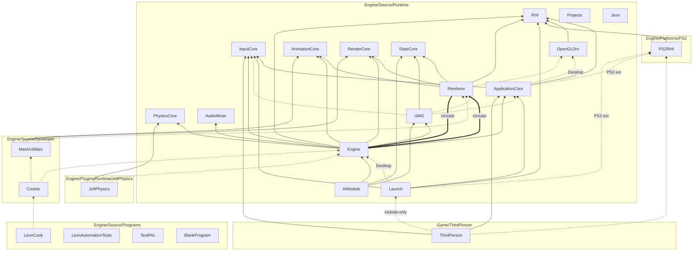

# LeonEngine — architecture

As-built module layout, dependencies and runtime flow. LeonEngine mirrors the **Unreal Engine 4.27**
source layout, module architecture and Epic naming, and is built with CMake through **LeonBuildTool**
(our UnrealBuildTool).

**Also:** [BUILD.md](BUILD.md) (LeonBuildTool reference) · [CODING_STANDARD.md](CODING_STANDARD.md) ·
[UnrealEngine427/](UnrealEngine427/README.md) (UE 4.27 knowledge base, [LeonMapping](UnrealEngine427/LeonMapping.md),
[NextSteps](UnrealEngine427/NextSteps.md)) · [SETUP.md](SETUP.md) · [TOOLS.md](TOOLS.md) · [LEVELS.md](LEVELS.md) ·
[ASSET_FORMATS.md](ASSET_FORMATS.md) · [LIBRARIES.md](LIBRARIES.md) · [README](../README.md)

---

## 1. Repository layout

```text
LeonEngine-PS2/
├── Engine/
│   ├── Build/                 # BatchFiles (Build, Clean, Rebuild, RunTests, Cook, FormatCode, Lint, …), Build.version
│   ├── Config/                # Base*.ini (placeholders, not loaded yet)
│   ├── Content/               # engine content: Materials, Textures, LevelTemplates
│   ├── Shaders/               # GLSL (desktop renderer)
│   ├── Source/
│   │   ├── Runtime/           # modules that ship in games
│   │   ├── Developer/         # tool-only modules (import, cook)
│   │   ├── Programs/          # standalone programs + LeonBuildTool
│   │   ├── ThirdParty/        # external modules (<Lib>/<Lib>.Build.cmake)
│   │   └── LeonGame.Target.cmake
│   ├── Platforms/PS2/         # PS2 platform extension (Source, Build, Config, Documentation)
│   └── Plugins/Runtime/JoltPhysics/
├── Game/ThirdPerson/          # the only game project (isolated; .lproj)
├── Docs/
├── Setup.bat / Setup.sh       # pinned third-party downloads
└── GenerateProjectFiles.bat / .sh
```

Every C++ module follows the UE anatomy: `<Module>/<Module>.Build.cmake`, `Public/` (headers other
modules may include), `Classes/` (public gameplay-class headers, UE convention), `Private/` (sources,
private headers, platform subfolders and `Tests/`). A module without those folders is *flat* (UE game
module style) — `Game/ThirdPerson/Source/ThirdPerson` is flat.

---

## 2. Layers

| Layer | Folder | Contents | May depend on |
| --- | --- | --- | --- |
| **Runtime** | `Engine/Source/Runtime` | Core, HAL, application, RHI, rendering, gameplay framework, … | Runtime, ThirdParty |
| **Developer** | `Engine/Source/Developer` | `MeshUtilities` (DCC import), `Cooker` (cook recipes, `UCookCommandlet`) | Runtime, Developer, ThirdParty |
| **Programs** | `Engine/Source/Programs` | `LeonCook`, `LeonAutomationTests`, `TestPAL`, `BlankProgram`, `LeonBuildTool` (CMake scripts, not a module) | anything |
| **ThirdParty** | `Engine/Source/ThirdParty` | External modules (`TYPE External`): GLM, GLFW, Glad, STB, NlohmannJson, MiniAudio, UFBX, CGLTF, TinyObjLoader, Catch2 | — |
| **Platform extension** | `Engine/Platforms/PS2` | PS2 halves of `Core`, `ApplicationCore`, `Launch` + the `PS2RHI` module; toolchain, Docker image, `PS2Engine.ini` | same as the module it extends |
| **Plugins** | `Engine/Plugins/Runtime/JoltPhysics` | `JoltPhysics` module + its third-party `JoltLib` (Win64 only) | Runtime |
| **Game** | `Game/ThirdPerson` | `ThirdPerson` primary game module + `ThirdPerson.Target.cmake` | Runtime (never the other way) |

Rules:

- **No engine module references the game.** `Game/ThirdPerson` is only discovered when a build passes
  `-Project=…/ThirdPerson.lproj`; engine sources never include its headers (the name appears only
  as a default in `Build.bat` / `RunPCSX2.ps1` usage lines).
- **Platform code lives in platform folders only**: `Private/Windows`, `Private/Linux`, `Private/Desktop`
  inside a module, or the extension under `Engine/Platforms/PS2`. LeonBuildTool drops source folders named
  after a platform or group that does not apply (a `Windows/` folder never compiles on PS2), and only
  discovers `Engine/Platforms/<P>/Source` when building for `<P>`.
- **Extension merge**: `Engine/Platforms/PS2/Source/Runtime/Core` is merged into `Engine/Source/Runtime/Core`
  (same relative path); its `Core_PS2.Build.cmake` uses `leon_module_extend(Core …)` to add PS2-only
  dependencies / system libraries. Extension `Public/` headers sit at the root of `Public/` (e.g.
  `PS2PlatformMemory.h`), which is what `COMPILED_PLATFORM_HEADER` expects for extensions.

---

## 3. Build model (summary)

Full reference: [BUILD.md](BUILD.md).

- `leon_module(<Name> …)` in `<Module>.Build.cmake` declares `PUBLIC_DEPENDENCIES`, `PRIVATE_DEPENDENCIES`,
  `CIRCULAR_DEPENDENCIES` (UE `CircularlyReferencedDependentModules`, propagated like public ones),
  `PLATFORMS` allow-list and `_<Platform|Group>` suffixed variants (`PRIVATE_DEPENDENCIES_Desktop`).
- Platforms: **Win64** (groups `Windows Microsoft Desktop`, C++20), **Linux** (`Unix Linux Desktop`, C++20,
  registered but not a verification gate), **PS2** (`PS2 Console`, C++17, extension, built in the pinned
  ps2dev Docker image).
- A module library's C++ standard is the **lowest** standard among the platforms it is allowed on: modules
  without a `PLATFORMS` list (Core, InputCore, RHI, ApplicationCore, …) compile as C++17 everywhere;
  desktop-only modules compile as C++20. The launch module compiled into an executable uses the platform's
  standard (C++20 on Win64, C++17 on PS2), so Launch code must still be valid C++17.
- Linking is always **static** (`IS_MONOLITHIC=1`). For each target, LeonBuildTool resolves the module
  closure from `Core` + the launch module + `EXTRA_MODULE_NAMES` (+ enabled plugin modules), builds every
  module except the launch module as a static library `Module.<Name>`, compiles the **launch module straight
  into the executable** with the target macros (`WITH_ENGINE`, `IS_PROGRAM`, `WITH_DEV_AUTOMATION_TESTS`,
  `LEON_TARGET_NAME`, `LEON_PROJECT_NAME`), and generates `<Target>.ModuleInit.gen.cpp` (see §8).
- Shared module libraries never see target macros; only the launch module does.

### Targets

| Target | File | Type | Platforms | Launch module | Roots / notes |
| --- | --- | --- | --- | --- | --- |
| `LeonGame` | `Engine/Source/LeonGame.Target.cmake` | Game | Win64 | `Launch` | `Engine AIModule`; `WITH_ENGINE=1`; loads one level (`LeonGame -map=<.llev>`) |
| `ThirdPerson` | `Game/ThirdPerson/Source/ThirdPerson.Target.cmake` | Game | PS2 | `Launch` | project module `ThirdPerson`; `COMPILE_AGAINST_ENGINE OFF` → `WITH_ENGINE=0` |
| `LeonCook` | `Engine/Source/Programs/LeonCook/` | Program | Desktop | `LeonCook` | `Cooker` → `UCookCommandlet::Main` |
| `LeonAutomationTests` | `Engine/Source/Programs/LeonAutomationTests/` | Program | Desktop | `LeonAutomationTests` | every desktop Runtime / Developer module except `Launch`, + `JoltPhysics` plugin; `COLLECT_AUTOMATION_TESTS` |
| `TestPAL` | `Engine/Source/Programs/TestPAL/` | Program | all | `TestPAL` | `Core` only; `COLLECT_AUTOMATION_TESTS`; runs Core's automation tests without Catch2 (PS2 included) |
| `BlankProgram` | `Engine/Source/Programs/BlankProgram/` | Program | all | `BlankProgram` | starts the module table and prints the platform (CI builds it for PS2) |

Module closures in practice:

- **PS2 `ThirdPerson`**: `Core`, `Launch`, `ThirdPerson`, `InputCore`, `ApplicationCore`, `RHI`, `PS2RHI`.
- **Win64 `LeonGame`**: everything reachable from `Launch` (desktop private dep `Engine`) +
  `AIModule` — every desktop Runtime module except `Json` and `Projects`, no Developer modules; plugins are disabled by
  default, so `JoltPhysics` is not linked.

---

## 4. Module dependency graph

Built from the `*.Build.cmake` files. Every module depends on **Core** (edges to Core omitted);
third-party modules are listed in the next table.



Solid = `PUBLIC_DEPENDENCIES`, dashed = `PRIVATE_DEPENDENCIES` (label = platform suffix or extension file),
thick = `CIRCULAR_DEPENDENCIES`. `Json` and `Projects` have no dependents; they are linked only by
`LeonAutomationTests` (`EXTRA_MODULE_NAMES`). `LeonAutomationTests`, `TestPAL` and `BlankProgram` depend only on Core
(`LeonAutomationTests` also on Catch2).

**Include-only dependency on Launch:** the launch module is compiled into the executable, not into a
library, so a module that depends on it (`ThirdPerson` → `Launch`) only receives Launch's public include
paths and `LAUNCH_API`; the symbols (`GEngineLoop`) resolve when the executable links.

### Third-party and system libraries

| Library | Used by (public / private) | Platforms |
| --- | --- | --- |
| GLM | public: Core (`_Desktop`), AIModule, AnimationCore, AudioMixer, Engine, Json, MeshUtilities, PhysicsCore, RenderCore, Renderer, UMG | Desktop |
| NlohmannJson | public: Engine, Json, Renderer; private: Cooker | Desktop |
| GLFW | private: ApplicationCore (`_Desktop`) | Desktop |
| STB | private: ApplicationCore (`_Desktop`), Engine, Renderer | Desktop |
| Glad | private: OpenGLDrv, Renderer | Desktop |
| MiniAudio | private: AudioMixer | Desktop |
| UFBX | private: MeshUtilities | Desktop |
| TinyObjLoader, CGLTF | private: MeshUtilities | Desktop |
| Catch2 | private: LeonAutomationTests | Desktop |
| JoltLib (Jolt 5.3.0) | private: JoltPhysics | Win64 |
| System libs | Core: `psapi` (Windows), `kernel` (PS2); OpenGLDrv: `dxgi` (Windows); ApplicationCore: `pad` (PS2); PS2RHI: `draw math3d packet graph dma kernel` | — |

---

## 5. Modules

| Module | Role | Key types | Platforms |
| --- | --- | --- | --- |
| **Core** | HAL, memory, assertions, templates, containers, strings / names / text, logging, delegates, automation tests, module manager, ticker, engine exit flag, paths, file helpers, transform, stats-overlay state | `FPlatformMemory`, `FPlatformTime`, `FPlatformMath`, `FPlatformMisc`, `FPlatformAtomics`, `FPlatformProperties`, `FMemory`, `TArray`, `TMap`, `TSet`, `FString`, `FName`, `FText`, `TDelegate`, `TMulticastDelegate`, `UE_LOG`, `GLog`, `FAutomationTestFramework`, `FModuleManager`, `IModuleInterface`, `FTicker`, `FPaths`, `FFileHelper`, `FCString`, `FTransform`, `FStatsOverlay` | all (`FileHelper.cpp`, `Paths.cpp`, `Transform.cpp` excluded on PS2) |
| **InputCore** | Key / gamepad identifiers | `EKeys` | all |
| **ApplicationCore** | Platform application, windows, gamepad input | `GenericApplication`, `FGenericWindow`, `IInputInterface`, `FPlatformApplicationMisc`; desktop `FGLFWApplication`, `FGLFWWindow`; PS2 ext `FPS2Application`, `FPS2Window`, `FPS2InputInterface` | all |
| **RHI** | Graphics backend interface + opaque GPU handle ids | `FDynamicRHI`, `GDynamicRHI`, `FRHIGPUMemoryStats`, `FRHITextureId` … | all |
| **OpenGLDrv** | OpenGL 3.3 RHI device | `FOpenGLDynamicRHI` | Desktop |
| **PS2RHI** | Graphics Synthesizer immediate-mode API (platform extension module) | `FPS2RHI`, `FPS2Texture`, `FPS2Material`, `FPS2ViewTarget`, `FPS2DirectionalLight` | PS2 |
| **Launch** | Entry points and engine loop | `GuardedMain`, `FEngineLoop`, `GEngineLoop`, `FPlatformEngineLoopHooks`; desktop-private `FGameApplication` | all |
| **Projects** | Project / plugin descriptors — empty placeholder (the `.lproj` / `.lplugin` readers arrive in P4) | — | Desktop |
| **Json** | JSON helpers | `FJsonUtils` | Desktop |
| **PhysicsCore** | Physics types and backend seam | `IPhysicsBackend`, `EPhysicsBackend`, `FHitResult`, `FBodyInstance`, `FCollisionQueryParams`, `FCapsuleShape`, `FTriangleMeshCollision` | Desktop |
| **AnimationCore** | Skeletons, sequences, blend spaces, anim instances | `USkeleton`, `UAnimSequence`, `UBlendSpace1D`, `UAnimInstance`, `UCharacterAnimInstance` | Desktop |
| **AudioMixer** | Audio device (miniaudio) | `FAudioDevice` | Desktop |
| **RenderCore** | CPU-side render data | `FMeshData`, `FMeshSection`, `FVertex`, `FBox`, `FFrustum`, `FMaterial` | Desktop |
| **Renderer** | Forward scene renderer and GPU resources | `FSceneRenderer`, `UTexture2D`, `UStaticMesh`, `USkeletalMesh`, `FShader`, `FShadowMap`, `FResourceCache`, `FDebugDraw`, `FDebugOverlay`, `FGPUPassTimer` | Desktop |
| **SlateCore** | Text layout primitives | `ETextJustify`, HUD font metrics | Desktop |
| **UMG** | Widgets | `UUserWidget`, `UButton`, `UTextBlock`, `UImage`, `UProgressBar`, `UVerticalBox`, `UMenuListWidget`, `UInteractionPromptWidget`, `FPaintContext` | Desktop |
| **Engine** | Gameplay framework, world, levels, physics scene | `UGameEngine`, `UGameInstance`, `UWorld`, `ULevel`, `AActor`, `APawn`, `ACharacter`, `UCharacterMovementComponent`, `AController`, `APlayerController`, `AGameModeBase`, `AGameStateBase`, `APlayerState`, `AHUD`, `UGameplayStatics`, `FPhysScene`, `UNavigationSystem` | Desktop |
| **AIModule** | AI controller and behavior trees | `AAIController`, `UBehaviorTree`, `UBTComposite_Sequence`, `UBTComposite_Selector`, `UBTDecorator_Bool`, `UBTTask_Action`, `UBlackboardComponent`, `FAIChaseBehavior` | Desktop |
| **MeshUtilities** | Static mesh import / build, skeletal FBX import (Developer) | `FStaticMeshBuilder`, `LoadObj`, `LoadStaticMeshFromFbx`, glTF import, `LoadSkeletalMeshFromFbx`, `LoadAnimSequenceFromFbx` | Desktop |
| **Cooker** | Cook recipes and paths (Developer) | `UCookCommandlet`, `FCookRecipe`, `FCookPaths` | Desktop |
| **JoltPhysics** (plugin) | Jolt rigid-body backend | `CreateJoltPhysicsBackend` | Win64 |
| **ThirdPerson** (game) | PS2 third-person game | `FThirdPersonModule`, `FThirdPersonGameMode`, `FThirdPersonCharacter`, `FThirdPersonCameraBoom`, `FThirdPersonLevel` | PS2 (target) |

---

## 6. Core: HAL and foundations

UE pattern: a generic implementation, a per-platform subclass, and a `HAL/` header that picks the current
platform through `COMPILED_PLATFORM_HEADER`.

```text
Core/Public/GenericPlatform/GenericPlatformMemory.h   struct FGenericPlatformMemory
Core/Public/Windows/WindowsPlatformMemory.h           struct FWindowsPlatformMemory : FGenericPlatformMemory
                                                      typedef FWindowsPlatformMemory FPlatformMemory;
Core/Public/Linux/LinuxPlatformMemory.h               (same for Linux)
Platforms/PS2/Source/Runtime/Core/Public/PS2PlatformMemory.h   (PS2 extension)
Core/Public/HAL/PlatformMemory.h                      #include COMPILED_PLATFORM_HEADER(PlatformMemory.h)
```

- LeonBuildTool defines `PLATFORM_<NAME>=1`, `LBT_COMPILED_PLATFORM=<HeaderName>` (UE `UBT_COMPILED_PLATFORM`)
  and `PLATFORM_IS_EXTENSION`. `HAL/PreprocessorHelpers.h` turns `COMPILED_PLATFORM_HEADER(PlatformMemory.h)`
  into `"Windows/WindowsPlatformMemory.h"` in-module, or `"PS2PlatformMemory.h"` for an extension.
- `HAL/Platform.h` defaults every `PLATFORM_*` macro to 0, includes the platform's `Platform.h`
  (`FPlatformTypes`, `PLATFORM_DESKTOP`, `PLATFORM_64BITS`, `FORCEINLINE`) and defines the global fixed-width
  types (`int32`, `uint64`, `SIZE_T`, `PTRINT`, …), `TCHAR` / `TEXT`, `LIKELY` / `UNLIKELY`, `PLATFORM_BREAK` and
  `LEON_PRINTF_FORMAT`. The EE is ILP32 (`PS2Platform.h`). **`TCHAR` is UTF-8 `char` on every platform**
  (`TEXT(x)` is `x`); `WIDECHAR` exists only for the Windows HAL.
- HAL structs: `FPlatformMemory::GetStats()` → `FPlatformMemoryStats`; `FPlatformTime::Cycles64()`,
  `GetSecondsPerCycle64()`, `CyclesToMicroseconds()` (integer, for the EE), `Seconds()`;
  `FPlatformMath::Sin256` / `Cos256` (1/256-turn angles, PS2 uses a table) plus integer / bit helpers
  (`CountLeadingZeros`, `FloorLog2`, `RoundUpToPowerOfTwo`, …); `FPlatformMisc` (`LowLevelOutputDebugString`,
  `LocalPrint`, `IsDebuggerPresent`, `RequestExit` — a forced exit halts the EE on PS2); `FPlatformAtomics`
  (Windows intrinsics, Linux `__atomic`, PS2 the non-atomic generic version: Leon runs one EE thread);
  `FPlatformProperties::PlatformName()` and the `NamePool*` limits.
- `CoreTypes.h` → `HAL/Platform.h`, `Misc/Build.h` (`UE_BUILD_*` from `LEON_BUILD_<CONFIG>`, `DO_CHECK`,
  `DO_GUARD_SLOW`, `DO_ENSURE`, `NO_LOGGING` = Shipping), `Misc/CoreMiscDefines.h`. `CoreMinimal.h` includes the
  whole Core set below.
- Other Core services: `FTicker::GetCoreTicker()` (`FTickerDelegate`s with an optional delay, `FDelegateHandle`;
  return `false` to unregister), `IsEngineExitRequested()` / `RequestEngineExit()` (`CoreGlobals.h`), `FStatsOverlay`
  (engine debug overlay state; the platform draws it).

### Core foundations (UE 4.27 API)

| Area | Headers | Notes |
| --- | --- | --- |
| Memory | `HAL/UnrealMemory.h`, `HAL/MallocAnsi.h` | `FMemory` over `GMalloc` = `FMallocAnsi`, which tracks current / peak bytes (`FMemory::GetUsage()`); PS2 / Linux ask `malloc_usable_size` (no per-block overhead), Windows keeps a small header |
| Assertions | `Misc/AssertionMacros.h` | `check`, `checkf`, `verify`, `checkNoEntry`, `checkSlow`, … ; `ensure` / `ensureMsgf` / `ensureAlways` report once per call site through `GLog` |
| Templates / Algo | `Templates/*`, `Misc/Optional.h`, `Misc/EnumClassFlags.h`, `Algo/*` | `MoveTemp`, `TTuple` / `TPair`, `TUniquePtr`, `TSharedPtr` / `TSharedRef` / `TWeakPtr` (`ESPMode::NotThreadSafe` default), `TFunction` / `TUniqueFunction` / `TFunctionRef`, `Sort` / `StableSort`, `TOptional`, `ENUM_CLASS_FLAGS`, `Algo::BinarySearch`, heap |
| Containers | `Containers/*` | allocator policies, `TArray`, `TArrayView`, `TBitArray`, `TSparseArray`, `TSet`, `TMap` / `TMultiMap`; elements are relocated with `memmove` (UE rule: no self-pointers) |
| Strings | `Containers/UnrealString.h`, `StringConv.h`, `Misc/CString.h`, `Misc/Char.h`, `Misc/Crc.h` | `FString` (`==` / `<` / `GetTypeHash` ignore case, like UE), `FCString`, `FChar`, `FCrc`; `TCHAR_TO_UTF8` & co. are identities |
| Names / text | `UObject/NameTypes.h`, `Internationalization/Text.h` | `FName` (8 bytes, case-insensitive, numeric suffix, global pool sized by `FPlatformProperties::NamePool*`; exhausting it is fatal); minimal `FText` (no localization: `LOCTEXT` keeps the source text) |
| Logging | `Logging/LogMacros.h`, `LogCategory.h`, `Misc/OutputDevice*.h` | `UE_LOG` / `UE_CLOG`, categories (`LogTemp`, `LogCore`, `LogInit`, …); `GLog` redirects to stdout (EE console / PCSX2 log on PS2) and, on Windows, the debugger. Line format `Category: Verbosity: Message` (verbosity omitted for `Log`); log file and config-driven verbosity come in P4 |
| Delegates | `Delegates/Delegate.h`, `IDelegateInstance.h` | `TDelegate`, `TMulticastDelegate` (`Broadcast` latest-first like UE4, removal during broadcast is safe), `DECLARE_DELEGATE*` / `DECLARE_MULTICAST_DELEGATE*` / `DECLARE_EVENT*`; no dynamic delegates until CoreUObject |
| Automation tests | `Misc/AutomationTest.h` | `IMPLEMENT_SIMPLE_AUTOMATION_TEST`, `FAutomationTestBase`, `FAutomationTestFramework::RunTests(Filter, ExcludeFlags)`; an unexpected error logged during a test fails it |

Core math (`FVector`, `FRotator`, float `FMath`) is P3; `IPlatformFile`, the `FPaths` rewrite, `FArchive`, config and
the command line are P4 ([NextSteps](UnrealEngine427/NextSteps.md)).

---

## 7. ApplicationCore and RHI

### ApplicationCore

| Abstraction | Desktop (`Private/Desktop`, GLFW) | PS2 (extension) |
| --- | --- | --- |
| `FPlatformApplicationMisc::CreateApplication()` | `FWindowsPlatformApplicationMisc` / `FLinuxPlatformApplicationMisc` | `FPS2PlatformApplicationMisc` |
| `GenericApplication` (`MakeWindow`, `PollGameDeviceState`, `GetInputInterface`) | `FGLFWApplication` | `FPS2Application` |
| `FGenericWindow` (`Create`, `PollEvents`, `SwapBuffers`, sizes, cursor, keys) | `FGLFWWindow` | `FPS2Window` (GS display; `SwapBuffers` waits for vsync) |
| `IInputInterface` (`IsGamepadConnected`, `IsGamepadKeyDown(EKeys)`, `GetGamepadAnalog(EKeys)`) | — | `FPS2InputInterface` (DualShock, libpad port 0; UE homologue `XInputInterface`) |

The window owns the graphics device: `FGenericWindow::InitRHI` calls `PlatformCreateDynamicRHI()`, loads it
and publishes it in `GDynamicRHI`. That is why ApplicationCore depends on the platform RHI module
(`OpenGLDrv` on desktop, `PS2RHI` through `ApplicationCore_PS2.Build.cmake`).

### RHI

- `FDynamicRHI` (`RHI/Public/DynamicRHI.h`): `Init(ProcAddressLoader)`, `SetViewport`, `GetGPUMemoryStats`,
  `GetName`, `GetAPIVersionString`. `GDynamicRHI` is the active instance; `PlatformCreateDynamicRHI()` is
  implemented by the platform RHI module.
- `RHIHandles.h`: opaque GPU ids (`FRHITextureId`, `FRHIFramebufferId`, `FRHIBufferId`, …, `InvalidTexture`)
  used in public Renderer headers so they do not expose GL types.
- **OpenGLDrv**: `FOpenGLDynamicRHI` (Glad loader, GPU memory stats per platform under `Private/Windows` and
  `Private/Linux`).
- **PS2RHI**: implements `PlatformCreateDynamicRHI()` and exposes the **static** `FPS2RHI` API used directly
  by PS2 code. Frame contract: `InitDisplay` (done by `FPS2Window`) → `SetViewTarget` /
  `SetDirectionalLight` / `SetAmbientLightColor` → `ClearColor` → `BindMaterial` → `DrawBox` /
  `DrawCookedMesh` / `DrawUnlit*` → `DrawDebugText` → `WaitVSync` (`FPS2Window::SwapBuffers`). Internals
  (`PS2GSContext`, `PS2SceneState`, `PS2Draw3D`, `PS2DrawPrimitives`, `PS2Texture`, `PS2DebugText`) live in
  `Private/`; the private helper namespace is `Leon::PS2`.

---

## 8. Module startup

- Each module registers itself with `IMPLEMENT_MODULE(<Impl>, <Module>)` (usually in
  `Private/<Module>Module.cpp`), which defines `extern "C" IModuleInterface* InitializeModule_<Module>()`.
  `FDefaultModuleImpl` covers modules without startup logic; game modules use
  `IMPLEMENT_PRIMARY_GAME_MODULE` / `IMPLEMENT_GAME_MODULE`.
- LeonBuildTool writes `<Target>.ModuleInit.gen.cpp` with the table `GetStaticallyLinkedModules()` (every
  Runtime / Developer module of the closure, **dependency order**) and `GPrimaryGameModuleName`. A module in
  the table without `IMPLEMENT_MODULE` fails to link.
- `FModuleManager::Get().StartupStaticallyLinkedModules()` creates and starts them in order;
  `ShutdownModules()` shuts them down in reverse. Programs call these directly (`BlankProgram`,
  `LeonAutomationTests`, `TestPAL`); games get them from `FEngineLoop`.
- Example: `JoltPhysics` registers its backend factory in `StartupModule`; `ThirdPerson` creates its game mode
  and registers an `FTickerDelegate::CreateLambda` with `FTicker` in `StartupModule` (keeping the `FDelegateHandle`).

---

## 9. Launch and the engine loop

`Launch<Platform>.cpp` (`Private/Windows`, `Private/Linux`, PS2 extension `LaunchPS2.cpp`) defines `main`,
which calls `GuardedMain`:

```text
GuardedMain: GEngineLoop.PreInit → (exit if requested) → Init → while !IsEngineExitRequested(): Tick → Exit
```

`WITH_ENGINE` is set per target (`COMPILE_AGAINST_ENGINE`) and reaches only the launch module.

### `WITH_ENGINE=1` — desktop (`LeonGame`)

- `PreInit`: starts the statically linked modules (the loop does not own a window here).
- `Init`: creates `FGameApplication` (`Launch/Private/Desktop`) and calls
  `Init(ArgCount, Args, LEON_PROJECT_NAME)`. `FGameApplication::Init` parses the command line (`-map=<.llev>`,
  `-nullrhi`, `--tick <Hz>`, `--show-stats`), creates `UGameEngine` (`Initialize(1280, 720, …)`, or
  `InitializeHeadless()` with `-nullrhi`), wires the default input, loads one level with `LoadLevelFile`
  (default `Engine/Content/LevelTemplates/Starter.llev`; `-map=` is relative to the working directory or to
  `Engine/Content`), creates `ADefaultGameMode`, calls `OnEnter` and then `UGameEngine::Start`.
- `Tick`: ticks `FTicker`, then `FGameApplication::Tick` → `UGameEngine::Tick(DeltaTime, …)` with
  `GameMode->Tick` as the update callback (windowed), or a fixed-rate `GameMode->Tick` (headless); returning
  `false` requests engine exit.
- `Exit`: `FGameApplication::Exit` (`GameMode->OnExit`, `UGameEngine::Shutdown`), then module shutdown.
- `LaunchEngineLoop.cpp` refuses `WITH_ENGINE` on non-desktop platforms (`#error`).

### `WITH_ENGINE=0` — PS2 (`ThirdPerson`)

- `PreInit`: `FPlatformApplicationMisc::CreateApplication()`, `MakeWindow()`, `Create(640, 448, LEON_TARGET_NAME)`,
  then module startup — so the primary game module can already reach the window through
  `GEngineLoop.GetMainWindow()` / `GetApplication()`.
- `Tick`: `PollGameDeviceState` → `PollEvents` → `FTicker::GetCoreTicker().Tick(DeltaTime)` (game work) →
  `FPlatformEngineLoopHooks::EndFrame` (PS2: `FPS2StatsOverlay::Draw` — stats panel + gamepad widget) →
  `SwapBuffers` (vsync) → `FPlatformEngineLoopHooks::PostPresent` (`MarkFrameStart`). Closing the window
  requests exit.
- `Exit`: module shutdown, window destroy, application release.
- `FPlatformEngineLoopHooks` is implemented per platform: `Private/Desktop/DesktopEngineLoopHooks.cpp` (empty)
  and PS2 `PS2EngineLoopHooks.cpp`.

### The PS2 game

`FThirdPersonModule` (`IMPLEMENT_PRIMARY_GAME_MODULE`) builds `FThirdPersonGameMode` from the main window and
input interface, calls `StartPlay` and ticks it from `FTicker`. The game mode owns textures / materials
(`FPS2Texture`, `FPS2Material`), `FThirdPersonLevel` (primitive sandbox built in code), `FThirdPersonCharacter`
(camera-relative move, jump, gravity, step-up, wall push-out) and `FThirdPersonCameraBoom`, draws through
`FPS2RHI`, publishes debug lines with `FStatsOverlay::AddOnScreenDebugMessage` and logs with
`UE_LOG(LogThirdPerson, …)` (EE console). It uses plain floats and `FPlatformMath` — the desktop gameplay framework
is not available on PS2 (see §15).

---

## 10. Gameplay framework (Engine, desktop)

Unreal shapes without reflection: `A`/`U` prefixes are naming only (no `UObject`, no GC).

| Area | Types / flow |
| --- | --- |
| Engine | `UGameEngine` creates its own application + window through `FPlatformApplicationMisc`, owns `ULevel`, `FSceneRenderer`, `FResourceCache`, `FAudioDevice`, `AHUD`, `FDebugOverlay`, `UPlayerInput`, camera, `UGameInstance` (`SetGameInstance<T>()`). Frame (`UGameEngine::Tick`): poll events → `UPlayerInput::Update` → shader hot reload → UI input → `HandleInput` → `TickPlayAudio` → update callback (game mode tick) → `TickPlayHud` → `Render` (+ UI paint) → `SwapBuffers` |
| Startup | `FGameApplication::Init` (Launch): `LoadLevelFile` (one `.llev`, `-map=`) → `ADefaultGameMode::OnEnter`; `FGameApplication::Tick` drives `GameMode->Tick` |
| World | `UWorld` (owned by `AGameModeBase`) owns spawned actors + `FPhysScene`; `SpawnActor<T>()` during tick is deferred; `TickGameplayFrame`: character move → `FPhysScene::Step` → overlaps → actor tick → sync to level → draw. `ULevel` is map content (`UStaticMeshComponent` PODs, lights, `FPlayerStart`, `FTriggerVolume`, `FPainCausingVolume`, `FAISpawnPoint`) |
| Actors | `AActor` (root `USceneComponent`, `RegisterComponent`, `CreateDefaultSubobject<T>()`, `GetUniqueID()` = spawn serial from `UWorld::SpawnActor`) → `APawn` → `ACharacter` (+ `UCharacterMovementComponent`, `USkeletalMeshComponent`, `TakeDamage`); `USpringArmComponent`, `UCameraComponent` |
| Controllers / rules | `AController` → `APlayerController`, `AAIController` (AIModule); `AGameModeBase` (`OnEnter`/`Tick`/`OnExit`, `InitGameState`, `StartMatch`, `PostLogin`, `RestartPlayer`, `HandleStartingNewPlayer`), `AGameStateBase` (`PlayerArray`), `APlayerState`, `UGameInstance` (`Init`, `Shutdown`, `NotifyLevelOpened`) |
| Helpers | `UGameplayStatics` (traces over `FPhysScene`, `ApplyPointDamage`, …), `VolumeHelpers`, `UNavigationSystem` (grid `FNavMesh`), `UInputMappingContext` / `Leon::InputActions` |
| UI / audio | `AHUD::AddWidget<T>()` + `Paint(FDebugOverlay&, …)` over UMG widgets; `FAudioDevice` (`PlaySound2D`, `PlaySoundAtLocation`, `PlayUiSound`, `PlayMusic`/`StopMusic`, `SetListener` from the camera each frame); headless (`-nullrhi`) initialises silent |

### Character movement (CMC lite)

- Kinematic capsule pawn: actor location = feet; `FCapsuleShape`; not an `FBodyInstance`.
- Modes `EMovementMode` Walking / Falling (`IsMovingOnGround`, `IsFalling`); floor via `FindFloor` /
  `FFindFloorResult`; walkable test against `WalkableFloorZ` (UE ~0.71).
- Tunables with UE names on `UCharacterMovementComponent`: `MaxWalkSpeed`, `JumpZVelocity`, `MaxStepHeight`,
  `WalkableFloorZ`, `AirControl`, `MaxJumpCount`.
- Per frame: horizontal capsule sweep (× `AirControl` when falling) → step-up (walking, ≤ `MaxStepHeight`) →
  slide → `ResolveCapsuleSides` → gravity → `FindFloor` → mode snap. Blocking sweeps push dynamic bodies
  (`ApplyCapsuleSweepPush`); `UWorld::TickGameplayFrame` separates overlapping pawns (`ResolvePawnOverlap`).

---

## 11. Physics

- **PhysicsCore** holds the types (`FHitResult`, `FBodyInstance`, `FCollisionQueryParams`, `FCapsuleShape`,
  triangle-mesh collision) and the seam `IPhysicsBackend` + `CreatePhysicsBackend(EPhysicsBackendKind)` /
  `RegisterPhysicsBackendFactory(Kind, Factory)`.
- **Engine** owns the gameplay-facing `FPhysScene` (`Public/Physics/PhysScene.h`) and the default **Arcade**
  backend (`Private/PhysicsEngine`: AABB + triangle-mesh traces, CMC queries such as `QuerySupportY`,
  optional arcade step). `UWorld::SetPhysicsBackend` recreates the scene with another backend.
- **JoltPhysics plugin** (Win64): `FJoltPhysicsModule::StartupModule` registers `CreateJoltPhysicsBackend` for
  `EPhysicsBackendKind::Jolt`. With Jolt, rigid bodies step in Jolt (static triangle meshes become `MeshShape`)
  and line / sphere / capsule traces use its narrow phase; the floor plane, slope planes and CMC side
  resolve stay Arcade. Asking for Jolt without the plugin logs and falls back to Arcade. The plugin is
  `EnabledByDefault: false` and currently enabled only by `LeonAutomationTests`.
- Level statics with CPU mesh data bake to triangle-mesh collision on `SyncFromLevel` (complex-as-simple
  lite).

---

## 12. Rendering (desktop)

- `FSceneRenderer` (Renderer) is a forward renderer: directional shadow map (light 0), optional half-res
  planar reflection (`PlanarReflectionScale = 0.5`), opaque / transparent (the sky is the
  procedural gradient in `blinn_phong.frag`). With post enabled the
  color pass renders into an HDR `FSceneColorTarget` (RGB16F + depth), then SSAO (`FSSAOTarget`) → blur →
  tonemap + exposure (`post_composite.frag`) → optional FXAA.
- Scalability: `SetPostProcessQuality(EPostProcessQuality::Off|Low|Medium|High)` (default **Low**: light SSAO,
  no FXAA, 1024 shadow map); optional early-Z (`SetEarlyZEnabled`).
- `FGPUPassTimer` measures `Shadow / Planar / Color / Ssao / Post` with `GL_QUERY_RESULT_AVAILABLE` (no stall).
- Resources: `FResourceCache`, `UTexture2D`, `UStaticMesh`, `USkeletalMesh`, `FShader` (GLSL from
  `Engine/Shaders`, hot reload), `FUniformBuffer`; materials `.lmat` (`LeonMaterialFormat`).
- Debug: `FDebugDraw` (lines, collision / nav-mesh debug) and `FDebugOverlay` (text / HUD backend).
- Levels load from binary `.llev` (`LoadLevelFile`) — see [LEVELS.md](LEVELS.md) and
  [ASSET_FORMATS.md](ASSET_FORMATS.md). There are no lightmaps; static lighting returns later as
  `<Map>_BuiltData.lasset`.
- **PS2** does not use Renderer: games draw immediately through `FPS2RHI` (§7).

---

## 13. Content and paths

- `FPaths::ResolveAssetPath` resolves relative to the executable, `Engine/Content` and `Engine/Shaders`
  (projects are never scanned). Among engine / staging candidates the newest file wins.
- Engine content is system-only: `Materials/M_Default.lmat`, `M_WorldGrid.lmat`, `M_SolidMetal.lmat`,
  `Textures/T_Default_D.png`, `LevelTemplates/Blank.llev`, `Starter.llev`.
- `LeonGame` runs a single level given with `-map=` (default `LevelTemplates/Starter.llev`); there is no
  runtime project / pack resolution — see Known debt.

---

## 14. Tools and tests

- **Developer/MeshUtilities**: OBJ (tinyobjloader), FBX (ufbx) and glTF (cgltf) import to `FMeshData`;
  `FStaticMeshBuilder` cooks static meshes; `FbxSkeletalImport.h` imports skinned meshes and animation
  sequences from FBX.
- **Developer/Cooker**: `UCookCommandlet::Main` (modes `staticmesh`, `recipe`),
  `FCookRecipe::RunFile`, `FCookPaths::ResolveBeside`.
- **Programs/LeonCook**: `main` → `UCookCommandlet::Main` (UE: `UE4Editor-Cmd -run=cook`); wrapper
  `Engine\Build\BatchFiles\Cook.bat`. Details: [TOOLS.md](TOOLS.md).
- **Tests**: each module keeps its tests in `<Module>/Private/Tests/`, excluded from the module library and compiled
  only into targets with `COLLECT_AUTOMATION_TESTS`. Core's are UE automation tests
  (`IMPLEMENT_SIMPLE_AUTOMATION_TEST`, `System.Core.*`: 31 on Win64, 27 on PS2 — the `FPaths` / `FTransform` tests are
  desktop-only); RenderCore, Renderer, PhysicsCore, AnimationCore, Engine, AIModule, MeshUtilities and the
  JoltPhysics plugin still use Catch2 (124 test cases) until they migrate (P5–P6).
  - `LeonAutomationTests` (Desktop) starts the module table, runs the automation tests, then Catch2, and fails if
    either fails. Run with `Engine\Build\BatchFiles\RunTests.bat` (`-automation=<filter>`, `-noautomation`,
    `-automationonly`; other arguments go to Catch2).
  - `TestPAL` (every platform, Core only) runs the automation tests without Catch2 and prints
    `TestPAL: PASSED (N test(s), 0 failed)` plus GMalloc and name-pool numbers. On PS2 it runs in PCSX2
    (`RunPCSX2.ps1 -Program TestPAL -Build`) and the result is read from the EE console; the numbers go to
    [Budgets.md](../Engine/Platforms/PS2/Documentation/Budgets.md).
- **CI** (`.github/workflows/ci.yml`): PS2 `ThirdPerson` + `BlankProgram` in the ps2dev image (ELF artifact);
  Win64 `Setup.bat`, `RunTests.bat`, `LeonGame` and `LeonCook`.

---

## 15. Known debt / deviations

Intentional deviations from UE 4.27 are tracked in
[LeonMapping.md — Deviations](UnrealEngine427/LeonMapping.md#deviations-from-ue-427-intentional); the
roadmap is [NextSteps.md](UnrealEngine427/NextSteps.md).

| Topic | Current state |
| --- | --- |
| Reflection | No `UObject` / `UCLASS` / UHT / GC. `A` and `U` prefixes are naming only; objects are plain C++ owned with `std::unique_ptr` (e.g. `UWorld` is a member of `AGameModeBase`). |
| Containers / strings | Core provides `TArray`, `TMap`, `FString`, `FName`, `FText` (minimal), delegates and `UE_LOG`, but the modules above Core still use `std::` containers, `std::string` and `std::function` until they migrate (P5–P6). `TCHAR` is UTF-8 `char` everywhere. |
| Math | glm on desktop (Y-up, lowercase API); plain floats + `FPlatformMath` on PS2. No `FVector` / `FRotator` / `FMatrix`. |
| Renderer | Calls OpenGL directly (Glad) instead of going through RHI command lists; `FDynamicRHI` only covers device init, viewport and memory stats. |
| Engine ↔ Renderer | `CIRCULAR_DEPENDENCIES` both ways (`Renderer.h` includes `Level.h`, `Level.h` includes GPU resources). UMG also depends privately on Renderer. |
| PS2 gameplay | The gameplay framework (Engine, AIModule, …) is desktop-only (glm / JSON, C++20). The PS2 game uses its own `F*` types (`FThirdPersonCharacter`, …) and `FPS2RHI`, with no `AActor` / `ACharacter`. |
| Game → Launch | The PS2 game module reads `GEngineLoop.GetMainWindow()` / `GetApplication()` through an include-only dependency on the launch module (UE game modules never see `FEngineLoop`); there is no `GEngine` / viewport on PS2 to hand them out. |
| Gamepad input | Game code polls `IInputInterface` state directly; no Slate application routing events. |
| Config | `Engine/Config/Base*.ini`, `Engine/Platforms/PS2/Config/PS2Engine.ini` and `Game/ThirdPerson/Config/Default*.ini` are placeholders; nothing loads them (no `FConfigCacheIni`). |
| Projects | The `Projects` module is an empty placeholder: `.lproj` files are read only by LeonBuildTool, and `LeonGame` runs one level from `-map=` (the `.lproj` / `.lplugin` readers arrive in P4). |
| Window / RHI ownership | The window creates the RHI (`FGenericWindow::InitRHI`), so ApplicationCore depends on the platform RHI module; on desktop `UGameEngine` creates its own application and window instead of `FEngineLoop`. |
| Platform checks | `Core/Private/Misc/Paths.cpp` still uses `#if PLATFORM_WINDOWS` outside a platform folder. |
| Linking | Always static (`IS_MONOLITHIC=1`), generated module table; no DLL modules or hot reload. |
| Build tool | CMake scripts instead of C# UBT; Linux is registered but not verified. |
