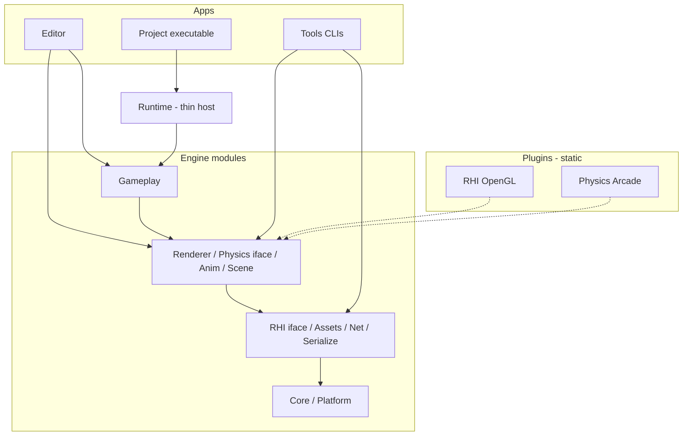

# Leon Engine — architecture

**Canonical path:** [`Docs/ARCHITECTURE.md`](ARCHITECTURE.md)  
**Also:** [README.md](../README.md), [SETUP.md](SETUP.md), [NAMING.md](NAMING.md), [TOOLS.md](TOOLS.md), [LEVELS.md](LEVELS.md), [ASSET_FORMATS.md](ASSET_FORMATS.md), [EDITOR.md](EDITOR.md), [CHANGELOG.md](../CHANGELOG.md), [LIBRARIES.md](LIBRARIES.md)

As-built layout and module boundaries. Root [`SPEC.md`](../SPEC.md) points here.

**Deferred (not blocking):** optional second RHI/physics backends; dynamic (DLL) plugins. GL handle types use `leon::rhi` opaque ids (`RHIHandles.h`) in public Renderer headers (OpenGL backend still maps 1:1).

---

## Goals

1. Small, generic engine core any Leon project can link.
2. Separate **edit-time** (Editor), **play-time** (Runtime), and **offline** (Tools).
3. Grow via optional **Plugins/** (static CMake), not by stuffing backends into core.
4. Unreal-like gameplay model (Actor, ActorComponent, SceneComponent, GameMode, World, Level).
5. Independent builds — root is not a mega-project.
6. Unreal-first **PascalCase** public API on Core / Gameplay / Scene (camelCase aliases kept where needed). Full rules: [NAMING.md](NAMING.md).

## Separate builds

| Project | Command | Produces |
| --- | --- | --- |
| Editor (full) | `Scripts\build.bat` | `Editor/build/Release/LeonEngine.exe`, tests |
| Editor (fast) | `Scripts\build-fast.bat` | `Editor/build-fast/LeonEngine.exe` (Ninja, tests OFF) |
| Editor (portable) | `Scripts\package-editor.bat` | `Dist/LeonEditor/LeonEngine.exe` + SDK |
| Project | `cmake -S Projects/<name>` | shipping exe via `leon_runtime` |
| Tools | `cmake -S Tools` / `Scripts\cook.bat` | `leon-cook`, `leon-cli`, `leon_resource_tools` — [TOOLS.md](TOOLS.md) |
| Tests | `Scripts\test.bat` | `ctest` on `Editor/build-ninja` |

Day-to-day editor work should use **`build-fast.bat`** (MSVC `/MP`, PCH on `leon_editor`, incremental asset sync). Full script list: [SETUP.md](SETUP.md#scripts-scripts).

## Repository layout

```text
Leon/
├── Engine/          # reusable modules + Assets/
├── Runtime/         # thin play-time host
├── Editor/          # edit-time app + panels (+ PIE Gameplay)
├── Tools/           # offline cook / CLI
├── Plugins/         # RHI OpenGL, Physics Arcade
├── Projects/        # game packs (own CMake)
├── Templates/       # project templates (Blank, ThirdPerson)
├── Samples/         # see Samples/README.md → Projects/ThirdPerson sample pack
├── ThirdParty/
├── Build/           # Dependencies, LeonCompileOptions, SyncDirectory
├── Scripts/
├── Docs/
├── Tests/
├── SPEC.md
└── README.md
```

| Path | Role |
| --- | --- |
| `Engine/Core` … `Utilities` | Physical module folders + `include/leon/` |
| `Engine/Assets/` | Runtime content (materials, HDR, level templates, …) |
| `Engine/Content/` | Asset loaders / validators (code) |
| `Engine/Serialization/` | JSON helpers (`leon_serialization`) |
| `Runtime/include/leon/runtime` + `Application\|Project\|WorldRuntime` | Thin play-time host (`<leon/runtime/…>`) |
| `Editor/Application\|Panels\|Gameplay\|…` | Edit-time UI (`leon::editor`) + PIE host (`GameHostSession` / `PiePackRegistry`) |
| `Tools/AssetPipeline\|Cli\|ResourceTools` | Offline cook / CLI / recipe lib — [TOOLS.md](TOOLS.md) |
| `Plugins/RHI/OpenGL` | OpenGL RHI + Renderer GPU + debug draw |
| `Plugins/Physics/Arcade` | Arcade PhysScene |
| `Projects/` | Game packs (`ResolveProjectsDirectory`) |
| `Templates/` | **Project** templates copied by the editor hub |
| `Scripts/` | `build` / `build-fast` / `cook` / `test` / `format` / `lint` |
| `Build/` | Shared CMake (`/MP`, SyncDirectory, FetchContent) |
| `Docs/` | Architecture, [NAMING](NAMING.md), [TOOLS](TOOLS.md), setup, [LEVELS](LEVELS.md), [ASSET_FORMATS](ASSET_FORMATS.md), [EDITOR](EDITOR.md) |

### Engine modules (CMake)

| Target | Folder |
| --- | --- |
| `leon_core` / `leon_platform` | `Engine/Core`, `Engine/Platform` |
| `leon_serialization` | `Engine/Serialization` |
| `leon_renderer` | `Engine/Renderer` (CPU); GPU in OpenGL plugin |
| `leon_import` | `Engine/Import` — DCC import / staticmesh cook (Editor + `leon_engine_cook` only) |
| `leon_scene` / `leon_gameplay` | `Engine/Scene`, `Engine/Gameplay` |
| `leon_animation` / `leon_assets` / `leon_network` / `leon_utilities` | matching folders |
| `leon_assets` | Also `Content/LevelClassNames.cpp` (shape/light class parsers for validator + cook) |
| `leon_engine_shell` | `Engine` bootstrap (`Gameplay/src/Engine.cpp`) |
| `leon_engine` | INTERFACE facade + default plugins (Editor / projects) |
| `leon_engine_cook` | INTERFACE lean cook: assets + animation + renderer + OpenGL cache |
| `leon_runtime` | thin host — **Projects/Templates/Editor** `add_subdirectory(Runtime)` after Engine (not pulled by Engine itself) |
| `leon_editor` | Editor static lib; PIE embeds `GameHostSession` + first-party `leon_*_gameplay` packs |

### RHI / Physics

- Engine modules do **not** include glad. Platform uses `IRHIDevice`.
- OpenGL under `Plugins/RHI/OpenGL`. Arcade PhysScene under `Plugins/Physics/Arcade` (`IPhysicsBackend`). Optional Jolt under `Plugins/Physics/Jolt` (`LEON_WITH_JOLT`, default ON): `World`/`GameMode::SetPhysicsBackend(Jolt)` (CoopTp match) drives rigid-body `Step` with incremental prepare; static TriangleMesh rebuilds as Jolt `MeshShape`; default World remains Arcade. When Jolt is active, Line/Sphere/Capsule traces use narrow-phase (`CastRay`/`CastShape`); floor plane + slope planes stay Arcade overlays; CMC side resolve stays Arcade.
- `EPhysicsBackend::Jolt` creates a real backend when Jolt is linked; without `LEON_WITH_JOLT` it falls back to Arcade with a log.
- PhysScene AABB sync uses mesh local bounds × model matrix (not scale alone).
- `GpuPassTimer` resolves with `GL_QUERY_RESULT_AVAILABLE` (no GPU stall). Passes: Shadow / Planar / Color / Ssao / Post.
- Forward color path can target an HDR `SceneColorTarget` (RGB16F + depth) for post: SSAO (half-res) → bilateral blur → ACES tonemap + exposure → FXAA. Quality presets Off/Low/Medium/High via `Renderer::SetPostProcessQuality` (default **Low**). Optional Early-Z for opaque. Shadow map size 1024/2048.

### Paths / content root

`SetActiveContentRoot(projectOrPack)` pins `ResolveAssetPath` to that pack's `Content/` (Editor on open project; Runtime on `LoadPack`). Unrelated `Projects/*` are not scanned. Engine Assets + exe staging remain fallbacks; newest-wins applies only among those.

### HUD / UI (Unreal-lite)

| Leon | Unreal analogy |
| --- | --- |
| `leon::HUD` (`GetHUD()`) | `AHUD` |
| `leon::UserWidget` | `UUserWidget` |
| `HUD::AddWidget<T>()` | `CreateWidget` + `AddToViewport` |
| `WidgetPaintContext::DrawText/Line/Rect` | Slate/UMG paint |
| `MenuListWidget` / `TextBlockWidget` / `ButtonWidget` / `VerticalBoxWidget` / `ProgressBarWidget` / `ImageWidget` | common UMG controls (lite) |
| `SetCenterHudText` / `AddOnScreenDebugMessage` | quick debug / legacy center slot |

Packs should prefer `GetHUD().AddWidget<>()` for menus and status. GPU text/mesh backend: `DebugOverlay` (OpenGL plugin).

### Audio (Unreal-lite)

| Leon | Unreal analogy |
| --- | --- |
| `leon::AudioDevice` (`GetAudioDevice()`) | `UAudioDevice` / `UGameplayStatics` |
| `PlaySound2D` / `PlaySoundAtLocation` | same names |
| `PlayUiSound(EUiSound)` | UI cues (`Content/assets/Audio/UI/*.wav` or procedural fallback) |
| `PlayMusic` / `StopMusic` | looping 2D music bed (dedicated slot) |
| `SetListener` | listener from camera each frame |

Backend: **miniaudio** (FetchContent). Dedicated / headless initializes silent.
### Runtime (thin)

`GameApplication` → `ProjectPack` + `WorldRuntime` + `Engine::run` (or headless `--dedicated`). Gameplay types stay in Engine.

Shipping CMake: `add_subdirectory(Engine)` then `add_subdirectory(Runtime)`, link `leon_runtime`. Editor also adds Runtime for in-process PIE (`GameHostSession`). Tools / cook use `leon_engine_cook` and do **not** add Runtime.

Level load (`LoadLevelFile`) decodes the binary `.llev` into a `LevelDocument`, validates it, commits a staging `Level` + camera, then runs **`LoadLevelLightmaps`** (Engine `LightmapIO`) so shipping packs see baked `.lm` textures. JSON levels are not supported. Authoring: [LEVELS.md](LEVELS.md).

### Editor / PIE

- Editor owns its ImGui loop (`EditorApp`), not `Engine::run`. Links `leon_engine` + `leon_runtime` + first-party `leon_*_gameplay` libs.
- **Play In Editor** (Selected Viewport / New Window, N=1): `leon::runtime::GameHostSession` + pack `RegisterModes` (same GameModes as Shipping) on the open level. Explicit `Default` → `DefaultGameMode`. Unknown projects → `PieGameMode` preview fallback.
- **Multiplayer N>1** (Listen/Client): spawns Shipping pack processes; editor stays editable.
- Selection uses session-stable `editorId` on Level objects / Actors (`EditorContext::ResolveSelectionIndices`).
- Close Project / Exit respect unsaved dirty state.
- GLFW init is process-refcount’d so PIE New Window can outlive temporary destroys safely; scroll routes through the play input window.
- Docking UI: Console (`` ` ``), Material Editor tabs for `.lmat`, Window menu for panel visibility — [EDITOR.md](EDITOR.md). Assets: [ASSET_FORMATS.md](ASSET_FORMATS.md).

#### PIE / `editorId` contract (Unreal-like)

| Item | Shipping-safe? | Notes |
| --- | --- | --- |
| `Actor::editorId` / `SetEditorId` / `GetEditorId` | Yes (harmless) | Session-stable id; Outliner / PIE selection. Zero = unset. |
| `World::FindActorByEditorId` | Yes | Used by Editor; cheap lookup for tools. |
| Level POD `editorId` on meshes / lights / PlayerStarts | Persisted in `.llev` | Selection + undo; not gameplay logic. |
| `Engine::SetPlayInputWindow` / `GetPlayInputTarget` | Editor PIE | `PlayInputTarget` routes input to PIE New Window; shipping leaves unset. |
| `SetPlayMouseLookActive` | Editor PIE | Gates look when cursor is not OS-captured (Selected Viewport). |
| `GameHostSession` | Yes (Runtime) | Shared by Shipping `GameApplication` and Editor PIE. |
| `PieGameMode` | **No** — Editor only | Fallback preview when pack gameplay is not linked. |

Do not put ImGui or `leon::editor` types in Engine. Engine exposes thin play pumps (`TickPlayAudio` / `TickPlayHud` / `PaintHudAndOverlay`) so the Editor loop can match `Engine::Run` parity.

### Naming

Canonical conventions (folders, files, types, includes, CMake) live in **[NAMING.md](NAMING.md)** — Engine → Runtime → Editor → Templates → Tools.

Summary: Unreal-first **PascalCase** on Core / Gameplay / Scene; Editor in `leon::editor`; libs `leon_*`, exes `leon-*`; PIE only under Editor. `Level::StaticMeshComponent` is a level POD, not a gameplay `ActorComponent`. Gameplay comps: `ActorComponent` base → `SceneComponent` (attach tree); register members with `RegisterComponent` or heap via `CreateDefaultSubobject<T>()` (no name registry / reflection).

### Anim / World safety

- Anim sequences stored in `std::deque` so BlendSpace pointers stay valid.
- `World::SpawnActor` during `Tick` is deferred until after the tick loop.
- Actors get a session `editorId` on spawn.

### Character movement (CMC lite)

- Capsule kinematic pawn: **Actor location = feet**; `CapsuleShape` radius/height; not a `BodyInstance`.
- Modes: `EMovementMode` Walking / Falling (`SetMovementMode`); `IsMovingOnGround` / `IsFalling` map to mode.
- Floor: `FindFloor` / `FindFloorResult` / `IsWalkable` (`CharacterMovement::WalkableFloorZ`, UE ~0.71).
- Slopes: `PhysScene::AddSlopeRamp` / `SlopePlane` for tests; CoopTp ramps are rotated Cube + TriangleMesh (ComplexAsSimple) so walkable normals match the mesh in any yaw.
- Tunables (UE names): `MaxWalkSpeed`, `JumpZVelocity`, `MaxStepHeight`, `WalkableFloorZ`, `AirControl`.
- Per frame: horizontal **capsule sweep** (Falling × `AirControl`) → **step-up** (Walking only, ≤ `MaxStepHeight`) → **slide** → `ResolveCapsuleSides` → gravity → FindFloor → mode snap. Dynamic shove: `ApplyCapsuleSweepPush` on blocking sweep hits (SafeMove never penetrates, so side-resolve push alone is insufficient).
- Pawn–pawn: `World::TickGameplayFrame` pairwise `ResolvePawnOverlap` (XZ equal depenetration; Y ranges must overlap) so players/AI do not stack.
- Step-up: raise → forward (≥ ~½ radius) → `FindFloor` + `QuerySupportY` (reject phantom shelves). Side resolve skips only when feet are **on** a top (XZ overlap), not merely within MaxStepHeight of it.
- Planar mirror: reflection pass draws level statics + queued skeletal Characters; plane Y = mirror mesh AABB top.
- World static props with CPU `MeshData` bake to `ECollisionShape::TriangleMesh` on `SyncFromLevel` (ComplexAsSimple lite): Arcade Line/Sphere/Capsule traces and `QuerySupportY` refine against world-space tris after AABB broadphase. With Jolt backend, body hits come from narrow-phase and dynamics use Jolt `Step` (floor slab + statics, MeshShape when TriangleMesh); floor/slopes and CMC side depenetration stay Arcade; optional `SlopePlane` ramps remain. Default World/PhysScene stays Arcade.

### Network

- `NetDriver` uses a process-wide ENet init refcount. Pack `Projects/CoopTp` flow (Unreal-like): `CoopGameInstance` → MainMenu (`coop-menu`) → Lobby (`coop-lobby`) → Match (`coop-tp` + `CoopTpGameState` / `CoopTpPlayerState`). Pack `Projects/Zombies`: FPS Menu→Lobby→**Town** (COD loop: points/doors/wall buys/perks/PaP). Pack `Projects/Furytoon`: party fighter Menu→Lobby→Kitchen (`furytoon-menu/lobby/match`); double jump; light/heavy combos; bots fill to `kMaxPlayers=4`. Sample pack `Projects/ThirdPerson` (fixed names, Bot.lchar). Net msgs: Hello/Welcome/InputCmd/Snapshot/**Travel**/**Rpc**. Protocol **v4**: locomotion `InputCmd` + `buttons` **uint16** (16 action bits; `InputButtons::*`); Snapshot = `SnapshotHeader` + optional `SnapshotMatchMeta` + pawns/bodies; `RpcHeader` + payload (`ERpcId::Notify`, pack ids ≥ `kRpcIdPackBase`); PawnSnap user payload. Travel: `ServerTravel` / `ClientTravel`; Lobby host uses `ServerTravelToMatchMap` (not `StartMatch`). Login: `LoginPlayer` → `PostLogin` (`GameState::PlayerArray`) → `HandleStartingNewPlayer` → `RestartPlayer`. Helpers: `leon/net/SnapshotCodec.h`, `leon/net/NetUtil.h` (`SendTravelToPeers`, LAN IP); `CaptureCharacterRoot` / AI relevancy cull; pack AI via `AIChaseBehavior`.
- **Match bootstrap (Unreal flow):** `GameMode::OnEnter` → `PrepareMatchWorld` (physics + `RegisterBodiesFromLevel` + nav bake) → `PostLogin` / `RestartPlayer` / `FindPlayerStart` → `StartMatch`. After doors toggle collision: `RebuildNavigation`. Health: `Character::TakeDamage` via `ApplyPointDamage`. Interact: Use bit → nearest `TriggerVolume` → pack purchase. Pain: `TickPainCausingVolumes`. Traces: `GameplayStatics` / `PhysScene::*Trace*ByChannel`. Party camera: `UpdateArenaCamera`.
- Runtime dedicated: `RequestDedicatedStart(port)` + GameMode `ConsumePendingDedicatedStart()`; CLI `--port` / `--tick`. CoopTp / Zombies / Furytoon each ship `leon-*-server` (`LEON_DEDICATED_DEFAULT=1`) via `build-project --with-server`. Listen host remotes = `kMaxPlayers-1`. CoopTp match: orange `AISpawnPlate` → `SpawnAIWave`; snapshot slots `>= kMaxPlayers` replicate AI (`kMaxAiPawns` / `kMaxSnapshotPawns`).
- `CharacterMovement.MaxJumpCount` (default 1; Furytoon uses 2 for double jump). `AIController`: wish / `MoveToLocation` / `MoveToActor` / `TickAI` → `AddMovementInput`; `EAILogicState` Idle/MoveTo/Chase. Optional `NavigationSystem` (grid NavMesh; bake inflates blockers by `agentRadius` + ring dilation). F3 draws walkable/blocked cells via `AppendDebugDraw`. Header-only `BehaviorTree` lite (`BTSequence` / `BTSelector` / blackboard). Root relevancy helpers: `net::IsPawnRelevant` / `CaptureCharacterRoot`.
- Hello packets validate `net::kProtocolMagic`. Hosts apply `PeerPacketWindow` rate limits (`kMaxAcceptedPacketsPerPeerPerSecond` / `kMaxRejectedPacketsPerPeerPerSecond`); abuse → disconnect. Toggle: `NetDriver::SetPeerRateLimitEnabled`.
- `GameState::GetPlayerArray` / `AddPlayerState` / `RemovePlayerState` / `HasPlayerState` (Unreal `PlayerArray`); `GetNumPlayers()` = array size; `Reset()` does not clear the array (logout does). Packs install a GameInstance subclass via `RunLeonGame` → `engine.SetGameInstance<T>()`. Host travel notify: `leon::net::SendTravelToPeers` (`NetUtil.h`); inbound datagrams gated by `AcceptInboundPacket` + `SanitizeInputCmd` on InputCmd.

---

## Templates: project vs level

Two different concepts (Unreal-like):

| Kind | Where | Used by | Examples |
| --- | --- | --- | --- |
| **Project template** | `Templates/<Id>/` | Welcome → New From Template | `Blank`, `ThirdPerson` |
| **Level template** | `Engine/Assets/LevelTemplates/*.llev` | Editor → File → New Level | `Blank.llev`, `Starter.llev` |

Editor factory: `EditorLevelFactory` → `ResolveAssetPath("LevelTemplates/…")` → `LoadLevelFile`.

---

## Engine content (system only)

Engine ships **primitives + default materials/textures** only:

| Item | Material (persisted on place) |
| --- | --- |
| Cube, Sphere | `Materials/M_Default.lmat` |
| Plane | `Materials/M_WorldGrid.lmat` |

Shared helper: `PlaceBasicShapeActor` (`Editor/SceneEditing/EngineContent.cpp`).

ThirdPerson character content (Bot mesh, skeleton, anims, `M_Bot`, cook recipes) lives under **`Templates/ThirdPerson/Content/assets/`**, not `Engine/Assets`.

---

## Build helpers (`Build/` + `Scripts/`)

| File | Role |
| --- | --- |
| `Dependencies.cmake` | FetchContent + vendored glad/ufbx/enet/imgui |
| `LeonCompileOptions.cmake` | `/W4`, `/MP`, `/FS` (Debug/RelWithDebInfo) |
| `SyncDirectory.cmake` | POST_BUILD copy-if-different for assets / packs |
| `Scripts/*.bat` / `build-linux.sh` | App entry wrappers — see [SETUP § Scripts](SETUP.md#scripts-scripts) |

`leon_editor` uses a PCH (`Editor/pch.h`: STL + GLM + ImGui).

**Tools:** see **[TOOLS.md](TOOLS.md)**. `leon-cook` → `leon_resource_tools` → `leon_engine_cook` (+ `leon_import`). `leon-cli` has no Engine link. Lightmap **load** (`LightmapIO`) stays in Engine; **bake** (`BakeLevelLightmaps`) is Editor-only.

---

## Dependency diagram



Editor links Runtime for in-process PIE (`GameHostSession`). Shipping projects also add Runtime. Tools do not.

---

## Success criteria

1. Shipping links Runtime + Engine + Plugins — zero Editor UI — **yes** (`Projects/Smoke`; Runtime is project-owned `add_subdirectory`).
2. OpenGL under Plugins; Engine talks RHI iface — **yes**.
3. `games/` gone; `Projects/Smoke` builds — **yes**.
4. Edit-time PIE GameMode not in Engine public surface — **yes** (`Editor/Gameplay`).
5. Tools do not build `leon_runtime`; Editor may for PIE host — **yes**.
6. DCC import (`leon_import`) not linked by shipping `leon_engine` — **yes**.
7. Docs stay current each release — **yes**.

Docs: [SETUP](SETUP.md) · [NAMING](NAMING.md) · [TOOLS](TOOLS.md) · [LEVELS](LEVELS.md) · [ASSET_FORMATS](ASSET_FORMATS.md) · [LIBRARIES](LIBRARIES.md) · [../README.md](../README.md)
