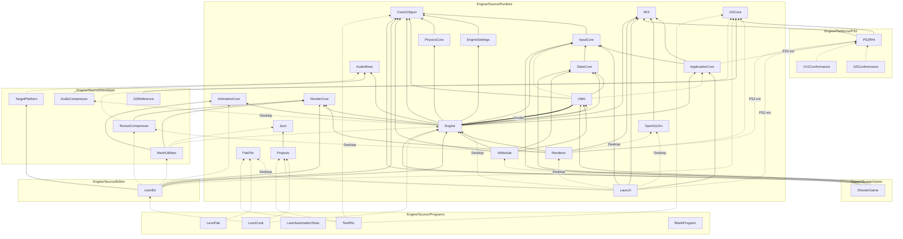

# LeonEngine — architecture

As-built module layout, dependencies and runtime flow. LeonEngine mirrors the **Unreal Engine 4.27**
source layout, module architecture and Epic naming, and is built with CMake through **LeonBuildTool**
(our UnrealBuildTool).

**Also:** [BUILD.md](BUILD.md) (LeonBuildTool reference) · [CODING_STANDARD.md](CODING_STANDARD.md) ·
[UnrealEngine427/](UnrealEngine427/README.md) (UE 4.27 knowledge base, [LeonMapping](UnrealEngine427/LeonMapping.md),
[NextSteps](UnrealEngine427/NextSteps.md)) · [SETUP.md](SETUP.md) · [TOOLS.md](TOOLS.md) · [LEVELS.md](LEVELS.md) ·
[ASSET_FORMATS.md](ASSET_FORMATS.md) · [LIBRARIES.md](LIBRARIES.md) · [TESTING.md](TESTING.md) · [README](../README.md)

---

## 1. Repository layout

```text
LeonEngine-PS2/
├── Engine/
│   ├── Build/                 # BatchFiles (Build, Clean, Rebuild, RunTests, RunGates, Cook, BuildCookRun, BotMatch,
│   │                          #   SmokeTest, MeasurePS2, FormatCode, Lint, …), Build.version (0.24.0)
│   ├── Config/                # BaseEngine.ini, BaseGame.ini, BaseInput.ini, BaseEditor.ini (first config layer)
│   ├── Content/               # engine content: .lasset packages (EngineMaterials, EngineResources, BasicShapes),
│   │                          #   .lmap maps (Maps: Entry, Template_Default, AxisTest)
│   ├── SourceArt/             # source files of the imported engine assets + ImportList.ini (outside Content, as UE)
│   ├── Shaders/               # GLSL of the desktop GS emulator (gs_emulator.*, gs_present.*)
│   ├── Source/
│   │   ├── Runtime/           # modules that ship in games
│   │   ├── Developer/         # tool-only modules (import, cook formats, the GS reference, target platforms)
│   │   ├── Editor/            # editor modules: LeonEd (factories, commandlets)
│   │   ├── Programs/          # standalone programs + LeonBuildTool and LeonHeaderTool (host tools)
│   │   ├── ThirdParty/        # external modules (<Lib>/<Lib>.Build.cmake)
│   │   └── LeonGame.Target.cmake
│   └── Platforms/PS2/         # PS2 platform extension: Source (Runtime halves + PS2RHI, Programs: GSConformance,
│                              #   VU1Conformance, the toolchain), Build (Docker, PCSX2, RunPCSX2 / MeasurePS2),
│                              #   Config (PS2Engine.ini), Documentation (Budgets.md, PS2SDK.md)
├── Game/ShooterGame/          # the game project, Win64 and PS2 (isolated; .lproj; Source, Content, SourceArt, Config;
│                              #   its own tests target; de_leon)
├── Docs/
├── CHANGELOG.md, SPEC.md
├── Setup.bat                  # pinned third-party downloads
├── Package.bat                # packages the Win64 and PS2 builds (Packages/ folders)
└── GenerateProjectFiles.bat
```

Every C++ module follows the UE anatomy: `<Module>/<Module>.Build.cmake`, `Public/` (headers other
modules may include), `Classes/` (public gameplay-class headers, UE convention), `Private/` (sources,
private headers, platform subfolders and `Tests/`). A module without those folders is *flat* (UE game
module style); `Game/ShooterGame/Source/ShooterGame` has `Public/` and `Private/` (UE ShooterGame's layout).

---

## 2. Layers

| Layer | Folder | Contents | May depend on |
| --- | --- | --- | --- |
| **Runtime** | `Engine/Source/Runtime` | Core, HAL, application, RHI, rendering, gameplay framework, … | Runtime, ThirdParty |
| **Developer** | `Engine/Source/Developer` | `MeshUtilities` (glTF import to mesh data, the LPS2 v2 build), `TextureCompressor` and `AudioCompressor` (the PS2 formats), `GSReference` (the software GS), `TargetPlatform` (the cook's platforms) | Runtime, Developer, ThirdParty |
| **Editor** | `Engine/Source/Editor` | `LeonEd` (factories, reimport, commandlets; UE: UnrealEd): `TYPE Editor`, desktop only, linked by programs and never by a game target (LeonBuildTool rejects it) | Runtime, Developer, Editor, ThirdParty |
| **Programs** | `Engine/Source/Programs` | `LeonCook`, `LeonPak`, `LeonAutomationTests`, `TestPAL`, `BlankProgram`; host tools that are not modules: `LeonBuildTool` (CMake scripts) and `LeonHeaderTool` (the reflection generator, [README](../Engine/Source/Programs/LeonHeaderTool/README.md)) | anything |
| **ThirdParty** | `Engine/Source/ThirdParty` | External modules (`TYPE External`): GLFW, Glad, STB, MiniAudio, CGLTF, MeshOptimizer | — |
| **Platform extension** | `Engine/Platforms/PS2` | PS2 halves of `Core`, `ApplicationCore`, `AudioMixer`, `Engine`, `Launch` and `Renderer` + the `PS2RHI` module; the PS2 programs `GSConformance` and `VU1Conformance`; toolchain, Docker image, `PS2Engine.ini` | same as the module it extends |
| **Plugins** | `Engine/Plugins`, `<Project>/Plugins` | plugin modules (`.lplugin` descriptors); the engine ships none | Runtime |
| **Game** | `Game/ShooterGame` | the `ShooterGame` primary game module (Win64 and PS2) + its `.Target.cmake` files | Runtime (never the other way) |

Rules:

- **No engine module references the game.** A project under `Game/` is only discovered when a build passes
  `-Project=…/<Project>.lproj`; engine sources never include its headers (the names appear only in usage lines and in
  the batch files that build the projects: `RunTests.bat`, `Lint.bat`, `SmokeTest.bat`).
- **Platform code lives in platform folders only**: `Private/Windows`, `Private/Desktop`
  inside a module, or the extension under `Engine/Platforms/PS2` (e.g. `PS2AsyncIO.cpp`, `PS2VectorMath.cpp`,
  `PS2AudioHardware.cpp`, `PS2SaveGameSystem.cpp`, `PS2RendererModule.cpp`). LeonBuildTool drops source folders named
  after a platform or group that does not apply (a `Windows/` folder never compiles on PS2), and only
  discovers `Engine/Platforms/<P>/Source` when building for `<P>`.
- **Extension merge**: `Engine/Platforms/PS2/Source/Runtime/Core` is merged into `Engine/Source/Runtime/Core`
  (same relative path); its `Core_PS2.Build.cmake` uses `leon_module_extend(Core …)` to add PS2-only
  dependencies / system libraries. Extension `Public/` headers sit at the root of `Public/` (e.g.
  `PS2PlatformMemory.h`), which is what `COMPILED_PLATFORM_HEADER` expects for extensions.

---

## 3. Build model (summary)

Full reference: [BUILD.md](BUILD.md).

- `leon_module(<Name> …)` in `<Module>.Build.cmake` declares `PUBLIC_DEPENDENCIES`, `PRIVATE_DEPENDENCIES`,
  `CIRCULAR_DEPENDENCIES` (UE `CircularlyReferencedDependentModules`, propagated like public ones),
  `PLATFORMS` allow-list and `_<Platform|Group>` suffixed variants (`PRIVATE_DEPENDENCIES_Desktop`).
- Platforms: **Win64** (groups `Windows Microsoft Desktop`, C++17; the development and editor platform) and **PS2**
  (`PS2 Console`, C++17, extension, built in the pinned ps2dev Docker image; the target platform). They are the only
  platforms LeonBuildTool registers.
- A module library's C++ standard is the **lowest** standard among the platforms it is allowed on, and the launch
  module compiled into an executable uses the platform's standard. Every platform registers C++17 (like UE 4.27), so
  every module and executable compiles as C++17.
- Linking is always **static** (`IS_MONOLITHIC=1`). For each target, LeonBuildTool resolves the module
  closure from `Core` + the launch module + `EXTRA_MODULE_NAMES` (+ enabled plugin modules), builds every
  module except the launch module as a static library `Module.<Name>`, compiles the **launch module straight
  into the executable** with the target macros (`WITH_ENGINE`, `IS_PROGRAM`, `WITH_DEV_AUTOMATION_TESTS`,
  `LEON_TARGET_NAME`, `LEON_PROJECT_NAME`), and generates `<Target>.ModuleInit.gen.cpp` (see §8).
- Shared module libraries never see target macros; only the launch module does.

### Targets

| Target | File | Type | Platforms | Launch module | Roots / notes |
| --- | --- | --- | --- | --- | --- |
| `LeonGame` | `Engine/Source/LeonGame.Target.cmake` | Game | Win64 | `Launch` | `Engine AIModule`; `WITH_ENGINE=1`; creates `GEngine` and opens a map (`LeonGame [<map>]`, `-map=<map>`) |
| `ShooterGame` | `Game/ShooterGame/Source/ShooterGame.Target.cmake` | Game | Win64, PS2 | `Launch` | project module `ShooterGame` (→ `Engine`, `AIModule`); `WITH_ENGINE=1`; opens `/Game/Maps/de_leon` |
| `ShooterGameTests` | `Game/ShooterGame/Source/ShooterGameTests.Target.cmake` | Program | Win64 | `LeonAutomationTests` | the engine's test runner + `ShooterGame`, `Renderer`, `LeonEd`; `COLLECT_AUTOMATION_TESTS` with `AUTOMATION_TEST_MODULES ShooterGame`: only the project's tests, run with the project's config |
| `LeonCook` | `Engine/Source/Programs/LeonCook/` | Program | Desktop | `LeonCook` | `Engine`, `LeonEd` (→ `TargetPlatform`), no renderer or RHI; `LeonCook [<Project>.lproj] -run=<Commandlet>` makes the `U<Name>Commandlet` class and calls `Main` (UE: `UE4Editor-Cmd`) |
| `LeonPak` | `Engine/Source/Programs/LeonPak/` | Program | Desktop | `LeonPak` | `PakFile`; creates, lists, tests and extracts `.lpak` files (UE: UnrealPak) |
| `LeonAutomationTests` | `Engine/Source/Programs/LeonAutomationTests/` | Program | Desktop | `LeonAutomationTests` | every desktop Runtime / Developer / Editor module except `Launch`; `COLLECT_AUTOMATION_TESTS` |
| `TestPAL` | `Engine/Source/Programs/TestPAL/` | Program | all | `TestPAL` | `Core`, `CoreUObject`, `Projects` (→ `Json`), `PakFile`; `COLLECT_AUTOMATION_TESTS`; runs their automation tests (PS2 included) and logs the reflection budget |
| `BlankProgram` | `Engine/Source/Programs/BlankProgram/` | Program | all | `BlankProgram` | starts the module table and prints the platform (`Lint.bat` builds it for Win64) |
| `GSConformance` | `Engine/Platforms/PS2/Source/Programs/GSConformance/` | Program | PS2 | `GSConformance` | `GSCore`, `PS2RHI`; draws GSCore's conformance scenes on the GS, to compare with the reference (GSReference) |
| `VU1Conformance` | `Engine/Platforms/PS2/Source/Programs/VU1Conformance/` | Program | PS2 | `VU1Conformance` | `GSCore`, `PS2RHI`; runs vertex batches through the VU1 microprograms and compares their GS writes with the C++ emitter's |

Module closures in practice:

- **PS2 `ShooterGame`**: `Launch`, `ShooterGame` and what they reach on PS2 — `Engine`, `Renderer` and `PakFile`
  (every game target adds them), `UMG`, `AIModule`, `CoreUObject`, `InputCore`, `ApplicationCore`, `RHI`, `PS2RHI`,
  `GSCore`, `AudioMixer`, `Projects`, `Json`, …; no Developer modules.
- **Win64 `LeonGame`**: everything reachable from `Launch` (desktop private deps `Engine` and `PakFile`) +
  `AIModule` — every desktop Runtime module (`CoreUObject`, `Json`, `Projects` and `PakFile` included), and of the
  Developer modules only `TextureCompressor` and `AudioCompressor` (the desktop draws and plays uncooked content as the
  PS2 cook makes it); no plugin (the engine ships none).

---

## 4. Module dependency graph

Built from the `*.Build.cmake` files. Every module depends on **Core** (edges to Core omitted);
third-party modules are listed in the next table.


```mermaid
flowchart BT
  subgraph Runtime [Engine/Source/Runtime]
    CoreUObject
    InputCore
    RHI
    GSCore
    ApplicationCore
    OpenGLDrv
    Launch
    Projects
    Json
    PakFile
    EngineSettings
    PhysicsCore
    AnimationCore
    AudioMixer
    RenderCore
    Renderer
    SlateCore
    UMG
    Engine
    AIModule
  end
  subgraph Developer [Engine/Source/Developer]
    MeshUtilities
    TargetPlatform
    TextureCompressor
    AudioCompressor
    GSReference
  end
  subgraph Editor [Engine/Source/Editor]
    LeonEd
  end
  subgraph Programs [Engine/Source/Programs]
    LeonCook
    LeonPak
    LeonAutomationTests
    TestPAL
    BlankProgram
  end
  subgraph PS2Ext [Engine/Platforms/PS2]
    PS2RHI
    GSConformance
    VU1Conformance
  end
  subgraph GameProject [Game/ShooterGame]
    ShooterGame
  end

  InputCore --> CoreUObject
  EngineSettings --> CoreUObject
  ApplicationCore --> InputCore
  ApplicationCore --> RHI
  ApplicationCore -. "PS2 ext" .-> PS2RHI
  OpenGLDrv --> RHI
  PS2RHI --> RHI
  Launch --> InputCore
  Launch --> ApplicationCore
  Launch --> RHI
  Launch -. "Desktop" .-> Engine
  Launch -. "Desktop" .-> Renderer
  Launch -. "Desktop" .-> OpenGLDrv
  Launch -. "PS2 ext" .-> PS2RHI
  Renderer --> RHI
  Renderer --> RenderCore
  Renderer --> Engine
  Renderer -.-> GSCore
  Renderer -. "Desktop" .-> OpenGLDrv
  Renderer -. "Desktop" .-> TextureCompressor
  Renderer -. "PS2 ext" .-> PS2RHI
  PS2RHI --> GSCore
  GSReference --> GSCore
  GSConformance -.-> PS2RHI
  VU1Conformance -.-> PS2RHI
  PhysicsCore --> CoreUObject
  SlateCore --> InputCore
  UMG --> CoreUObject
  UMG --> SlateCore
  UMG -.-> ApplicationCore
  UMG -.-> InputCore
  UMG == "circular" ==> Engine
  Engine --> CoreUObject
  Engine --> EngineSettings
  Engine --> InputCore
  Engine --> ApplicationCore
  Engine --> RHI
  Engine --> RenderCore
  Engine --> UMG
  Engine --> PhysicsCore
  Engine --> AnimationCore
  Engine --> AudioMixer
  Engine --> SlateCore
  AIModule --> CoreUObject
  AIModule --> Engine
  AIModule --> UMG
  AIModule --> SlateCore
  MeshUtilities --> RenderCore
  MeshUtilities --> AnimationCore
  MeshUtilities -.-> Engine
  MeshUtilities -.-> Json
  LeonEd --> CoreUObject
  LeonEd --> Engine
  LeonEd --> TargetPlatform
  LeonEd --> RenderCore
  LeonEd -.-> AnimationCore
  LeonEd -.-> MeshUtilities
  LeonEd -.-> TextureCompressor
  LeonEd -.-> GSCore
  TextureCompressor --> RenderCore
  TextureCompressor -.-> GSCore
  AudioCompressor --> AudioMixer
  Engine -. "Desktop" .-> AudioCompressor
  TargetPlatform -.-> AudioMixer
  LeonCook -.-> Engine
  LeonCook -.-> LeonEd
  LeonCook -.-> Projects
  Projects --> Json
  Launch -.-> Projects
  Launch -. "Desktop" .-> PakFile
  LeonPak -.-> PakFile
  TestPAL -.-> PakFile
  ShooterGame --> CoreUObject
  ShooterGame --> InputCore
  ShooterGame --> Engine
  ShooterGame --> UMG
  ShooterGame --> SlateCore
  ShooterGame -.-> AIModule
  TestPAL -.-> CoreUObject
  TestPAL -.-> Projects
  TestPAL -.-> GSCore
```

Solid = `PUBLIC_DEPENDENCIES`, dashed = `PRIVATE_DEPENDENCIES` (label = platform suffix or extension file),
thick = `CIRCULAR_DEPENDENCIES`. `Projects` (→ `Json`) is a private dependency of `Launch`, which loads the
`.lproj` in `PreInit`; every game target therefore links both, on every platform. `LeonAutomationTests` and
`BlankProgram` depend on Core only, `TestPAL` on Core, CoreUObject, Projects, PakFile and GSCore;
`LeonAutomationTests` links the modules it tests through its target's module list.
`PakFile` (P16) depends on Core only and builds for every platform; the desktop `Launch` links it to mount the paks
before the config loads, every game target links it on every platform, and `TestPAL` links it for its tests. `TargetPlatform` (Developer)
depends on Core; `LeonEd` links it for the cook. `CoreUObject` depends on Core only; since P12 the gameplay modules are
reflected and depend on it: `Engine` and
`AIModule`, and `UMG` (`UUserWidget`); since P13 also `EngineSettings` (the config classes) and `InputCore` (the
reflected `FKey`), and since N30f `PhysicsCore` (`UPhysicalMaterial`), so every game target links it, the PS2 one
included. `AnimationCore` is plain data again since P14:
the anim instances moved to Engine with the animation assets. `Launch` links
the desktop RHI (`OpenGLDrv`) because `FEngineLoop::PreInit` starts it (`RHIInit`). A module with a circular dependency on a
reflected one (UMG on Engine) waits for that module's LeonHeaderTool step (`LeonHeaderTool.<Module>` target), since a
circular edge does not order the build.

**Engine and the Renderer (P13, UE's render boundary).** Engine never includes a Renderer header and does not depend
on it: it declares the interfaces in its own headers (`SceneInterface.h`, `PrimitiveSceneProxy.h`,
`LightSceneProxy.h`, `RendererInterface.h`, `SceneView.h`, `CanvasTypes.h`) and reaches the implementation by module
name (`GetRendererModule()`, `FModuleManager::LoadModuleChecked<IRendererModule>("Renderer")`). The Renderer depends on
Engine and implements them; every engine target links it (LeonBuildTool adds it with `Engine` and `PakFile`), and so
does `LeonAutomationTests`. In a target without the Renderer, worlds get no scene and Engine runs without drawing.

**Include-only dependency on Launch:** the launch module is compiled into the executable, not into a
library, so a module that depends on it (to reach `GEngineLoop`, say) only receives Launch's public include paths
and `LAUNCH_API`; the symbols resolve when the executable links. No module depends on it today.

### Third-party and system libraries

| Library | Used by (public / private) | Platforms |
| --- | --- | --- |
| GLFW | private: ApplicationCore (`_Desktop`) | Desktop |
| STB | private: LeonEd (`stb_image`, the texture factory: the only image decoder; `stb_truetype`, the TrueType font factory: the only font reader) | Desktop (header-only) |
| Glad | private: OpenGLDrv, Renderer | Desktop |
| MiniAudio | private: AudioMixer | Desktop |
| CGLTF | private: MeshUtilities (glTF, the only mesh format) | Desktop |
| MeshOptimizer | private: MeshUtilities (the LPS2 v2 build; no game target links it) | Desktop |
| System libs | Core: `psapi ole32` (Windows), `patches kernel` (PS2); OpenGLDrv: `dxgi` (Windows); ApplicationCore: `pad` (PS2); AudioMixer: `audsrv` (PS2, with `audsrv.irx` staged); Engine: `mc` (PS2, the memory card); PS2RHI: `draw graph dma kernel` | — |

---

## 5. Modules

| Module | Role | Key types | Platforms |
| --- | --- | --- | --- |
| **Core** | HAL, memory, assertions, templates, containers, strings / names / text, logging, delegates, automation tests, math, platform file layer, archives, paths, config, command line, misc types (GUID, MD5, date / time), module manager, ticker, engine exit flag | `FPlatformMemory`, `FPlatformTime`, `FPlatformMath`, `FPlatformMisc`, `FPlatformProcess`, `FPlatformProperties`, `FMemory`, `FMallocBinned`, `LLM_SCOPE`, `FMemStack`, `FScratchpad`, `FVectorMath` (VU0 on the PS2), cycle stats (`SCOPE_CYCLE_COUNTER`), `TArray`, `TMap`, `TSet`, `FString`, `FName`, `FText`, `TDelegate`, `UE_LOG`, `GLog`, `FAutomationTestFramework`, `FMath`, `FVector`, `FRotator`, `FQuat`, `FMatrix`, `FTransform`, `IPlatformFile`, `IAsyncReadFileHandle` / `IAsyncReadRequest` / `FAsyncIOSystem` (the asynchronous reads, N24), `FPlatformFileManager`, `IFileManager`, `FArchive`, `FMemoryReader`, `FMemoryWriter`, `FPaths`, `FFileHelper`, `FConfigCacheIni` / `GConfig`, `FCommandLine`, `FParse`, `FApp`, `FGuid`, `FMD5`, `FSHA1`, `FDateTime`, `FOutputDeviceFile`, `FModuleManager`, `FTicker` | all |
| **CoreUObject** | `UObject` and its reflection: object model, classes / structs / enums / functions, properties, object creation and lookup, the object array, casts, the runtime side of LeonHeaderTool's generated code; garbage collection, weak / strong / soft references, `UPROPERTY(Config)`, `UFUNCTION(Exec)`; packages: `.lasset` / `.lmap` saving, synchronous loading and asynchronous loading (N24, over Core's asynchronous reads) with tagged properties, bulk data and long package names ([README](../Engine/Source/Runtime/CoreUObject/README.md), [ASSET_FORMATS](ASSET_FORMATS.md#packages--lasset--lmap)) | `UObject`, `UClass`, `UScriptStruct`, `UEnum`, `UFunction`, `UPackage`, `FProperty` (+ every property type), `FObjectInitializer`, `NewObject`, `FindObject`, `GUObjectArray`, `TObjectIterator`, `Cast`, `TSubclassOf`, `CollectGarbage`, `FGCObject`, `FReferenceCollector`, `TWeakObjectPtr`, `TStrongObjectPtr`, `FSoftObjectPath`, `TSoftObjectPtr`, `LoadConfig` / `SaveConfig`, `CallFunctionByNameWithArguments`, `UPackage::SavePackage`, `LoadPackage`, `LoadObject`, `LoadPackageAsync` / `ProcessAsyncLoading` / `FlushAsyncLoading`, `FLinkerLoad` / `FLinkerSave`, `FPropertyTag`, `FByteBulkData`, `FPackageName` | all |
| **InputCore** | Keys: the reflected `FKey` (named by an `FName`, config text `Key=SpaceBar`) and their details | `FKey`, `EKeys`, `FKeyDetails`, `FInputCoreModule` | all |
| **EngineSettings** | The project's map, game mode and general settings as config classes | `UGameMapsSettings`, `FGameModeName`, `UGeneralProjectSettings` | all |
| **ApplicationCore** | Platform application, windows, gamepad input (the DualShock on every platform: a desktop gamepad reads as one, through libpad's bytes and dead zone) | `GenericApplication`, `FGenericWindow`, `IInputInterface` (controller ids, `FForceFeedbackValues`), `FDualShockAnalog`, `FDualShockConnection`, `FDualShockForceFeedback`, `FDualShockPressure`, `FPlatformApplicationMisc`; desktop `FGLFWApplication`, `FGLFWWindow`, `FGLFWInputInterface`; PS2 ext `FPS2Application`, `FPS2Window`, `FPS2InputInterface` | all |
| **RHI** | Graphics backend interface + opaque GPU handle ids | `RHIInit` / `RHIExit`, `FDynamicRHI`, `GDynamicRHI`, `FRHIGPUMemoryStats`, `FRHITextureId` … | all |
| **GSCore** | The Graphics Synthesizer's contract (Leon; [plan](PLANS/ps2-gs-parity.md)): its registers and formats as in the GS User's Manual (chapter 7), encoded and decoded, and the command list the renderer fills and every backend consumes (register writes in order, image uploads), limited to what every backend reproduces; the list as a GIF packet (PACKED A+D writes, IMAGE transfers), appended to an array or written as the VIF1 DMA source chain the PS2 sends (CNT / REF / END with DIRECT, and each vertex batch as the platform's `IGSVertexBatchEncoder` writes it: [ps2-shipping](PLANS/ps2-shipping.md) N14); the vertex batch command (`FGSVertexDraw`, `FGSVertexBatch`: a LPS2 v2 batch with its transforms, material and lights) and the C++ emitter that is its reference (`FGSPrimitiveEmitter`: transform, lighting, clipping, guard band, back faces, strips); the GS conformance scenes the reference's tests check and GSConformance draws on the PS2; the drawing environment every backend shares (buffers, size, pixel mapping, depth test); the 4 MB local memory laid out as the GS's (pages, blocks and columns with each storage format's tables, manual chapter 8) with its transfers, and the texel decoder (formats, CLUTs, wrap modes) the reference and the emulator share; debug text (5x7 glyphs) and rectangles recorded as sprites, which every backend draws (the PS2 error screen, GSConformance); the television modes and the frame pacing in fields (which vertical blank shows a frame) | `EGSRegister`, `EGSPixelFormat`, `FGSPrim`, `FGSRGBAQ`, `FGSXYZ`, `FGSTex0`, `FGSTex1`, `FGSAlpha`, `FGSTest`, `FGSFrame`, `FGSZBuf`, `FGSDimx`, `GSToFixed4`, `FGSCommandList`, `FGSGifPacket`, `FGSVertexBatch`, `FGSVertexDraw`, `FGSPrimitiveEmitter`, `IGSVertexBatchEncoder`, `GSConformance::GetScenes`, `FGSDrawEnvironment`, `FGSLocalMemory`, `FGSTexelDecoder`, `FGSClutBuffer`, `FGSTextureLayout`, `FGSDebugDraw`, `EGSDmaTag`, `EGSVifCommand`, `EGSVideoMode`, `FGSFieldPacer` | all |
| **GSReference** (Developer) | A software Graphics Synthesizer ([plan](PLANS/ps2-gs-parity.md), P2): executes an `FGSCommandList` into a 4 MB local memory by the GS User's Manual's rules (drawing rules, texture sampling, CLUTs, fog, pixel tests, blending, dithering, frame buffer writes, transfers); the oracle the desktop GS emulator and the PS2 backend are compared with | `FGSReferenceRasterizer` | Desktop |
| **TextureCompressor** (Developer) | A texture's platform data for a cook (UE: TextureCompressor and the TextureFormat modules): the PS2's paletted textures, powers of two up to 256, PSMT4 / PSMT8 with a deterministic median cut ([ps2-engine](PLANS/ps2-engine.md) E3) | `FPalettedTextureBuilder`, `FPalettedTexture` | Desktop |
| **AudioCompressor** (Developer) | A sound's platform data for a cook (UE: the AudioFormat modules, AudioFormatADPCM): the SPU2's ADPCM, 16-byte blocks of 28 samples, each block's filter and shift searched against the decoder, mono, resampled by a windowed sinc to the sound's rate (22 050 Hz for effects), the loop on a block, the same bytes every run ([ps2-shipping](PLANS/ps2-shipping.md) N19); the desktop game uses it for uncooked sounds | `FSpuAdpcmEncoder`, `FSpuAdpcmSettings`, `FSpuAdpcmCompressed` | Desktop |
| **OpenGLDrv** | OpenGL 3.3 RHI device (the GS emulator's context) | `FOpenGLDynamicRHI` | Desktop |
| **PS2RHI** | The Graphics Synthesizer's display and frame (platform extension module): the frame's `FGSCommandList`s sent to VIF1 as one double-buffered DMA chain, their GS writes by DIRECT and their vertex batches to VU1's microprograms (`FPS2VU1`, `Private/VU1/VU1Programs.vsm`, `Skinned.vsm`); the vertical blank by interrupt ([README](../Engine/Platforms/PS2/Source/Runtime/PS2RHI/README.md)) | `FPS2RHI`, `FPS2DynamicRHI`, `FPS2VU1`, `FPS2VU1BatchEncoder`, `FPS2VerticalBlank` | PS2 |
| **Launch** | Entry points and engine loop | `GuardedMain`, `FEngineLoop` (an `IEngineLoop` with the engine), `GEngineLoop` | all |
| **Projects** | `.lproj` / `.lplugin` descriptors (UE `.uproject` / `.uplugin` fields), current project, plugin discovery | `FProjectDescriptor`, `FPluginDescriptor`, `FModuleDescriptor`, `FPluginReferenceDescriptor`, `IProjectManager`, `IPluginManager`, `IPlugin` | all |
| **PakFile** | `.lpak` files (P16; UE: PakFile): the format, the reader, the platform file that mounts them in the chain, and the writer LeonPak uses ([ASSET_FORMATS.md](ASSET_FORMATS.md#paks--lpak)) | `FPakInfo`, `FPakEntry`, `FPakIndexEntry`, `FPakFile`, `FPakPlatformFile`, `FPakWriter`, `FPakInputPair`, `LogPakFile` | all |
| **Json** | Native JSON DOM, streaming reader / writer, serializer (UE API, no exceptions) | `FJsonObject`, `FJsonValue`, `TJsonReader`, `TJsonWriter`, `FJsonSerializer` | all |
| **PhysicsCore** | Physics types: hits and queries, bodies, collision responses, triangle-mesh collision, the AABB tree of the broadphase (N16), physical materials (N30f) | `FHitResult`, `FBodyInstance`, `EBodyCollisionShape`, `FCollisionQueryParams`, `FCollisionShape`, `FTriangleMeshCollision`, `FAabbTree`, `UPhysicalMaterial`, `EPhysicalSurface` | all |
| **AnimationCore** | The plain skeletal data under Engine's animation assets, which the glTF import produces, the animation keys' compression and the pose operations (P14, [ps2-shipping](PLANS/ps2-shipping.md) N21, N25; UE's AnimationCore holds the low-level animation types) | `FReferenceSkeleton`, `FSkinWeightInfo`, `FRawAnimSequenceTrack`, `FRawAnimNotify`, `FRawAnimSequence`, `FCompressedAnimSequence`, `FQuantizedQuat48`, `FAnimCompression`, `FAnimCompressionSettings`, `FAnimationRuntime`, `FBlendSpaceTriangulation`, `FBlendSampleData` | all |
| **AudioMixer** | Audio device over the SPU2's model on every platform ([ps2-shipping](PLANS/ps2-shipping.md) N19, [Audio](#audio)): SPU2 ADPCM buffers resident in its 2 MB (a stack, as audsrv allocates it), 24 hardware voices (2 for music, 4 kept for sounds above the default priority), the volume and pan of each voice computed from the listener with audsrv's steps; the format and its decoder; the platform's `FAudioHardware` carries it out (audsrv's voices on the PS2; on the desktop the buffers decoded and the voices mixed on the CPU by `FSoftwareAudioMixer` into miniaudio's `FAudioOutput`) | `FAudioDevice`, `EUISound`, `FSpuAdpcm`, `FSpuAdpcmSound`, `FSpuVoiceVolume`, `FAudioHardware`, `FSoftwareAudioMixer`, `FAudioOutput` (desktop) | all |
| **RenderCore** | CPU-side render data, UE view matrices, the GL clip-space adapter; the tests' legacy data converter | `FMeshData`, `FMeshSection`, `FVertex`, `FLPS2Mesh` (LPS2 v2: a mesh's render data, static or skinned), `FVisibilityCellGraph` (cells and portals, N15), `FFrustum` (over Core's `FBox` / `FPlane`), `FMaterial` (`MaterialShared.h`: the values a material gives the renderer), `EMaterialLightingModel`, `EPixelFormat` (`PixelFormat.h`), `MakeViewMatrix` / `MakeLookAtView` (`ViewMatrices.h`), `ToGLClipSpace` (`GLClipSpace.h`), `EShaderReloadResult` (`ShaderCore.h`); for the tests only, `FLegacyCoordinateConversion` (`Public/Tests`) | all |
| **Renderer** | The renderer module (§12): the scene (`FScene`, its cells and portals) and the GS scene renderer, which records every frame as an `FGSCommandList` (GS register writes and VU1 vertex batches); on PS2 it goes to `PS2RHI`'s DMA chain (`Renderer_PS2.Build.cmake`), on the desktop to the OpenGL GS emulator. Only its module interface is public (Engine's `IRendererModule`) | `FScene`, `FGSSceneRenderer`, `FSceneRenderList` (the scratchpad's frame lists), `FGSTextureCache`, `FWorldEffectsGeometry`; desktop `FRendererModule`, `FGSOpenGLEmulator`, `FShader`; PS2 `FPS2RendererModule`; `LogRenderer` | all |
| **SlateCore** | The UI's primitives UMG uses: text justification, layout, geometry, input events and the navigation keys | `ETextJustify`, `FMargin` (`Layout/Margin.h`), `EHorizontalAlignment` / `EVerticalAlignment`, `EUINavigation` / `EUINavigationAction` (`Types/SlateEnums.h`), `FGeometry`, `FReply`, `FKeyEvent` / `FPointerEvent` (`Input/`), `FNavigationConfig` (UE's, from Slate) | all |
| **UMG** | Widgets (UObjects since P12) as UE's widget tree; no Slate behind them: the widgets take input themselves (Slate's handlers), the user widget routes it and holds the focus ([ps2-polish](PLANS/ps2-polish.md) P5) | `UWidget` (`ESlateVisibility`, `Slot`, `GetDesiredSize`, `Paint`, `GetCachedGeometry`, focus and navigation rules, `OnKeyDown` ...), `UPanelWidget` / `UPanelSlot`, `UContentWidget`, `UBorder`, `UVerticalBox` / `UVerticalBoxSlot`, `UHorizontalBox` / `UHorizontalBoxSlot`, `UCanvasPanel` / `UCanvasPanelSlot`, `UWidgetSwitcher`, `UButton`, `UTextBlock`, `UImage`, `UProgressBar`, `UTableView`, `UUserWidget`, `UWidgetTree`, `FPaintContext`, `FHittestGrid`, `FSlateBrush`, `FSlateFontInfo`, `FButtonStyle` | all |
| **Engine** | The engine object and maps (`.lmap`, P15), gameplay framework as UObjects (P12), world, levels as actors (P13), the fixed step, tick groups and timers (N18), input, the viewport client and the console (P13), physics scene and its broadphase (N16), save games (N24), the asset classes and their import data (P14), the render interfaces (P13) | `UEngine` / `GEngine`, `UGameEngine`, `IEngineLoop`, `FFixedStepClock`, `FTickTaskManager`, `FTimerManager`, `FPhysSceneBroadphase`, `UPhysicsSettings`, `AVisibilityCellVolume`, `AVisibilityPortal`, `FURL`, `UGameViewportClient`, `FViewport`, `UPlayer`, `ULocalPlayer`, `UGameInstance` / `FWorldContext`, `UWorld`, `ULevel`, `FActorSpawnParameters`, `AActor`, `AInfo`, `UActorComponent`, `USceneComponent`, `UPrimitiveComponent`, `UShapeComponent`, `UCapsuleComponent`, `UBoxComponent`, `USphereComponent`, `UMeshComponent`, `UStaticMeshComponent`, `USkeletalMeshComponent`, `UCameraComponent`, `USpringArmComponent`, `UMovementComponent`, `UPawnMovementComponent`, `UCharacterMovementComponent`, `APawn`, `ACharacter`, `AController`, `APlayerController`, `AGameModeBase`, `AGameMode` (`MatchState`), `AGameStateBase`, `AGameState`, `APlayerState`, `AHUD`, `APlayerCameraManager`, `UForceFeedbackEffect` (N24), `USaveGame`, `ISaveGameSystem` / `FGenericSaveGameSystem` / `FMemoryCardSaveGameSystem` / `IPlatformFeaturesModule` (N24), `ADefaultPawn`, `UFloatingPawnMovement`, `URotatingMovementComponent`, `UInputSettings`, `UPlayerInput`, `UInputComponent`, `UGameplayStatics`, `FPhysScene`, `UNavigationSystem`; `AStaticMeshActor`, `APlayerStart`, `ATargetPoint`, `AVolume`, `ATriggerVolume`, `ABlockingVolume`, `APainCausingVolume`, `ALight`, `ADirectionalLight`, `APointLight`, `ULightComponent` (+ base, local, directional, point), `AWorldSettings`, `ACameraActor`, `ANavigationWaypoint`; `UTexture` / `UTexture2D` / `UTextureCube`, `UStaticMesh` (`FStaticMeshLODResources`, `FTriMeshCollisionData`, `FStaticMaterial`, `IMeshBuilderModule`), `UBodySetup` (`FKAggregateGeom`, `FKBoxElem`, `ECollisionTraceFlag`), `UMaterialInterface` / `UMaterial` (`EMaterialShadingModel`), `USkeleton`, `USkeletalMeshSocket`, `USkeletalMesh`, `UAnimationAsset`, `UAnimSequenceBase`, `UAnimSequence`, `UAnimMontage`, `UAnimNotify`, `UBlendSpaceBase`, `UBlendSpace1D`, `UBlendSpace`, `UAimOffsetBlendSpace1D`, `UAnimInstance`, `UCharacterAnimInstance`, `USoundBase` / `USoundWave`, `UDataAsset`, `UCommandlet`, `UAssetImportData` (`FAssetImportInfo`); `FDebugDraw`, `FDebugOverlay`; `FSceneInterface`, `FPrimitiveSceneProxy`, `FLightSceneProxy`, `IRendererModule`, `FSceneViewFamily`, `FSceneView`, `FCanvas`; `LogEngine`, `LogLevel`, `LogPath`, `LogPhysics`, `LogSpawn`, `LogWorld` (`EngineLogs.h`) | all |
| **AIModule** | AI controller (a UObject actor), behavior trees over a typed blackboard, and senses | `AAIController`, `UBehaviorTree`, `UBTComposite_Sequence`, `UBTComposite_Selector`, `UBTDecorator_Bool`, `UBTTask_Action`, `UBlackboardComponent`, `UPawnSensingComponent` (P20), `EPathFollowingStatus` | all |
| **MeshUtilities** | glTF import (static meshes, skinned meshes and their animations, scenes: the only mesh format since [ps2-shipping](PLANS/ps2-shipping.md) N21), the LPS2 v2 build of the meshes' render data, static and skinned (Developer; Engine's `IMeshBuilderModule`) | `FLPS2MeshBuilder`, `FStaticMeshBuilder`, `LoadStaticMeshFromGltf`, `LoadSkeletalMeshFromGltf`, `LoadAnimSequencesFromGltf`, `LoadGltfScene` (`FGltfScene`), `FImportCoordinateConversion` | Desktop |
| **TargetPlatform** | The platforms the cook targets (Developer, P16; UE: TargetPlatform): Win64 and PS2, both with the PS2's formats (paletted textures, SPU2 ADPCM sounds); only Win64 stages the shaders | `ITargetPlatform`, `ITargetPlatformManagerModule`, `GetTargetPlatformManager` / `GetTargetPlatformManagerRef` | Desktop |
| **LeonEd** | The editor module (Editor; UE: UnrealEd): asset factories, the map importer, reimport, the commandlets LeonCook runs (the cook by the book, P16) | `UFactory`, `UTextureFactory`, `UGLTFImportFactory`, `UGLTFMapFactory`, `UMapImportSettings`, `USoundFactory`, `UMaterialFactoryNew`, `UPhysicalMaterialFactoryNew`, `UBlendSpaceFactoryNew` / `UBlendSpaceFactory1D` / `UAimOffsetBlendSpaceFactory1D`, `UAnimMontageFactory`, `FReimportHandler`, `FReimportManager`, `UImportAssetsCommandlet`, `UResavePackagesCommandlet`, `UValidateAssetsCommandlet`, `UCookCommandlet`, `FAssetImportUtils`, `FStaticLightingSystem` (the baked vertex lighting, N22), `LogLeonEd` | Desktop |

---

## 6. Core: HAL and foundations

UE pattern: a generic implementation, a per-platform subclass, and a `HAL/` header that picks the current
platform through `COMPILED_PLATFORM_HEADER`.

```text
Core/Public/GenericPlatform/GenericPlatformMemory.h   struct FGenericPlatformMemory
Core/Public/Windows/WindowsPlatformMemory.h           struct FWindowsPlatformMemory : FGenericPlatformMemory
                                                      typedef FWindowsPlatformMemory FPlatformMemory;
Platforms/PS2/Source/Runtime/Core/Public/PS2PlatformMemory.h   (PS2 extension)
Core/Public/HAL/PlatformMemory.h                      #include COMPILED_PLATFORM_HEADER(PlatformMemory.h)
```

- LeonBuildTool defines `PLATFORM_<NAME>=1`, `LBT_COMPILED_PLATFORM=<HeaderName>` (UE `UBT_COMPILED_PLATFORM`)
  and `PLATFORM_IS_EXTENSION`. `HAL/PreprocessorHelpers.h` turns `COMPILED_PLATFORM_HEADER(PlatformMemory.h)`
  into `"Windows/WindowsPlatformMemory.h"` in-module, or `"PS2PlatformMemory.h"` for an extension.
- `HAL/Platform.h` defaults every `PLATFORM_*` macro to 0, includes the platform's `Platform.h`
  (`FPlatformTypes`, `PLATFORM_DESKTOP`, `PLATFORM_64BITS`, `FORCEINLINE`) and defines the global fixed-width
  types (`int32`, `uint64`, `SIZE_T`, `PTRINT`, …), `TCHAR` / `TEXT`, `LIKELY` / `UNLIKELY`, `PLATFORM_BREAK` and
  `LEON_PRINTF_FORMAT`. The EE is ILP32 (`PS2Platform.h`). **`TCHAR` is UTF-8 `char` on every platform**
  (`TEXT(x)` is `x`); `WIDECHAR` exists only for the Windows HAL.
- HAL structs: `FPlatformMemory::GetStats()` → `FPlatformMemoryStats`; `FPlatformTime::Cycles64()`,
  `GetSecondsPerCycle64()`, `CyclesToMicroseconds()` (integer, for the EE), `Seconds()`, the 32-bit `Cycles()` /
  `GetSecondsPerCycle()` of the cycle stats (QPC on Win64, the COP0 Count on the EE) and the CPU event counters
  (`NumPerfCounters`, `EnablePerfCounters`, `ResetPerfCounters`, `ReadPerfCounter`: none on the desktop, the EE's
  PCR0 / PCR1 counting the I$ and D$ misses);
  `FPlatformMath::Sin256` / `Cos256` (1/256-turn angles, PS2 uses a table) plus integer / bit helpers
  (`CountLeadingZeros`, `FloorLog2`, `RoundUpToPowerOfTwo`, …); `FPlatformMisc` (`LowLevelOutputDebugString`,
  `LocalPrint`, `IsDebuggerPresent`, `RequestExit` — a forced exit halts the EE on PS2); `FPlatformAtomics`
  (Windows intrinsics, PS2 the non-atomic generic version: Leon runs one EE thread);
  `FPlatformProperties::PlatformName()` and the `NamePool*` limits.
- `CoreTypes.h` → `HAL/Platform.h`, `Misc/Build.h` (`UE_BUILD_*` from `LEON_BUILD_<CONFIG>`, `DO_CHECK`,
  `DO_GUARD_SLOW`, `DO_ENSURE`, `NO_LOGGING` = Shipping), `Misc/CoreMiscDefines.h`. `CoreMinimal.h` includes the
  whole Core set below.
- Other Core services: `FTicker::GetCoreTicker()` (`FTickerDelegate`s with an optional delay, `FDelegateHandle`;
  return `false` to unregister), `IsEngineExitRequested()` / `RequestEngineExit()` (`CoreGlobals.h`).

### Core foundations (UE 4.27 API)

| Area | Headers | Notes |
| --- | --- | --- |
| Memory | `HAL/UnrealMemory.h`, `HAL/MallocBinned.h`, `HAL/LowLevelMemTracker.h`, `Misc/MemStack.h`, `Misc/Scratchpad.h` | `FMemory` over `GMalloc` = `FMallocBinned` on every platform, the memory tags (`LLM_SCOPE`) with their budgets, the frame's stack `FMemStack` and the scratchpad `FScratchpad`: see [Memory](#memory) below |
| Vector math | `Math/VectorMath.h` | `FVectorMath` (UE: `VectorMatrixMultiply`, `VectorTransformVector`, `FConvexVolume`'s permuted planes; [ps2-shipping](PLANS/ps2-shipping.md) N15): a matrix product, a matrix times a vector and a box's or a sphere's test against up to 8 planes kept four to a quadword (`FVectorPlaneSet`). On the PS2 it is VU0 in macro mode (COP2 from the EE: `LQC2`, `VMULA` / `VMADDA` into ACC, `SQC2`; `PS2VectorMath.cpp`), elsewhere its scalar reference `FVectorMathFPU`, the same sums in the same order. `FMatrix::operator*` and `TransformFVector4` go through it (so do the skeletal pose's palette products), and so does `FFrustum`. TestPAL compares VU0 with the reference within two units in the last place of the sum of each sum's products' magnitudes (measured in PCSX2: 2; VU0 accumulates in ACC, the FPU rounds each step) (`System.Core.Math.VectorMathVU0`) |
| Assertions | `Misc/AssertionMacros.h` | `check`, `checkf`, `verify`, `checkNoEntry`, `checkSlow`, … ; `ensure` / `ensureMsgf` / `ensureAlways` report once per call site through `GLog` |
| Templates / Algo | `Templates/*`, `Misc/Optional.h`, `Misc/EnumClassFlags.h`, `Algo/*` | `MoveTemp`, `TTuple` / `TPair`, `TUniquePtr`, `TSharedPtr` / `TSharedRef` / `TWeakPtr` (`ESPMode::NotThreadSafe` default), `TFunction` / `TUniqueFunction` / `TFunctionRef`, `Sort` / `StableSort`, `TOptional`, `ENUM_CLASS_FLAGS`, `Algo::BinarySearch`, heap |
| Containers | `Containers/*` | allocator policies, `TArray`, `TArrayView`, `TBitArray`, `TSparseArray`, `TSet`, `TMap` / `TMultiMap`; elements are relocated with `memmove` (UE rule: no self-pointers) |
| Strings | `Containers/UnrealString.h`, `StringConv.h`, `Misc/CString.h`, `Misc/Char.h`, `Misc/Crc.h` | `FString` (`==` / `<` / `GetTypeHash` ignore case, like UE), `FCString`, `FChar`, `FCrc`; `TCHAR_TO_UTF8` & co. are identities |
| Names / text | `UObject/NameTypes.h`, `Internationalization/Text.h` | `FName` (8 bytes, case-insensitive, numeric suffix, global pool sized by `FPlatformProperties::NamePool*`; exhausting it is fatal); minimal `FText` (no localization: `LOCTEXT` keeps the source text) |
| Logging | `Logging/LogMacros.h`, `LogCategory.h`, `Misc/OutputDevice*.h` | `UE_LOG` / `UE_CLOG`, categories (`LogTemp`, `LogCore`, `LogInit`, …); `GLog` redirects to stdout (EE console / PCSX2 log on PS2) and, on Windows, the debugger. Line format `Category: Verbosity: Message` (verbosity omitted for `Log`). Desktop also writes `<Project>/Saved/Logs/<Project>.log` (`FOutputDeviceFile`, flushed per line, the previous run kept as `<Project>-backup-<date>.log`); without a `.lproj`, `<Project>` is `Engine/Programs/<App>/` (runtime only, gitignored). Override with `-LogDir=` or `LEON_LOG_DIR` (`FPaths::ApplyLogDirectoryOverrides`). Verbosity comes from `[Core.Log]` and `-LogCmds="LogFoo Verbose, …"` (`FLogSuppressionInterface`) |
| Delegates | `Delegates/Delegate.h`, `IDelegateInstance.h` | `TDelegate`, `TMulticastDelegate` (`Broadcast` latest-first like UE4, removal during broadcast is safe, `Add` drops dead bindings), `DECLARE_DELEGATE*` / `DECLARE_MULTICAST_DELEGATE*` / `DECLARE_EVENT*`; static, lambda, raw, SP and `UObject` bindings (`BindUObject` / `AddUObject` hold a `TWeakObjectPtr`, named through `UObject/WeakObjectPtrTemplatesFwd.h`); no dynamic delegates |
| Console commands | `Misc/Exec.h`, `Misc/CoreMisc.h` | `FExec` (`Exec(UWorld*, Cmd, Ar)`), `FSelfRegisteringExec` / `FStaticSelfRegisteringExec` (`StaticExec` offers a command to every live handler); UObjects answer through `UObject::ProcessConsoleExec` |
| Automation tests | `Misc/AutomationTest.h` | `IMPLEMENT_SIMPLE_AUTOMATION_TEST`, `FAutomationTestBase`, `FAutomationTestFramework::RunTests(Filter, ExcludeFlags)`; an unexpected error logged during a test fails it |
| Math | `Math/UnrealMath.h` (from `CoreMinimal.h`) | UE 4.27's float math: `FMath` (constants, interpolation, `VRand`, line / box / plane helpers), `FVector`, `FVector2D`, `FVector4`, `FIntPoint`, `FIntVector`, `FRotator`, `FQuat`, `FMatrix` (row vectors, `V * M`) and the derived matrices (`FRotationMatrix`, `FTranslationMatrix`, `FScaleMatrix`, `FPerspectiveMatrix`, `FLookAtMatrix`, …), `FPlane`, `FBox`, `FBox2D`, `FSphere`, `FBoxSphereBounds`, `FTransform` (scalar), `FColor` / `FLinearColor`, `FRandomStream`. No `double` math; PS2 builds reject implicit float to double promotion |
| Files | `GenericPlatform/GenericPlatformFile.h`, `HAL/PlatformFilemanager.h`, `HAL/FileManager.h`, `Misc/FileHelper.h` | `IPlatformFile` (UE's layered chain; `FPlatformFileManager::Get().GetPlatformFile()` is the topmost, `FindPlatformFile(Name)` finds one), backends Windows (Win32) and PS2 (read-only newlib POSIX on `host:` and `cdrom0:`), `OpenAsyncRead` (the asynchronous reads of `FAsyncIOSystem`: the PS2's IO thread, Win64's game thread in the queue's order; ps2-shipping N24; sorted by offset and coalesced, N24b), and PakFile's `FPakPlatformFile` on top of them when a build has paks (§13); `IFileManager::Get()` opens buffered `FArchive` readers / writers and walks directories; `FFileHelper::LoadFileToString` / `LoadFileToArray` / `SaveStringToFile` (writes a temporary file, then moves it) |
| Archives | `Serialization/Archive.h`, `MemoryReader.h`, `MemoryWriter.h`, `BufferArchive.h`, `UObject/ObjectVersion.h`, `Misc/EngineVersion.h` | `FArchive` with `<<` for the scalars, `FString` (UTF-8, length + 1), `FName` / `FText` (as strings), `TArray` / `TSet` / `TMap` and the math types, and virtual `UObject*` / `GetLinker()` hooks that do nothing in a plain archive (CoreUObject's package linkers write `FName` as a name table index and `UObject*` as an `FPackageIndex`); `UEVer()` is the package format version (`ELeonPackageVersion`); `FMemoryReader`, `FMemoryWriter`, `FBufferArchive`; `FEngineVersion` |
| Paths | `Misc/Paths.h` | UE's `FPaths` over `FString` (`EngineDir`, `ProjectDir`, `ProjectContentDir`, `ProjectSavedDir`, `ProjectLogDir`, `Combine`, `/` operator, `NormalizeFilename`, `ConvertRelativePathToFull`, `MakePathRelativeTo`, …). Desktop directories are absolute and come from the generated module-init globals (`GLeonEngineDirFromBaseDir`, `GLeonProjectDirFromBaseDir`), except in a staged build (`IsStaged`, P16: UE's `../../../Engine/` and the project folder above `Binaries/`); PS2 uses the staged layout under the ELF folder (`<Base>/Engine/`, `<Base>/<Project>/`). (The legacy `ResolveLegacyContentPath` went in P15: the renderer takes its shaders from `EngineDir()` / `Shaders`.) |
| Command line | `Misc/CommandLine.h`, `Misc/Parse.h`, `Misc/App.h`, `HAL/PlatformProcess.h` | `FCommandLine::Set` / `Get` (built from `argv` in every `main`), `FParse::Param` / `Value` / `Token` / `Command` with UE's rules (`-` or `/` switches, quoted values, word boundaries), `FApp` (project name, build configuration), `FPlatformProcess::BaseDir()` (from `argv[0]` on PS2) |
| Config | `Misc/ConfigCacheIni.h` | `FConfigCacheIni` / `GConfig` with `GEngineIni`, `GGameIni`, `GInputIni`, `GEditorIni`. Layers (D8): `Engine/Config/Base.ini` → `Base<T>.ini` → `Engine/Platforms/<P>/Config/<P><T>.ini` → `<Project>/Config/Default<T>.ini` → `<Project>/Platforms/<P>/Config/<P><T>.ini` → `<Project>/Saved/Config/<Plat>/<T>.ini` (desktop only; `Flush` writes the user changes there: an array key as `!Key=ClearArray` plus one `.Key=Value` line a value, so the saved layer replaces the lower layers' array; `RemoveKey` / `EmptySection` are saved too; `Flush(true)` reloads a global file from its whole hierarchy). `+ - . !` array operators, quoted values, `-ini:Engine:[Section]:Key=Value` overrides |
| Misc types | `Misc/Guid.h`, `Misc/SecureHash.h`, `Misc/Crc.h`, `Misc/DateTime.h`, `Misc/Timespan.h` | `FGuid` (`NewGuid`, `NewDeterministicGuid` from MD5), `FMD5` / `FMD5Hash`, `FSHA1` / `FSHAHash` (the paks' hashes), `FCrc`, `FDateTime` / `FTimespan` (integer ticks, no double) |

### Memory

[ps2-shipping](PLANS/ps2-shipping.md) N17. The PC allocates the way the EE does: one allocator, the same tags and budgets,
the same frame's stack.

- **`GMalloc` = `FMallocBinned`** (UE: FMallocBinned; `HAL/MallocBinned.h`), made on the first `FMemory` call. Small
  blocks, up to 1 KB after alignment, come from 64 size classes 16 bytes apart; a class carves 4 KB pages from an
  arena reserved from the system heap at start-up (`FPlatformProperties::SmallBlockArenaSize`: 2 MB on the PS2, 16 MB
  on Win64), each page keeps its freed blocks in a list, and a page that empties goes back to the arena for any class:
  allocating and freeing are O(1) and deterministic. A larger alignment (64, 128, up to 1 KB) picks a class that is a
  multiple of it. Large blocks, and small ones once the arena is full (`ArenaOverflows`), come from `malloc` with a
  small header. `FMemory::GetUsage()` gives the current, peak and live bytes, the allocations since start-up (the
  churn per frame), the arena's pages in use and at most; `GetSizeClassStats` each class's blocks and pages.
  `QuantizeSize` returns the class size, so a `TArray` grows into its block. A spin lock guards it; the engine
  allocates from its one thread.
- **Memory tags** (UE: LLM; `HAL/LowLevelMemTracker.h`): `LLM_SCOPE(ELLMTag::X)` charges the allocations of a block to
  a tag (`EngineMisc` outside every scope, `UObject`, `LoadMapMisc`, `Textures`, `Meshes`, `Animation`, `Audio`,
  `Physics`, `AI`, `SceneRender`, `GameMisc`, `Temporary`, and `RenderLists`: the GS command lists and the frame's
  DMA chains, [ps2-shipping](PLANS/ps2-shipping.md) N14b); a scope is two stores, an allocation two additions and a
  compare. The allocator keeps each small block's tag in a byte per 16 bytes of the arena, a large block's in its
  header, and gives a freed block back to its own tag. Budgets come from `[Core.MemoryBudgets]` of the Engine config
  (KB per tag and `Total`, `WarningPercent`; PS2Engine.ini sets the EE's), loaded by `FEngineLoop::PreInit`: over the
  warning share logs once, over the budget is a fatal error that names the tag (a test's hook takes the events
  instead). Compiled out of Shipping (`ENABLE_LOW_LEVEL_MEM_TRACKER`).
- **The frame's stack** `FMemStack` (UE; `Misc/MemStack.h`): `PushBytes` bumps a pointer through 16 KB chunks of
  `GMalloc` (tagged `Temporary`), `FMemMark` gives back what was pushed after it, `TArray<T, TMemStackAllocator<>>` is
  a temporary array on it and `new (FMemStack::Get()) T` a temporary object. The chunks stay once popped, so a warm
  frame takes nothing from the heap. `FEngineLoop::Tick` ends the frame (`EndFrame`): a mark still open, or a
  `TMemStackAllocator` container still holding memory (a use after the frame), is an error; a mark that pops while a
  container allocated inside it holds memory too. Its users: the collision queries' hit arrays (the Single traces and
  the character's capsule traces), the player input's lists, the canvas's items and texts (its own mark), the scene
  renderer's impact marks, tracers and blob shadows, and the navigation's path search.
- **The scratchpad** `FScratchpad` ([ps2-shipping](PLANS/ps2-shipping.md) N15; `Misc/Scratchpad.h`): the EE's 16 KB of
  on-chip RAM at `0x70000000` (`FPlatformMemory::GetOnChipScratchpad`), read and written in a cycle outside the data
  cache, as a stack of the frame's hottest temporaries: `FScratchpadMark` gives back what was pushed after it,
  `TArray<T, TScratchpadAllocator<>>` is an array on it (the block at its top grows in place), and what does not fit
  goes to the frame's stack (counted: `GetNumOverflows`). Every platform has one of the same size (the PC a static
  buffer; the PS2 too with `-nospr`, to measure it), so what fits on the PS2 fits everywhere. Its users: the scene
  renderer's frame lists (`FSceneRenderList`: the gathered primitives, the opaque and translucent sections, the blob
  shadows' casters) and the strip emitter's per-batch scratch. Nothing a DMA chain reads may live there.
- **The load arena** (`FLinkerLoad::GetLoadArena`, 64 KB chunks tagged `LoadMapMisc`): a package's file bytes live on
  it, not on the heap. `LoadPackage` marks it before the linker reads the file and pops it once the exports are
  serialized, so an imported package's bytes go before its importer's; a tables-only linker (the cook) gives them back
  before `CreateLinker` returns; the outermost `EndLoad` returns the chunks to `GMalloc`, so what a map's load read is
  freed as a block.
- **Stats**: `stat unit`'s `RAM` line is `GMalloc`'s current / peak / budget (the `Total` budget), not the process;
  `stat memory` (F8) lists the heap, the arena, the churn, the frame's stack and every tag's current, peak, budget and
  allocations per frame; `-LogFrameTimes` logs a `Memory over N frames` line every 5 s and adds `heap_kb` and
  `allocs_per_frame` to `FrameStats Summary:` and a `MemoryTags:` line (each tag's peak) at exit.

### Asynchronous IO and loading

[ps2-shipping](PLANS/ps2-shipping.md) N24, N24b; UE's API.

- **Reads**: `IPlatformFile::OpenAsyncRead` gives an `IAsyncReadFileHandle` (`SizeRequest`, `ReadRequest` with a
  priority; `IAsyncReadRequest::PollCompletion` / `WaitCompletion` / `Cancel` / `GetReadResults`). The queue is
  `FAsyncIOSystem` (`Async/AsyncIOSystem.h`): the highest priority first, within one the read nearest ahead of the last
  (UE's sweep), the queued reads close to it coalesced into one (`CoalesceBytes` 128 KB, gaps up to 16 KB), a long read
  in 64 KB chunks; `RaisePriority` moves a read to the front. The callbacks run on the game thread. On the PS2 an EE
  thread (`PS2AsyncIO.cpp`) one priority above the game's reads the queue with kernel semaphores and sleeps in each IOP
  call while the game runs; it allocates and logs nothing (`FPS2PlatformMisc::LockIop` serializes its reads with the
  game's IOP calls). Win64 has no thread: the game thread reads the queue in the same order (at `Tick` and in the
  waits), so a run is the same. The pak reads its entries through a second handle of the `.lpak`; the game thread's
  handle reads 64 KB blocks ahead (`FPakBlockCacheHandle`).
- **Packages** (CoreUObject): `LoadPackageAsync` reads a package's and its imports' bytes through the queue (at most
  640 KB ahead, the imports first); the game thread serializes a package with the synchronous loader once its closure is
  in memory (`ProcessAsyncLoading`, run by `UGameEngine::Tick` before the world within `AsyncLoadingTimeLimit`, 8 ms on
  the PS2), and a `LoadPackage` of a package in flight takes its bytes. `FlushAsyncLoading`, `CancelAsyncLoading`,
  `IsAsyncLoading`, `GetNumAsyncPackages` as UE's. `UEngine::LoadMap` loads the map through the queue and flushes after
  `BeginPlay`, so what the game requested in `InitGame` (ShooterGame's soft paths: weapons, sounds, animations) arrives
  with the map and no file opens after the first frame.

### Cycle stats (the profiler)

`Stats/Stats.h` (UE: `Stats2.h`; [ps2-shipping](PLANS/ps2-shipping.md) N9) times a frame's work as a hierarchy, on every
platform:

```cpp
DECLARE_CYCLE_STAT(TEXT("Line Trace"), STAT_LineTrace, STATGROUP_Collision);   // in a .cpp
DECLARE_CYCLE_STAT_EXTERN(TEXT("World Tick"), STAT_WorldTick, STATGROUP_Engine, ENGINE_API);   // in a header ...
DEFINE_STAT(STAT_WorldTick);                                                    // ... and in one .cpp

void FPhysScene::LineTraceMultiByChannel(...)
{
	SCOPE_CYCLE_COUNTER(STAT_LineTrace);   // times the rest of the block
	...
}
```

- `DECLARE_STATS_GROUP` names a group; Core declares the engine's (`STATGROUP_Engine`, `Game`, `AI`, `Collision`,
  `Physics`, `Audio`, `SceneRendering`, `RHI`). `GET_STATID` gives a stat's `TStatId`.
- A scope records only while the stats collect (`FThreadStats::IsCollectingData`: `MasterEnableAdd` /
  `MasterEnableSubtract` count the holders, `-LogFrameTimes` for the run and `stat cycles` while its page shows).
  Otherwise a scope costs that test.
- The record is `FThreadStats`' tree in static arrays: a node per stat under each parent it ran in (256 nodes), and a
  stack of 16 open scopes; nothing is allocated per scope. A node sums its inclusive `FPlatformTime::Cycles()` (QPC on
  Win64; the COP0 Count, the EE's 294.912 MHz CPU clock, one `mfc0`), its calls and the platform's event counters
  (the EE's PCR0 / PCR1: instruction and data cache misses, zeroed every frame so they never reach their overflow bit,
  which would raise the non-maskable counter exception). Differences are unsigned 32-bit, so a counter that wraps
  inside a scope is harmless. A scope that does not fit (the tree is full, or it nests deeper than 16) is dropped with
  the scopes inside it, and one warning is logged. The root is the frame: `FThreadStats::AdvanceFrame` (at the start
  of `UGameEngine::Tick`) counts it and its own cycles. Game thread only (the engine runs one thread).
- `FCycleStatsWindow` reads the counts over a stretch of frames (the totals now less those at `Restart`):
  `GetStatCounts`, `GetMillisecondsPerFrame` and `GetReportLines` (the hierarchy as text).
- The engine's scopes: `EngineStats.h` declares the frame's top level, in `UGameEngine::Tick`'s order (Input, World
  Tick, Audio, Garbage Collection, Viewport Tick, Viewport Draw, Canvas Flush, Present) and `UGameViewportClient::Draw`'s
  parts (End of Frame Updates, Scene, HUD, Debug Overlay). Below them: Tick Actors, Character Movement, Character
  Overlaps and Physics Step (`UWorld`, `FPhysScene::Step`), Line Trace / Sweep / Overlap (`FPhysScene`'s queries),
  AI Tick and Pawn Sensing (AIModule), Audio Voices (`FAudioDevice::Tick`: the voices started and their volumes) and
  on the desktop Audio Mix (`FSoftwareAudioMixer::Mix`), GS Scene Render and GS Canvas
  (`FGSSceneRenderer`), and on the PS2 Frame Chain, VIF1 DMA, GS Finish (the frame's DMA chain) and Vertical Blank Wait
  (`FPS2RHI::WaitVSync`); ShooterGame adds Bot Tick.
- Output: `-LogFrameTimes` (windowed or headless) logs every 5 s the `Frame split` (its parts are the top level
  scopes) and a `Profile over N frames (ms, calls):` block (every scope, indented, with its milliseconds and calls per
  frame; the EE's cache misses per frame on the top level); at exit `FrameStats Summary:` and `ProfileSummary:` (each
  top level scope's `<Stat>_ms`, which MeasurePS2 adds to its CSV). `stat cycles` (F7) shows the top scopes in the
  debug overlay's top-left block, refreshed every 0.25 s.
- Cost: off, a scope is one test. On, a recorded scope costs 30 ns on Win64 (two QPC reads of 12.7 ns) and 133 CPU
  cycles (451 ns) on the EE (`System.Core.Stats.Cost`): about 100 scopes a PS2 frame, 0.11 % of it
  ([Budgets.md](../Engine/Platforms/PS2/Documentation/Budgets.md)). The headless `BotMatch 10 7` (75 µs frames, no
  render) takes 2.6 % more CPU with the stats on (3.4 % with the whole `-LogFrameTimes`); a windowed 33 ms frame,
  0.01 %.

### Coordinates

Since P7 the desktop world uses UE 4.27's space, the same one the math types assume (`FVector::ForwardVector`,
`RightVector` and `UpVector` are the world axes):

| Item | Convention |
| --- | --- |
| Axes | X forward, Y right, Z up; **left-handed** |
| Units | 1 unit = 1 cm (UE's `WorldToMeters` = 100); speeds in cm/s, masses in kg, angles in degrees |
| Rotations | `FRotator` (Pitch about Y, positive looks up; Yaw about Z, positive turns from +X toward +Y, clockwise seen from above; Roll about X), `FQuat`, `FTransform` |
| Matrices | `FMatrix` row vectors (`V * M`); `A * B` applies A first, so an MVP is `Model * View * Projection` |
| View space | x right, y up, z forward, left-handed (UE's `FViewMatrices`): `MakeViewMatrix(Origin, FRotator)` / `MakeLookAtView` in `RenderCore/Public/ViewMatrices.h` |
| Projection | `FPerspectiveMatrix` with the vertical field of view, or `FOrthoMatrix`; depth z / w in [0, 1], 0 at the near plane; no reversed Z |
| GL clip space | `ToGLClipSpace` (`RenderCore/Public/GLClipSpace.h`) keeps x, y, w and writes z_gl = 2z − w, applied last. Frustum planes, the shadow lookup and the debug light frustum read the GL result |
| Winding | triangles keep their index order through every conversion; front faces are counter-clockwise on screen (`glFrontFace(GL_CCW)`, set explicitly) |

**Converters.** Every basis change below swaps or flips one axis (determinant −1): the physical scene is kept (what was
on the right stays on the right, triangles keep their winding on screen), and what flips is whatever is built with a
handedness: cross products (the right vector is `Up ^ Forward`) and the sense of rotations.

| Converter | From → to | Allowed in |
| --- | --- | --- |
| `FLegacyCoordinateConversion` (`RenderCore/Public/Tests/LegacyCoordinateConversion.h`, test only since P15) | legacy data (Y up, right-handed, metres, XYZ Euler degrees) ↔ world: positions (X, Z, Y) × 100, directions (X, Z, Y), rotations (−X, −Z, −Y, W), scale (X, Z, Y) | the tests (`Public/Tests`, `Private/Tests`: the golden tables recorded before P7); G4 rejects it anywhere else |
| `FImportCoordinateConversion` (`MeshUtilities/Public/ImportCoordinateConversion.h`) | imported files → world: `RightHandedYUp` (glTF, the only mesh format) (X, Z, Y) × 100 | the importer's last step, after normals and winding are final; matrices convert as B⁻¹ M B (a glTF map's node transforms too), transforms component by component (`ConvertTransform`: bones and animation keys) |
| `ToGLClipSpace` | UE clip space → GL clip space | the GL renderer, after the projection |
| Audio listener (`FAudioDevice`) | the world's centimetres to the metres of the attenuation (1 / distance past 1 m), the pan across the listener's right (`Up ^ Forward`) | AudioMixer |

**Angle map** (legacy values → world), which the `.llev` level reader applied until P15 and the golden tests still use:

| Legacy | World |
| --- | --- |
| Actor yaw ψ (0 = legacy +Z, positive toward +X) | `FRotator(0, 90 − ψ, 0)`; the content faces +X, so a character's mesh has no relative rotation |
| Orbit camera (yaw Y, pitch P; eye at `Target + Distance * (cos P cos Y, sin P, cos P sin Y)`) | view rotation `FRotator(−P, Y + 180, 0)`; eye = `Target − Rotation.Vector() * Distance` |
| Free-look camera (yaw Y, pitch P) | view rotation `FRotator(P, Y, 0)` |
| Directional light (pitch P, yaw Y) | `FRotator(−P, 90 − Y, 0)`; the light shines along its forward axis |
| Spin rate (degrees / s about legacy Y) | negated (rotations turn the other way) |

Nothing on disk is in legacy space since P15: the `.lasset` and `.lmap` packages hold world-space data
([ASSET_FORMATS.md](ASSET_FORMATS.md)), and the legacy levels were migrated to maps ([LEVELS.md](LEVELS.md)). The
deliberate differences from UE (vertical field of view, no reversed Z, the GL clip adapter,
the capsule on the feet, legacy content facing +Y, the doubled mouse look, the spring arm's socket
offset) are listed in [LeonMapping — Deviations](UnrealEngine427/LeonMapping.md#deviations-from-ue-427-intentional).

---

## 7. ApplicationCore and RHI

### ApplicationCore

| Abstraction | Desktop (`Private/Desktop`, GLFW) | PS2 (extension) |
| --- | --- | --- |
| `FPlatformApplicationMisc::CreateApplication()` | `FWindowsPlatformApplicationMisc` | `FPS2PlatformApplicationMisc` |
| `GenericApplication` (`MakeWindow` returning `TSharedRef<FGenericWindow>`, `PollGameDeviceState`, `GetInputInterface`) | `FGLFWApplication` | `FPS2Application` |
| `FGenericWindow` (`Create`, `PollEvents`, `SwapBuffers`, sizes, `GetCursorPos` as `FVector2D`, keys, the `OnMouseWheel` delegate) | `FGLFWWindow` | `FPS2Window` (GS display; `SwapBuffers` waits for vsync) |
| `IInputInterface` (`GetNumControllers`, `IsGamepadConnected(ControllerId)`, `IsGamepadKeyDown(ControllerId, EKeys)`, `GetGamepadAnalog(ControllerId, EKeys)` with the pressure axes, UE's `SetForceFeedbackChannelValue(s)`) | `FGLFWInputInterface` (two gamepads; on Windows the Xbox pads' motors through XInput, `FXInputForceFeedback`, ps2-shipping N24b) | `FPS2InputInterface` (DualShocks on ports 0 and 1, pressure and vibration, libpad; UE homologue `XInputInterface`; ps2-shipping N24) |

The launch module owns the graphics device (P13, UE's `RHIInit`): `FEngineLoop::PreInit` creates the main window,
then `RHIInit(MainWindow->GetRHIProcAddressLoader())` calls `PlatformCreateDynamicRHI()`, loads it on the window's
context and publishes it in `GDynamicRHI`, and `BindRHIViewport` sets the viewport to the window; `FEngineLoop::Exit`
calls `RHIExit` before the window goes. The desktop window depends on no RHI module; the PS2 window still draws through
`PS2RHI` (`InitDisplay`, `WaitVSync`; `ApplicationCore_PS2.Build.cmake`).

### RHI

- `FDynamicRHI` (`RHI/Public/DynamicRHI.h`): `Init(ProcAddressLoader)`, `SetViewport`, `GetGPUMemoryStats`,
  `GetName`, `GetAPIVersionString`. `GDynamicRHI` is the active instance; `PlatformCreateDynamicRHI()` is
  implemented by the platform RHI module and returns an owned pointer (`RHIInit` keeps it until `RHIExit`). RHI
  code logs through `LogRHI`.
- `RHIHandles.h`: opaque GPU ids (`FRHITextureId`, `FRHIFramebufferId`, `FRHIBufferId`, …, `InvalidTexture`)
  used in public Renderer headers so they do not expose GL types.
- **OpenGLDrv**: `FOpenGLDynamicRHI` (Glad loader, GPU memory stats under `Private/Windows`).
- **PS2RHI**: implements `PlatformCreateDynamicRHI()` and exposes the **static** `FPS2RHI` API for the display and
  the frame. Frame contract: `InitDisplay` (done by `FPS2Window`) → `ClearColor` → `Submit(const FGSCommandList&)`,
  once for each list recorded against `GetDrawEnvironment()` (the Renderer's scene and canvas; `FGSDebugDraw`'s text
  and rectangles on the error screen and in GSConformance) → `WaitVSync` (`FPS2Window::SwapBuffers`), which sends the
  frame's lists to VIF1 as one DMA chain, double buffered (`FGSGifPacket::BuildChain`, written through the uncached
  accelerated segment while the GS draws the frame before, kicked without waiting; the uploads' pixels, the cooked
  textures' images in place (N23) and the meshes' streams by REF: N11, N14; the GS writes by DIRECT, the vertex
  batches to VU1) and sleeps on the vertical blank interrupt's semaphore (`FPS2VerticalBlank`) until the field
  `FGSFieldPacer` picks (the display in the console's region: NTSC, or PAL with the 448-line frame centred;
  [ps2-shipping](PLANS/ps2-shipping.md) N10) → `ShutdownDisplay` (`FPS2Window::Destroy`). `AllocateTextureArena` hands the Renderer's texture cache the VRAM the
  display leaves. Nothing draws on the GS except through a command list (the immediate `DrawBox` / `BindMaterial`
  path went in [ps2-shipping](PLANS/ps2-shipping.md) N2). Internals (`PS2GSContext`) live in `Private/`; the private
  helper namespace is `Leon::PS2` ([README](../Engine/Platforms/PS2/Source/Runtime/PS2RHI/README.md)).

---

## 8. Module startup

- Each module registers itself with `IMPLEMENT_MODULE(<Impl>, <Module>)` (usually in
  `Private/<Module>Module.cpp`), which defines `extern "C" IModuleInterface* InitializeModule_<Module>()`.
  `FDefaultModuleImpl` covers modules without startup logic; game modules use
  `IMPLEMENT_PRIMARY_GAME_MODULE` / `IMPLEMENT_GAME_MODULE`.
- LeonBuildTool writes `<Target>.ModuleInit.gen.cpp`. It holds:
  - the table `GetStaticallyLinkedModules()`: every Runtime / Developer / Editor module of the closure in **dependency
    order**, each with its `RegisterReflection` function (LeonHeaderTool's `RegisterReflection_<Module>`, or
    `nullptr` for a module without reflected types);
  - `GPrimaryGameModuleName`;
  - the directory globals `FPaths` starts from on desktop (`GLeonEngineDirFromBaseDir`,
    `GLeonProjectDirFromBaseDir`, `GLeonProjectName`).

  A module in the table without `IMPLEMENT_MODULE` fails to link.
- `FModuleManager::Get().StartupStaticallyLinkedModules()` creates and starts them in order;
  `ShutdownModules()` shuts them down in reverse. For each module it calls `InitializeModule`, then its
  `RegisterReflection` (records the module's reflected types), then `OnProcessLoadedObjectsCallback`, then
  `StartupModule`. CoreUObject binds the callback to `ProcessNewlyLoadedUObjects` in its own `StartupModule`, after
  `UObjectBaseInit`, so every later module's packages, enums, structs, classes and class default objects exist before
  its `StartupModule` runs (UE's per-module `ProcessNewlyLoadedUObjects`). Targets without CoreUObject leave the
  callback null. Programs call these directly (`BlankProgram`,
  `LeonAutomationTests`, `TestPAL`); games get them from `FEngineLoop`.
- Example: `InputCore` registers the keys' details (`EKeys::Initialize`) in `StartupModule`.

---

## 9. Launch and the engine loop

`Launch<Platform>.cpp` (`Private/Windows`, PS2 extension `LaunchPS2.cpp`) defines `main`,
which calls `GuardedMain`:

```text
GuardedMain: GEngineLoop.PreInit → (exit if requested) → Init → while !IsEngineExitRequested(): Tick → Exit
```

`WITH_ENGINE` reaches only the launch module: it is 1 for every game target (`LeonGame`, `ShooterGame`, on every
platform), which LeonBuildTool links against `Engine`, `Renderer` and `PakFile`, and 0 for programs (UE's
`bCompileAgainstEngine` defaults). `FEngineLoop` always creates `GEngine`; the loop without the engine went with
ThirdPerson in [ps2-shipping](PLANS/ps2-shipping.md) N2.

### The engine loop (`LeonGame`, `ShooterGame`)

- `PreInit` (every platform, UE's order): `FPlatformProcess::SetArgV0` + `FCommandLine::Set` → the project
  (`-project=<.lproj>`, a first argument ending in `.lproj`, the target's own `LEON_PROJECT_NAME`, or a staged build's
  folder) → the platform file chain (desktop, UE's `LaunchCheckForFileOverride`: `FPakPlatformFile` goes on top and
  mounts the paks when the build has some, always in Shipping, §13) → `FConfigCacheIni::InitializeConfigSystem()` → log file (desktop) and `[Core.Log]` / `-LogCmds` verbosity →
  `IProjectManager::LoadProjectFile` → the platform application, the main window
  (`[/Script/Engine.GameViewportClient] DefaultResolutionX/Y`, 1280 × 720) and the RHI on its context (`RHIInit`; none
  with `-nullrhi`, when `FApp::CanEverRender()` is false) → the statically linked modules.
- `Init` (UE's `FEngineLoop::Init`): reads Leon's capture switches (`-Screenshot=<file.bmp>`, `-ExitAfterFrames=N`,
  `-ExitAfterSeconds=N`, `-benchmark`: the steps do not wait for the clock, `FApp::IsBenchmarking`; a capture is an unattended run, `FApp::IsUnattended`, so the viewport client ignores the OS input and
  the mouse cannot move the view), creates `GEngine` of the class `[/Script/Engine.Engine] GameEngine=` names (`UGameEngine`, in the
  root set), queues `-ExecCmds="Cmd1;Cmd2"` (`;` or `,` separate them) in `GEngine->DeferredCommands`, then calls
  `GEngine->Init(this)` and `GEngine->Start()`. `UGameEngine::Init` starts the renderer on the window, creates the
  game instance (`GameInstanceClass`) and its world context, the viewport client (`GameViewportClientClassName`) on the
  window's `FViewport`, and the first local player (`SetupInitialLocalPlayer`); `Start` has the game instance open the
  startup map (`StartGameInstance`, §10). A map that cannot be opened ends the run with exit code 1.
- `Tick`: `GEngine->UpdateTimeAndHandleMaxTickRate()` (the frame's time and its fixed steps, below), `FTicker`, the
  platform events (`PollGameDeviceState`, `PollEvents`), `GEngine->TickDeferredCommands()`, the frame count
  (`-ExitAfterFrames`, `-Screenshot` requests an `FScreenshotRequest` for that frame), then `GEngine->Tick`, then
  `FMemStack::EndFrame` (N17). `UGameEngine::Tick`: the asynchronous loading (`ProcessAsyncLoading`, §6) → shader hot
  reload → `UGameViewportClient::ProcessInput` (keys, mouse and gamepads to the local players, in a frame with a
  step) → pending travel (`TickWorldTravel`) → the frame's world
  steps, each `UWorld::TickGameplayFrame` then `ConditionalCollectGarbage` (a safe point) → audio (the listener, then
  `FAudioDevice::Tick`, as UE updates its audio device after the world) → `UGameViewportClient::Tick` (on-screen
  messages, HUD stats) → `FViewport::Draw` (`UGameViewportClient::Draw`, screenshots, present). Headless, it flushes
  `GLog` instead of drawing.
- **The fixed step** ([ps2-shipping](PLANS/ps2-shipping.md) D4, N18). The world advances only in steps of 1/30 s
  (`[/Script/Engine.Engine] FixedStepsPerSecond=30`): `UEngine::UpdateTimeAndHandleMaxTickRate` reads the real time
  since the last frame in integer microseconds (`FPlatformTime::Cycles64`) and `FFixedStepClock` turns it into whole
  steps, carrying the rest over exactly (units of 1 / 30 000 000 s: a step is 1 000 000). A frame runs at most
  `MaxStepsPerFrame` (4) steps; the time beyond is dropped and counted (the spiral-of-death guard: a machine too slow,
  a load or a debugger slows the game for that frame instead of running ever more steps). The PS2 draws at the
  vertical blank: 30 fps on NTSC (a step a frame) and 25 on PAL (one or two, 1.2 on average), the step staying 1/30 s.
  The render draws between the last two steps with the rest as the weight (`GetRenderInterpolationAlpha`): each step
  ends with `UWorld::SendAllEndOfFrameUpdates`, so every scene proxy holds its last two steps' transforms
  (`FPrimitiveSceneProxy::SetStepTransform`) and the viewport blends the moving ones (`FSceneInterface::
  InterpolateTransforms`; a jump over 3 m is drawn at once) and the player's view (`APlayerCameraManager::
  GetInterpolatedView`, into a camera of the viewport's own). The blend is the render's alone: nothing of it goes back
  to a component or a camera manager, so the simulation never sees it. A headless run steps the same way, sleeping
  until its next step; `-benchmark` runs one step a frame without waiting, and a capture (`FApp::IsUnattended`) one
  step a frame drawn as it is. `UEngine::Tick` called without `UpdateTimeAndHandleMaxTickRate` (tests) moves the clock
  by its `DeltaSeconds`. The world's time counts in the timers' integer units (`UWorld::GetTimeSeconds` never drifts),
  and the load of a map is no game time (the clock starts again after `LoadMap`).
- `Exit`: `GEngine->PreExit()` (the game instance shuts down, the world is destroyed and collected, the renderer
  stops while the context exists), `GEngine` leaves the root set and a last collection frees it, then module shutdown,
  `RHIExit`, the window and the application; the pak platform file leaves the chain last.

### The frame on the PS2 and Win64

ShooterGame runs on the EE through the same loop, with the gameplay framework and the GS scene renderer
([ps2-engine](PLANS/ps2-engine.md)). The staged build reads its content from
`<Project>/Content/Paks/<Project>-PS2.lpak` beside the ELF, on `host:` or on the disc image (`cdrom0:`, §13). One
frame, the same code on both platforms but for the input backends, VU1 and the present:

```text
FEngineLoop::Tick
  UpdateTimeAndHandleMaxTickRate   FFixedStepClock: whole 1/30 s steps, at most 4, the rest carried over
  PollGameDeviceState, PollEvents  the DualShocks (libpad) / GLFW's keys, mouse and pads (XInput motors)
  UGameEngine::Tick
    ProcessAsyncLoading            the packages whose bytes came in (§6)
    ProcessInput                   keys, mouse and pads to the local players' controllers
    each step: UWorld::TickGameplayFrame
                                   timers → TG_PrePhysics → FPhysScene::Step → TG_DuringPhysics → TG_PostPhysics →
                                   cameras → TG_PostUpdateWork → SendAllEndOfFrameUpdates (the proxies' step transforms)
               ConditionalCollectGarbage (incremental)
    FAudioDevice::Tick             the listener, the queued plays, the voices' volumes
    UGameViewportClient::Draw      the proxies and the view interpolated between the last two steps
      FGSSceneRenderer::Render     cells and portals, VU0 frustum tests, the frame's lists on the scratchpad, each LPS2
                                   batch to VU1 (DrawVertexBatch; the C++ emitter on Win64), one that crosses the guard
                                   band or the near plane to be clipped there (D8, ps2-polish P8b) → FGSCommandList
      DrawCanvas                   the HUD and the debug text as SPRITEs (a glyph a textured one)
      present                      PS2: FPS2RHI::WaitVSync: the lists as one VIF1 DMA chain (BuildChain), kicked,
                                        then sleep until FGSFieldPacer's vertical blank (FPS2VerticalBlank)
                                   Win64: FGSOpenGLEmulator executes the list, FFramePacer holds it SyncInterval fields
  FMemStack::EndFrame
```

The PS2's debug overlay and its tools are in [Engine/Platforms/PS2/README.md](../Engine/Platforms/PS2/README.md).

---

<a id="10-gameplay-framework-engine-desktop"></a>

## 10. Gameplay framework (Engine)

The gameplay classes are UObjects (P12): `UCLASS` types with `GENERATED_BODY` and `UPROPERTY` members, created with
`NewObject` / `SpawnActor` / `CreateDefaultSubobject` and freed by the garbage collector (D11). Since P13 the engine is
one too: `GEngine` is a `UGameEngine` (`UEngine`, `Config=Engine`) in the root set.

**Ownership** (who keeps what alive; everything else is garbage at the next collection):

```
GEngine: UGameEngine (root set)
  +-- UGameViewportClient (GameViewport) --> FViewport on the main window; EngineShowFlags
  +-- UGameInstance --> ULocalPlayer (LocalPlayers) --> APlayerController (PlayerController, a weak link)
  |                 --> FWorldContext --> UWorld (root set; outer: the package /Temp/Untitled_<N>; named after the map)
  |                                         +-- ULevel "PersistentLevel" (outer: the world)
  |                                         |     +-- Actors: game mode, game state, controllers, player states,
  |                                         |           pawns, HUD, camera manager... (outer: the level)
  |                                         |           APlayerController: PlayerInput, InputComponent, MyHUD,
  |                                         |           PlayerCameraManager (UPROPERTY)
  |                                         |           +-- components (outer: the actor; AActor::OwnedComponents)
  |                                         |     +-- WorldSettings: the AWorldSettings of the level (UPROPERTY)
  |                                         +-- AuthorityGameMode, GameState (UPROPERTY)
  |                                         +-- Scene: FSceneInterface (the Renderer's FScene; null when headless)
  |                                         +-- PhysicsScene: FPhysScene (a body per colliding primitive)
  +-- DefaultTexture, UISounds (UPROPERTY), FAudioDevice, FDebugOverlay
  |     (AddOnScreenDebugMessage)

Root set: the default material (loaded from /Engine/EngineMaterials/M_Default); the other /Engine packages load on
  demand (LoadObject) and are collected with their last user
Components --> their assets: UStaticMeshComponent::StaticMesh, UMeshComponent::OverrideMaterials,
  USkeletalMeshComponent::SkeletalMesh (UPROPERTY) --> UStaticMesh::StaticMaterials, BodySetup --> UMaterial
  --> BaseColorMap (UTexture2D)
FScene (FGCObject) --> the meshes and textures its proxies draw
```

- **Roots**: `GEngine` from `FEngineLoop::Init` to `Exit`; the world from `UWorld::CreateWorld` to `DestroyWorld`;
  CoreUObject's usual roots (classes, CDOs, `/Script` packages). The engine reaches its game instance and viewport
  client through `UPROPERTY`s; the HUD, the player input and the camera manager belong to the player controller.
  A test world is an `FScopedTestWorld`.
- **References** between gameplay objects are `UPROPERTY`s (`AController::Pawn`, `APawn::Controller`,
  `AActor::Owner`, `AAIController::MoveActor`, ...): destroying an actor clears them at the next collection.
- **Assets** (P14) live while something references them: a component, a material, the engine's default properties,
  a scene proxy (the scene reports them), the root set (the engine assets). A level's legacy meshes, materials and
  textures (transient, `/Temp/LegacyAssets/...`) are collected with the world that used them.

**Spawn** (`UWorld::SpawnActor(Class, Location, Rotation, FActorSpawnParameters)` and the `SpawnActor<T>` templates):
`NewObject` in the level (name, template and flags from the parameters) → owner, instigator, root placed → added to
`ULevel::Actors` (or, while the world ticks, to `PendingSpawnActors` until the tick ends) → `RegisterAllComponents`
(the root first; each component runs `OnRegister`, then creates its render state (a primitive or light component adds
its scene proxy to `UWorld::Scene`) and its physics state (a colliding primitive adds a body to the physics scene)) →
`PreInitializeComponents` → `InitializeComponents` →
`PostInitializeComponents` → `DispatchBeginPlay` (`BeginPlay` begins the components first) once the world has begun
play (`UWorld::BeginPlay`, which `UEngine::LoadMap` calls after the players logged in; a world made outside `LoadMap`
begins play when its owner says so, as `FScopedTestWorld` does). `bDeferConstruction` / `SpawnActorDeferred` stop before `PreInitializeComponents`
until `FinishSpawning`.

**Destroy** (`AActor::Destroy` → `UWorld::DestroyActor`): `Destroyed` (a pawn releases its controller, a controller
its pawn and player state) → `EndPlay(EEndPlayReason::Destroyed)` (the components end play) → components unregistered
→ removed from the level (the slot is nulled while the world ticks and compacted after) → actor and components marked
pending kill. `UWorld::DestroyWorld` ends play on every actor (`Quit`), marks everything in the world pending kill and
leaves the root set.

**Garbage collection safe points**: `UEngine::LoadMap` after destroying the old world; `UGameEngine::PreExit` (and a
replaced game instance) after destroying the world, and `FEngineLoop::Exit` after releasing `GEngine`; a level
(re)load (`ApplyLevelDocument`); `obj gc`; `UEngine::ConditionalCollectGarbage` after each world step, through
`FGarbageCollectionTimer` (N18: an incremental collection every `gc.TimeBetweenPurgingPendingKillObjects`, 10 s,
visiting `gc.IncrementalObjectsPerStep` objects a step and purging when it ends; a full one when a game asks with
`UEngine::ForceGarbageCollection`, ShooterGame at each round's start; the periodic full collection is gone); the end of
an `FScopedTestWorld`. The incremental collection is in [CoreUObject's README](../Engine/Source/Runtime/CoreUObject/README.md#garbage-collection).

**Ticking** (N18, UE's `FTickFunction`): an actor ticks through `AActor::PrimaryActorTick` and a component through
`UActorComponent::PrimaryComponentTick`, only when its class sets `bCanEverTick` (off by default, as in UE: placed
geometry, lights and volumes cost the world nothing). `BeginPlay` registers them with the world's `FTickTaskManager`
(`UWorld::GetTickTaskManager`), `EndPlay` and unregistration take them out, `SetActorTickEnabled` /
`SetComponentTickEnabled` turn them on and off. The manager keeps, for each group, the list of the enabled ones in the
level's order (an actor's components just before it, in the order they registered), so a step visits only what ticks
and in the same order every run. `UWorld::Tick` runs a step: the time moves on, the timers
(`UWorld::GetTimerManager`, UE's `FTimerManager`: `SetTimer` with a delegate or a UObject's method, rate, looping, first
delay; `ClearTimer`, `IsTimerActive`, `GetTimerRemaining`; an integer clock, so a timer comes on the same step every
run), `TG_PrePhysics` (the controllers, then their pawns: `AController::AddPawnTickDependency` makes the pawn and its
components wait for the controller), the physics step (`TickGameplayFrame`), `TG_DuringPhysics`, `TG_PostPhysics`, the
camera managers, `TG_PostUpdateWork`, the effects' ageing and, with a scene, the end of step updates. `TickInterval`
ticks every that many seconds, the remainder carried over; `AddPrerequisite` orders two tick functions of a group. The
timers run first in the step (UE runs them after `TG_PostPhysics`): what a deadline changes (a reload done, a round gone
live, a life span) is what the step's actors see, as when each actor polled its deadline in its own tick.

| Area | Types / flow |
| --- | --- |
| Engine | `GEngine` (`UGameEngine`) starts the renderer on the main window (`IRendererModule::InitRenderer`), creates the `UGameInstance` (`GameInstanceClass`; it creates the world context), the `UGameViewportClient` and the first `ULocalPlayer`, loads its default assets from their packages (`InitializeObjectReferences`: `DefaultTexture`, the default material, the UI sounds) and owns `FAudioDevice`, `FDebugOverlay` and the fixed step clock (`FFixedStepClock`). Frame (`UGameEngine::Tick`, §9): the asynchronous loading → shader hot reload → the viewport client's input → pending travel → the frame's fixed steps (each: world step, `ConditionalCollectGarbage`) → audio → the viewport client's tick and draw (between the last two steps) |
| Startup | `UGameInstance::StartGameInstance`: the map is the first command-line token, `-map=` (Leon's alias) or `GameDefaultMap` (`/Engine/Maps/Template_Default`), with its URL options → `UEngine::Browse` → `UEngine::LoadMap`: find the `.lmap` (a long package name, or a file; a file outside the mount points mounts its content folder) → the local players leave their controllers, the old world's actors end play (`LevelTransition`), the world is destroyed and collected → `LoadPackage` → `UWorld::FindWorldInPackage`, rooted → `UWorld::InitWorld` → `UWorld::SetGameMode(FURL)` (`UGameInstance::CreateGameModeForURL`, D18: `?game=`, `AWorldSettings::DefaultGameMode`, `GameModeMapPrefixes`, `GlobalDefaultGameMode`, `AGameModeBase`) → `InitializeActorsForPlay` (`UpdateWorldComponents`, `InitGame`, the actors initialize) → every local player's `SpawnPlayActor` (`AGameModeBase::Login` spawns the `PlayerControllerClass`, `PostLogin` gives it its HUD and restarts it: `FindPlayerStart` → `SpawnDefaultPawnFor` → possess) → `UWorld::BeginPlay` (`StartPlay`, then every actor) → `UGameInstance::LoadComplete`. `open <map>` travels the same way at the next frame (`SetClientTravel`, `TickWorldTravel`) |
| World | `UWorld` owns its `ULevel` (actors and `AWorldSettings`), the `FPhysScene`, the render scene (`Scene`, allocated in `InitWorld` through `IRendererModule::AllocateScene` when `FApp::CanEverRender()`), the `LineBatcher` (`FDebugDraw`) and the navigation; `SpawnActor` during a tick joins the level after it; `TickGameplayFrame` (what `UGameEngine::Tick` runs each fixed step): the timers → `TG_PrePhysics` (the controllers' input, then their pawns; a character moves in its movement component's tick) → pawn separation → `FPhysScene::Step` → the characters leave the bodies they overlap and separate again → `FPhysScene::SyncComponentsToBodies` (simulated bodies move their components) → `TG_DuringPhysics`, `TG_PostPhysics` → the camera managers → `TG_PostUpdateWork` → `SendAllEndOfFrameUpdates` (the step's transforms and skeletal poses to the scene proxies) |
| Levels | Actors (P13) in `.lmap` maps (P15, [LEVELS.md](LEVELS.md)): the world, its persistent level, `AWorldSettings` first, then `AStaticMeshActor`, `APlayerStart`, `ATargetPoint`, `ATriggerVolume`, `ABlockingVolume`, `APainCausingVolume`, `ADirectionalLight`, `APointLight`, `ACameraActor`, `ANavigationWaypoint`, with their components (a `URotatingMovementComponent` among them); a map is saved with `UPackage::SavePackage` and imported from glTF by LeonEd's `UGLTFMapFactory`. Gameplay finds them with `UGameplayStatics::GetAllActorsOfClass` / `GetAllActorsWithTag` |
| Actors | `AActor` (root component = actor transform; `DefaultSceneRoot` unless a subclass skips it; `Tags`, `bHidden`, `Owner`, `Instigator`, `GetUniqueID()` = spawn serial, `PrimaryActorTick`, `GetWorldTimerManager()`, `SetLifeSpan` a timer) → `AInfo` (hidden, does not tick) and `APawn` → `ACharacter` (root `UCapsuleComponent`, `UCharacterMovementComponent`, `USkeletalMeshComponent`, `TakeDamage`) |
| Components | `UActorComponent` (render state, physics state, `MarkRenderStateDirty`) → `USceneComponent` (relative transform, `Mobility`, `AttachToComponent` with rules and a socket, `SetupAttachment`) → `UPrimitiveComponent` (`CreateSceneProxy`, `SetCollisionEnabled` / `SetSimulatePhysics`, `GetCollisionShape`) → `UShapeComponent` (`UCapsuleComponent`, `UBoxComponent`, `USphereComponent`) and `UMeshComponent` (`UStaticMeshComponent`, `USkeletalMeshComponent`, whose bones are sockets); `UCameraComponent`, `USpringArmComponent`; `UMovementComponent` → `UPawnMovementComponent` → `UCharacterMovementComponent`; `ULightComponentBase` → `ULightComponent` → `UDirectionalLightComponent`, `ULocalLightComponent` → `UPointLightComponent` |
| Controllers / rules | `AController` (an actor: `ControlRotation`, possession, `InitPlayerState`) → `APlayerController`, `AAIController` (AIModule); `AGameModeBase` (an `AInfo`: `GameStateClass`, `PlayerControllerClass`, `PlayerStateClass`, `DefaultPawnClass` (`ADefaultPawn`), `HUDClass`; `InitGame`, `InitGameState`, `StartPlay`, UE's login and restart flow: `Login`, `PostLogin`, `HandleStartingNewPlayer`, `RestartPlayer`, `FindPlayerStart`, `SpawnDefaultPawnFor`) → `AGameMode` (`MatchState`: EnteringMap → WaitingToStart → InProgress → WaitingPostMatch, or Aborted); `AGameStateBase` (`PlayerArray`, match clock from the world's time) → `AGameState` (`MatchState`, `ElapsedTime`: UE's one-second `DefaultTimer`); `APlayerState`; `UGameInstance` (`Init`, `Shutdown`, `InitializeStandalone`, `StartGameInstance`, `CreateGameModeForURL`, `LocalPlayers`, `NotifyLevelOpened`); `UPlayer` / `ULocalPlayer` (`SpawnPlayActor`, `Exec`) |
| Helpers | `UGameplayStatics` (traces over `FPhysScene`, `ApplyPointDamage`, `GetAllActorsOfClass`, ...), `UNavigationSystem` (P20: the level's `ANavigationWaypoint` graph, A*, capsule-sweep reachability, `AutoLinkWaypoints`, the agent of `[/Script/Engine.NavigationSystem]` through `FWaypointLinkParams::FromConfig`; `FindPath` can return each point's node, so `AAIController` follows the `Jump` and `Crouch` waypoint flags; `UNavigationPath`; a plain class the world owns by value, not a UObject), `AActor::MakeNoise` |
| UI / audio | `AHUD::AddWidget<T>()` (a `UUserWidget` with the HUD as its outer: `Initialize` makes its `UWidgetTree` and calls `NativeOnInitialized`, which builds the tree, then `NativeConstruct`; the HUD ticks and paints the visible ones) + `Paint(FCanvas&)` (UMG's `FPaintContext` wraps the canvas); `FAudioDevice` plays a `USoundWave`'s SPU2 ADPCM on a hardware voice ([Audio](#audio): `UGameplayStatics::PlaySound2D` / `PlaySoundAtLocation`; `PlayUiSound` with the sound waves `[/Script/Engine.Engine] UI*SoundName` names, silent without one; `PlayMusic`/`StopMusic`; `SetListener` from the camera each frame); headless (`-nullrhi`) initialises silent |
| Save games | UE's (N24): a `USaveGame` subclass's properties as tagged properties behind UE's GVAS header (`UGameplayStatics::CreateSaveGameObject`, `SaveGameToSlot` / `LoadGameFromSlot` / `DoesSaveGameExist` / `DeleteGameInSlot`, `SaveGameToMemory` / `LoadGameFromMemory`) through `IPlatformFeaturesModule::GetSaveGameSystem`: Win64's `FGenericSaveGameSystem` (`Saved/SaveGames/<Slot>.sav`), the PS2's `FMemoryCardSaveGameSystem` over libmc on `mc0:` (the game's folder with `icon.sys` and its icon, a checksummed header; `ESaveGameResult` says why a call failed: no card, unformatted, full, removed, corrupt). The card is used blocking, on a change, never every frame. ShooterGame saves its options in the `Settings` slot |

### Input

UE 4.27's input by config (P13). The keys are InputCore's `FKey`s; `BaseInput.ini` (with a project's
`DefaultInput.ini`) holds the mappings:

```text
FGenericWindow keys / mouse --> UGameViewportClient::ProcessInput --> InputKey / InputAxis (the first local player's controller)
  APlayerController::InputKey --> UPlayerInput (key state; DebugExecBindings: F1-F6 run console commands)
  APlayerController::Tick (PlayerTick) --> ProcessPlayerInput: BuildInputStack (the pawn's input component, then the controller's)
    --> UPlayerInput::ProcessInputStack: AxisConfig (MouseX / MouseY: 0.3 degrees per pixel), ActionMappings, AxisMappings
    --> UInputComponent bindings (BindAction / BindAxis) --> ADefaultPawn: AddControllerYawInput / PitchInput, AddMovementInput
  --> UpdateRotation (the control rotation; the pawn's FaceRotation) --> the pawn ticks after its controller
  --> UWorld updates the camera managers (APlayerCameraManager::UpdateCamera: the view target's camera, FMinimalViewInfo)
```

- `UInputSettings` (`[/Script/Engine.InputSettings]`): `ActionMappings`, `AxisMappings`, `AxisConfig`,
  `DefaultViewportMouseCaptureMode` (the window captures the cursor), `DefaultPlayerInputClass`,
  `DefaultInputComponentClass`. `UPlayerInput` copies them when the controller's input system starts
  (`InitInputSystem`); `UPlayerInput::DebugExecBindings` (`[/Script/Engine.PlayerInput]`) bind keys to commands outside
  Shipping.
- The default pawn: `AGameModeBase::DefaultPawnClass` is `ADefaultPawn` with `UFloatingPawnMovement` (800 cm/s along
  the normalized input, no acceleration): `MoveForward` (W / S, the arrows) along the view, `MoveRight` (D / A),
  `MoveUp` (E / Q, world Z), `Turn` / `LookUp` (the mouse), `TurnRate` / `LookUpRate`.
- **Gamepads** ([ps2-shipping](PLANS/ps2-shipping.md) N24, N24b): `UGameViewportClient::ProcessInput` also polls the
  platform's `IInputInterface` (`SetInputInterface`) for each controller id and sends its `EKeys::Gamepad_*` keys and
  axes to the local player with that id, the same on both platforms. The PS2 reads two DualShock 2s through libpad
  (ports 0 and 1): the analog mode, the buttons' pressure as axes (`FDualShockPressure`), the motors
  (`FDualShockForceFeedback`), asked for again after a reconnection (`FDualShockConnection`, one command a frame).
  Force feedback is UE's: `SetForceFeedbackChannelValue(s)`, `UForceFeedbackEffect`,
  `APlayerController::ClientPlayForceFeedback`; Win64 reads its pads through GLFW and drives the Xbox pads' motors
  through XInput (`FXInputForceFeedback`, loaded at run time).
- **Input modes** ([ps2-polish](PLANS/ps2-polish.md) P9): `APlayerController::SetInputMode` with UE's
  `FInputModeGameOnly` (the viewport captures the mouse, which looks), `FInputModeUIOnly` (a free cursor for the HUD's
  widgets, which does not look: `EMouseCaptureMode::NoCapture`) and `FInputModeGameAndUI` (free, looking while the
  left button is held). The HUD's widgets always see the keys first; a menu that must keep the game's input still pushes
  a blocking input component (`bBlockInput`).

### Pause

UE's pause ([ps2-polish](PLANS/ps2-polish.md) P9). `APlayerController::SetPause` (or `UGameplayStatics::SetGamePaused`,
the `Pause` command) asks the game mode: `AGameModeBase::SetPause` keeps a pauser with its `FCanUnpause` and makes the
first one the world settings' `PauserPlayerState`; `ClearPause` drops the pausers that may unpause and, with none left,
clears it (`AllowPausing`: Leon's games are standalone, so always). `UWorld::IsPaused` reads it, and a paused world's
step is a `LEVELTICK_PauseTick`: the world's time (`GetTimeSeconds`), its timers (`FTimerManager`), the physics step and
the effects' ageing stand still, and the tick task manager runs only the tick functions with `bTickEvenWhenPaused`:
the player controllers (which then only process their input, the bindings with `bExecuteWhenPaused`, unless
`bShouldPerformFullTickWhenPaused`) and the HUDs with their widgets. The camera managers and the scene keep their last
step (the frame draws still), `GetRealTimeSeconds` goes on, and the audio device, outside the world, plays on.

### Viewport client and console

`UGameViewportClient` (`GameViewportClientClassName`, `Engine/Classes/Engine/GameViewportClient.h`) shows the game
world in the main window through an `FViewport` (`UnrealClient.h`): it routes the input (above), ticks the on-screen
messages and the HUD stats, and draws the frame (§12): the view family of the player's camera manager, then the HUD
(`APlayerController::MyHUD`) and the debug text into the frame's `FCanvas`, then the screenshot (`FScreenshotRequest`)
and the present. `EngineShowFlags` holds `Bounds`, `Collision`, `Navigation` and `AxesGizmo`.

Console commands (`-ExecCmds`, `DebugExecBindings`, `ULocalPlayer::Exec`) take UE's chain:

```text
ULocalPlayer::Exec --> UGameViewportClient::Exec: show <Flag>
                   --> UGameInstance (Exec, its Exec UFUNCTIONs)
                   --> UEngine::Exec: exit / quit, obj gc, stat unit / stat fps, stat cycles, RecompileShaders
                       [changed|all], open <map>
                   --> FSelfRegisteringExec::StaticExec
                   --> UPlayer::Exec: UPlayerInput, APlayerController (FOV), the pawn, the game mode, the game state,
                       the world settings (their UFUNCTION(Exec)s through ProcessConsoleExec)
```

### Character movement

- Kinematic capsule pawn: actor location = feet; the root `UCapsuleComponent` (radius, half height; it stands on the
  feet, so its top is at feet + 2 × half height; `GetCapsule()` is its `FCollisionShape`). Since P17 the capsule is a
  query-only body of object type `ECC_Pawn` (UE's Pawn profile, §11), so traces hit characters; the movement sweeps
  ignore it (`IgnoreComponentID`) and `SendPhysicsTransform` moves it after each move.
- Modes `EMovementMode` Walking / Falling (`IsMovingOnGround`, `IsFalling`); floor via `FindFloor` /
  `FFindFloorResult`; walkable test against `WalkableFloorZ` (UE ~0.71).
- Tunables with UE names on the `UCharacterMovementComponent` default subobject (`UPROPERTY`s): `MaxWalkSpeed`,
  `MaxWalkSpeedCrouched`, `JumpZVelocity`, `MaxStepHeight`, `WalkableFloorZ`, `AirControl`, `MaxJumpCount`,
  `CrouchedHalfHeight`, and UE's velocity model's `MaxAcceleration`, `GroundFriction`, `BrakingDecelerationWalking` /
  `Falling`, `BrakingFrictionFactor`, `BrakingFriction` + `bUseSeparateBrakingFriction`, `FallingLateralFriction`,
  `AirControlBoostMultiplier` / `VelocityThreshold`. `ACharacter` still runs the movement itself with them (UE runs it
  in the component); the component ticks (`TickComponent`, after the controller's input) and calls it.
- Two horizontal models. `bInstantVelocity` (the default, Leon's CMC lite the golden tables pin): the character moves
  at `GetMaxSpeed()` along its input at once, `AirControl` × that speed in the air. UE's model (`bInstantVelocity =
  false`, P17): the input is an acceleration of `MaxAcceleration`; walking, `CalcVelocity` turns the velocity toward
  it (`V = V - (V - |V| × dir(A)) × min(dt × GroundFriction, 1)`), adds `A × dt` and clamps to the speed; without
  input or above the speed, `ApplyVelocityBraking` brakes in sub-steps of at most 1/33 s with
  `Friction × BrakingFrictionFactor` and `BrakingDecelerationWalking` (`V -= (Friction × V + Decel × dir(V)) × dt`,
  never reversing, stopping below 10 cm/s); falling, the velocity is kept and the input accelerates it by
  `AirControl` (boosted × `AirControlBoostMultiplier` below `AirControlBoostVelocityThreshold`). The velocity after a
  move is its real displacement over the time (a wall stops it), capped at the speed it had.
- `GetMaxSpeed()` is virtual (walking: `MaxWalkSpeedCrouched` crouched, else `MaxWalkSpeed`); a game overrides it for
  its speed modifiers (ShooterGame's walk key).
- Crouch (`ACharacter::Crouch` / `UnCrouch` → `bWantsToCrouch`, applied before the next move when `CanCrouch`): the
  capsule's half height becomes `CrouchedHalfHeight`; on the ground the feet stay, in the air the capsule shrinks
  around its centre (the feet come up, as UE's). Standing up sweeps the full capsule up first and stays crouched while
  a ceiling is in the way. `BaseEyeHeight` follows (`CrouchedEyeHeight`), `OnStartCrouch` / `OnEndCrouch` tell the
  character.
- Per frame: horizontal capsule sweep (the model above) → step-up (walking, ≤ `MaxStepHeight`) → slide →
  `ResolveCapsuleSides` → gravity → `FindFloor` → mode snap. Blocking sweeps push dynamic bodies
  (`ApplyCapsuleSweepPush`); `UWorld::TickGameplayFrame` separates overlapping pawns (`ResolvePawnOverlap`).
- First-person view: `UCameraComponent::bUsePawnControlRotation` makes the camera take the owning pawn's view rotation
  (UE's `GetCameraView`); `AActor::CalcCamera` asks the actor's active camera component. `UPlayerInput::SetMouseSensitivity`
  (an Exec command) sets the degrees a pixel of mouse turns.

<a id="animation-runtime"></a>

### Animation runtime

[ps2-shipping](PLANS/ps2-shipping.md) N25, over N21's local-space keys. Everything below runs on the EE as on the PC,
in C++ with floats; the vertices are skinned by the renderer (§12).

- **The graph** (`UAnimInstance`, UE's native anim instance; the anim blueprint's graph is C++, the same for every
  character): (1) the **base pose**, a blend space played synchronized (`UBlendSpace1D` by speed, `UBlendSpace` by
  speed and direction: all its samples share one normalized time, advanced by their weighted length, UE's
  length-based sync), under which `UCharacterAnimInstance` keeps its JumpStart / FallLoop / Land state machine with
  the 0.15 s crossfade (`EvaluateBasePose`); (2) the **slots**: the montages over it, `DefaultSlot` on the whole body,
  `UpperBody` as a **layered blend per bone** from the branch bone up (`SetUpperBodyBranchBone`, UE's
  `FInputBlendPose` branch filter: 1 for the bone and its descendants), so the legs keep the locomotion; (3) the **aim
  offset** (`UAimOffsetBlendSpace1D`, 3 to 5 poses from −90 to 90 degrees of pitch), its blend at the aim pitch made
  additive against its base pose and added on the same branch (`FAnimationRuntime::ConvertPoseToAdditive` /
  `AccumulateAdditivePose`: rotation `Delta * Base`, in each bone's parent space).
- **Blend spaces**: `GetSamplesFromBlendInput` gives at most three samples and their weights (`FBlendSampleData`,
  inline storage): 1D, the two samples around the input; 2D, the barycentric weights of the Delaunay triangle it falls
  in (`FBlendSpaceTriangulation`, on the axes normalized to their ranges, rebuilt from the samples when the asset
  loads), or the nearest edge's outside them. The poses blend n-way (`BlendPosesTogether`: a normalized lerp that keeps
  the first pose's hemisphere).
- **Montages** (`UAnimMontage`, a UE subset: one slot, one clip, optional sections): `Montage_Play` (length, rate,
  start), `Montage_Stop`, `Montage_JumpToSection`, `Montage_SetNextSection`, `Montage_IsPlaying` / `IsActive`,
  `GetCurrentActiveMontage`, `GetSlotMontageGlobalWeight`. The weight rises linearly over `BlendInTime`; the blend out
  starts `BlendOutTime` before the end (following the section links; a looping section never ends until sent on) and
  lasts what is left; at weight 0 `OnMontageEnded` broadcasts (UE's `FOnMontageEndedMCDelegate`), interrupted when it
  was stopped or replaced (a montage on a busy slot blends the old one out over its own blend in).
  `ACharacter::PlayAnimMontage` / `StopAnimMontage` play on the character's mesh.
- **Notifies** (`FAnimNotifyEvent` on `UAnimSequenceBase::Notifies`; authored in glTF extras,
  [ASSET_FORMATS.md](ASSET_FORMATS.md#animation-notifies)): the players queue what they cross during the update: the
  blend space's highest weighted sample, each montage not interrupted (its clip's and its own), the state machine's
  active state. A notify fires once per crossing, `[previous, current)` split at a loop's wrap (several wraps in a long
  frame fire it that many times; an update of no time fires nothing), in time order, after the update:
  `UAnimNotify::Notify` for a notify object, then `OnAnimNotify` (name, animation) for all, which the owning actor binds
  (UE calls the blueprint's `AnimNotify_<Name>` events; Leon has no blueprints).
- **The pose cache** (`USkeletalMeshComponent`): each tick the anim instance updates (`UpdateAnimation`: the graph's
  inputs and time, the montages, the notifies), then the pose is evaluated at most once into component-space matrices
  (`RefreshBoneTransforms`: local poses on the frame's stack, `FMemMark` + `TMemStackAllocator`, the cache's arrays
  keeping their capacity: no heap allocation per frame, `System.Engine.Animation.NoHeapAllocationPerFrame`). Sockets
  (by bone index), bounds and skin matrices read the cache; the skin matrices go to the proxy only after a new
  evaluation.
- **Throttling** (measurable: `GetNumPoseEvaluations`, `GetUpdateRate`): the update always runs (montages end and
  notifies fire on time), but the evaluation may be skipped, keeping the last pose. `VisibilityBasedAnimTickOption`
  `AlwaysTickPose` (UE's option) skips it while the mesh has not been drawn in the last 0.2 s (`LastRenderTime`, which
  the renderer stamps on the skinned meshes it draws); `bEnableUpdateRateOptimizations` (UE's URO) evaluates every N
  frames by the distance to the nearest view drawn last frame (`UWorld::ViewLocationsRenderedLastFrame`): N = 1 +
  distance / `UpdateRateDistanceStep` (1 500 cm) up to `MaxUpdateRate` (4), staggered by the component's id
  (`[/Script/Engine.AnimationSettings]`). ShooterGame's bodies use both; UE's defaults (always evaluate) elsewhere.
- **View models**: a skinned mesh may be a view model (`bRenderAsViewModel`, first-person arms): `FScene::GatherPrimitives`
  sorts the skinned proxies into the world's and the view model pass's as it does the static ones, with the owner
  flags (`bOnlyOwnerSee`: its player's view only); the view model pass culls them by their pose's bounds too (N15).
- **Cost**: `System.Engine.Animation.Perf.TenCharacters` (10 characters of 32 bones, each a 2D locomotion blend of 3
  clips, an upper-body montage and a 5-pose aim offset, the update, the evaluation and the skin matrices): **about 70 µs
  a frame on Win64** (7 µs a character; Ryzen-class desktop, Development). The EE runs Leon's C++ about 80 times slower
  (N20: the world's 0.05 ms a frame on Win64 against 3.9 ms in PCSX2), so **about 0.5 ms a character on the EE**, 5 ms
  for ten evaluated every frame; with the throttling (the culled ones skipped, the far ones every 2 to 4 frames) a
  10-bot round draws 2 to 4 characters close and costs about 1.5 to 2.5 ms. `MeasurePS2` measures it with N27's
  characters (Budgets.md, "N27 animated characters"); with N29's art the frame holds 30 fps.
- **The crouch** (`UCharacterAnimInstance::SetCrouchBlendSpace` / `SetCrouched`, N27): while crouched the locomotion
  plays the crouched blend space with the same input and synchronized time, crossfading over `CrossfadeDuration`
  when the crouch changes; only the space playing fires notifies (the crouched walk is silent, as in CS).
- **ShooterGame** (N27's art, [ART_PIPELINE.md](ART_PIPELINE.md#the-characters-arms-and-weapons)):
  `AShooterCharacter` shows its team's skinned body (`SK_Body_CT` / `SK_Body_T` on `SKEL_Body`) with a
  `UCharacterAnimInstance` (the 2D locomotion `BS_Locomotion`, the crouched `BS_Crouch`, the jump clips, the drawn
  weapon's aim offset `AO_Rifle` / `AO_Pistol` / `AO_Grenade`), its team's first-person arms (`SK_Arms_*` on
  `SKEL_Arms`, `Mesh1P`, ticked by the pawn and posed only when drawn) idling with the drawn weapon's one-sample blend
  space, the weapon's world and view models on the `Weapon_R` socket of both, the weapons' fire / reload / draw
  montages and the bomb's plant / defuse ones on both meshes, a death montage that holds the body down (its last
  section loops on itself), footsteps and the magazine's notifies. `ShooterGame.Animation.CharacterArt` checks the
  content's wiring, `ShooterGame.Animation.SkinnedPawn` the paths with the engine's test character
  (`FSkinnedTestCharacter`).

---

### Audio

The audio device runs the SPU2's model on every platform ([ps2-shipping](PLANS/ps2-shipping.md) N19; UE: `FAudioDevice`
with its platform's sound buffers and sources), and the platform's `FAudioHardware` only carries its decisions out, so
the desktop keeps the same buffers, gives the same voices and sends the same volumes as the PS2:

- **Sounds** are mono SPU2 ADPCM (`FSpuAdpcm`: 16-byte blocks of 28 samples, five predictor filters, the loop flags).
  A cooked `USoundWave` holds them; an uncooked one makes them from its PCM source the first time the device needs
  them (`USoundWave::CacheCompressedData`, AudioCompressor's `FSpuAdpcmEncoder`, exactly what the cook writes). The
  format: [ASSET_FORMATS.md](ASSET_FORMATS.md#sound-waves).
- **Buffers** (`AcquireSoundBuffer` / `ReleaseSoundBuffer`, `USoundWave::GetSoundBuffer`): a sound is uploaded once, at
  its load (`USoundWave::PostLoad`), shared by its object path and counted; `BeginDestroy` drops its reference. The
  device places them in the SPU2's RAM as audsrv does, one after the other from 0x5010 up to 2 MB
  (`FSpuAdpcm::SoundRamBytes`, 2028 KB), so only the last ones can be freed: an unreferenced buffer stays resident (a
  sound that comes back after a garbage collection reuses it) until a new one needs its room, and a sound that does not
  fit is an error that names it. The cook checks the same budget per map ([Budgets.md](../Engine/Platforms/PS2/Documentation/Budgets.md)).
- **Voices**: the SPU2's 24 (core 1, audsrv's). `PlaySound2D` / `PlaySoundAtLocation` queue a play; `FAudioDevice::Tick`
  (after the world tick) starts the queued plays, each on the effect voice free the longest. The last two voices are
  the music's; a sound at the default priority (`USoundBase::Priority` 1) leaves the last 4 free effect voices to
  higher ones (ShooterGame's bomb sounds: 2, its radio 1.5), and one below it the last 10
  (`NumLowPriorityVoices`; ShooterGame's steps and impacts: 0.5, [ps2-shipping](PLANS/ps2-shipping.md) N30f), so a
  crowd of small sounds never takes the shots' voices. A spatialized sound too far to be heard (audsrv's level 0 on
  both sides, past about 218 m at full volume) takes no voice (UE: a sound beyond its attenuation is not played). audsrv cannot key a voice off, so nothing is stolen: a sound that finds
  no voice is dropped, the same on the desktop; a voice is busy for its sound's length at its pitch (the device's own
  clock, no RPC), and one the SPU2 has not finished (`audsrv_ch_play_adpcm` refuses it) is skipped for the next.
- **Volume**: a spatialized voice's gains come from the listener each tick (1 / distance in metres past 1 m, panned
  across the listener's right, the near ear full), quantized to audsrv's `audsrv_adpcm_set_volume_and_pan` steps
  (`FSpuVoiceVolume`: 26 levels); a voice's volume is sent only when those steps change. The desktop mixes with the
  same levels.
- **PS2** (`PS2AudioHardware.cpp`): audsrv's ADPCM calls, each a SIF RPC to the IOP: `audsrv_load_adpcm` (a 16-byte
  header with the pitch, then the blocks, from a 64-byte aligned copy written back from the cache),
  `audsrv_adpcm_set_volume_and_pan` then `audsrv_ch_play_adpcm` on the chosen voice, `audsrv_free_adpcm`. Nothing is
  mixed or streamed on the EE: audsrv's PCM stream is not used.
- **Desktop** (`Private/Desktop`): each buffer decoded once with the SPU2's decoder, the voices mixed on the game thread
  (`FSoftwareAudioMixer`: the SPU2's pitch as a 16.16 step, linear where the SPU2 interpolates with its Gaussian table)
  into miniaudio's ring (`FAudioOutput`), each tick queueing what the device played since the last.
- **Music** is a resident buffer like the rest, looping by its flags, on a music voice; stopping it mutes the voice
  (audsrv has no key off), which stays busy until its sound's end, so a new bed takes the other music voice. A long
  track would be streamed instead: audsrv cannot refill a resident sample (a second load of the same id is ignored)
  nor queue ADPCM on a voice, so that needs an IOP module of Leon's own that double-buffers the blocks from the disc
  into a looping SPU2 region (N24's asynchronous IO). ShooterGame plays no music, so nothing is streamed; the API
  (`PlayMusic` / `StopMusic`) stays.

## 11. Physics

- **PhysicsCore** holds the types (`FHitResult`, `FBodyInstance`, `FCollisionQueryParams`, `FCollisionShape`,
  the collision responses, triangle-mesh collision, `FAabbTree`, `UPhysicalMaterial`).
- **Engine** owns `FPhysScene` (`Public/Physics/PhysScene.h`, `Private/PhysicsEngine`), the one physics
  implementation, the same on Win64 and PS2: AABB, triangle-mesh and upright-capsule traces, the character movement's
  queries such as `QuerySupportZ`, and an arcade step, in the world's centimetres, Z up. There is no backend layer:
  the Jolt plugin and the `IPhysicsBackend` seam that existed only for it went in
  [ps2-shipping](PLANS/ps2-shipping.md) N3.
- **Collision channels** (P17, UE's model): every body has an object type (`ECollisionChannel`: `ECC_WorldStatic`,
  `ECC_WorldDynamic`, `ECC_Pawn`, `ECC_Visibility`, `ECC_Camera`, `ECC_PhysicsBody`, …, `ECC_GameTraceChannel1..18`)
  and a response to every channel (`FCollisionResponseContainer`: `ECR_Ignore` / `ECR_Overlap` / `ECR_Block`,
  PhysicsCore). A query traces on a channel with `FCollisionQueryParams` (ignored components and actors, `AddIgnoredActor`)
  and `FCollisionResponseParams` (the query's own response to each object type); a body answers with the smaller of its
  response to the trace channel and the query's response to its object type. `*Single*` returns the first blocking hit,
  `*Multi*` every blocking and overlapping hit, nearest first (`FHitResult::bBlockingHit`, `GetActor`,
  `GetComponent`). `ByObjectType` queries (`FCollisionObjectQueryParams`) hit the bodies of the given types.
  `UPrimitiveComponent::SetCollisionObjectType` / `SetCollisionResponseToChannel(s)` / `SetCollisionResponseToAllChannels`
  set a component's; `UCollisionProfile` (`[/Script/Engine.CollisionProfile] DefaultChannelResponses`) names the game
  channels and their default response (ShooterGame: `ECC_GameTraceChannel1` "Weapon", blocked by default). The
  defaults keep the older behaviour: a component is `ECC_WorldStatic` blocking everything, a raw body added without a
  component ignores the other mobility's channel (a static body ignores `ECC_WorldDynamic` traces, a dynamic one
  `ECC_WorldStatic` traces: the old channel filter), and the character's capsule is UE's Pawn profile (`ECC_Pawn`,
  query only, blocking everything but `ECC_Visibility`, and in Leon `ECC_Pawn`, since pawns separate by
  `ResolvePawnOverlap`). Named profiles (`BlockAll`, `Pawn`, …) are not implemented; the classes set UE's profile values
  in their constructors.
- Bodies come from the components (P13, UE's physics state): registering a `UPrimitiveComponent` whose collision is
  enabled adds a body keyed by the component (`FPhysScene::AddComponentBody`; `FBodyInstance::ComponentID` is the
  component's `GetUniqueID()`, and hits and query parameters carry it: `IgnoreComponentID`), and unregistering it
  removes it. A static mesh component's body follows its mesh's `UBodySetup`: a static body collides with the mesh's
  triangles (complex-as-simple lite) unless the setup says `CTF_UseSimpleAsComplex`, and the simple shape is the setup's
  boxes, or the mesh's bounding box when it has none (the default); a box component is its scaled extent. Changing the collision, the simulation or the mesh recreates the body; simulated bodies move their
  components after each step (`SyncComponentsToBodies`).
- **Broadphase** ([ps2-shipping](PLANS/ps2-shipping.md) N16, UE: the scene's static and dynamic query structures):
  `FPhysSceneBroadphase` keeps the bodies that do not move in an AABB tree (`FAabbTree`, PhysicsCore: flat arrays of
  nodes and items, no pointers, so a level can cook it), built when static bodies were added (loading a map), not every
  frame, and the moving bodies (dynamic ones, movable components such as the character's capsule, a static body the
  first time it moves) in a list sorted on X, kept sorted as they move (sort and sweep). Each triangle mesh has its own
  tree over its triangles (`FTriangleMeshCollision::Tree`). Every query and contact (`*ByChannel`, `*ByObjectType`,
  `OverlapMultiByObjectType`, `QuerySupportZ`, `ResolveCapsuleSides`, `ApplyCapsuleSweepPush`, the step's pairs, which
  never pair two static bodies) tests only what the broadphase finds and gives what testing every body gave: the bodies
  keep the order they were added in (their serial), which breaks ties between hits and orders the step's pairs even
  after a removal moves the last body into the removed one's index. `*Single*` queries allocate nothing and skip what
  lies beyond the nearest blocking hit. A component's body is found by its unique id. Bodies edited in place through the
  mutable `GetBodies()` (tests) make the next query take every box again. `UWorld::ResolveCharacterOverlaps` finds the
  pairs of characters close enough to touch with a sort and sweep on X.
- **Physical materials** ([ps2-shipping](PLANS/ps2-shipping.md) N30f, UE's): `UPhysicalMaterial` (PhysicsCore,
  `PhysicalMaterials/PhysicalMaterial.h`, a `PM_` asset) has a surface type (`EPhysicalSurface`: the default and
  `SurfaceType1..62`, which a game names in `[/Script/Engine.PhysicsSettings] +PhysicalSurfaces=`, `UPhysicsSettings`);
  a material names it (`UMaterial::PhysMaterial`, `UMaterialInterface::GetPhysicalMaterial`). A query whose
  `FCollisionQueryParams::bReturnPhysicalMaterial` is set reports it: `FHitResult::PhysMaterial` is the physical
  material of the hit triangle's material (`FHitResult::FaceIndex`, the mesh's collision triangle, whose slot is
  `FTriMeshCollisionData::MaterialIndices`, saved since package version 6, `VER_LEON_COLLISION_MATERIAL_INDICES`:
  `UPrimitiveComponent::GetMaterialFromCollisionFaceIndex`), or of the
  component's first material for a simple shape (a `UCX_` box; UE: the body setup's, then the first material's);
  `UPhysicalMaterial::DetermineSurfaceType` gives the default for none (UE falls back to the engine's default physical
  material). Without the flag the queries skip the lookup. Leon's physics has no friction or restitution to take from
  it: the game reads the surface (ShooterGame's steps, impacts and penetration).

---

## 12. Rendering (the GS path)

The Engine / Renderer boundary is UE's (P13). Behind it there is one scene renderer for every platform
([ps2-gs-parity](PLANS/ps2-gs-parity.md) P4 / P5, [ps2-engine](PLANS/ps2-engine.md) E2): the frame is recorded as the
PS2 Graphics Synthesizer's register writes (`FGSCommandList`, GSCore), which the PS2 sends to the GIF and the desktop
executes on an OpenGL emulation of the GS.

```text
Engine (game thread)                                  Renderer (behind IRendererModule)
UPrimitiveComponent::CreateRenderState_Concurrent --> FSceneInterface::AddPrimitive(Component)    FScene
  CreateSceneProxy: FStaticMeshSceneProxy /                                                         +-- FPrimitiveSceneInfo per proxy,
  FSkeletalMeshSceneProxy                                                                           |   in level order
ULightComponent --> AddLight(FLightSceneProxy)                                                      +-- FLightSceneInfo per light
UWorld::SendAllEndOfFrameUpdates --> UpdatePrimitiveTransform, skin matrices, UpdateLightTransform
UGameViewportClient::Draw: FSceneViewFamily + FSceneView --> BeginRenderingViewFamily ----------> FGSSceneRenderer::Render
  AHUD::Paint / FDebugOverlay::Draw --> FCanvas --> Flush_GameThread --> DrawCanvas(Canvas) -----> FGSSceneRenderer::DrawCanvas
UWorld::LineBatcher (FDebugDraw), impact marks, tracers -----------------------------------------> (the same frame)
                                                                                                        |
                                                  FGSCommandList (GS registers, vertex batches)   |
                                            PS2: FPS2RHI::Submit -> VIF1: DIRECT (PATH2), VU1 (PATH1) <-+
                                            Desktop: FGSOpenGLEmulator::Execute -> 640x448 target -> Present
```

- **Scene.** `UWorld::Scene` is the Renderer's `FScene`, allocated by `IRendererModule::AllocateScene` in
  `UWorld::InitWorld` and removed in `DestroyWorld`; worlds that can never render (`-nullrhi`, `FApp::CanEverRender`)
  have none, and their components create no proxies. A proxy is the render thread's copy of a component (the mesh, the
  section materials, the transform and visibility; a skeletal proxy also holds the skin matrices and the pose's bounds).
  `MarkRenderStateDirty` recreates it at once (there is no render thread); moved components and poses reach it through
  `SendAllEndOfFrameUpdates` before each frame. The scene keeps its primitives and lights in level order (the owner's
  spawn serial, then the component), so the draw order is the level's. `FScene::GatherPrimitives` splits the visible
  static and skeletal meshes into the world's and the view model's.
- **Cells and portals** ([ps2-shipping](PLANS/ps2-shipping.md) N15). A map's `VIS_<Cell>` nodes are
  `AVisibilityCellVolume`s (a box, named `CellName`) and its `PORTAL_<CellA>_<CellB>` nodes `AVisibilityPortal`s (a
  quad's four corners between two cells). The scene gathers them into its `FVisibilityCellGraph` (RenderCore, 64 cells
  at most) when they initialize or go (`FSceneInterface::UpdateVisibilityCells`), and gives every primitive the cells
  its bounds touch (a 64-bit mask; a primitive that moves is assigned again each frame). Each frame the view's cell is
  the smallest holding the eye; from it the walk goes through each portal whose quad, clipped to what is in front of
  the eye, projects into the screen rectangle the cell was reached through, into the next cell with the two
  rectangles' intersection (never twice into a cell on one path; a portal within 60 cm of the eye is open whole). The
  world pass gathers only the primitives of a visible cell, or of none. A map without cells, or an eye outside them
  (a free camera above the map), sees everything, as before. `FFrameStats::CellsVisible`, `ObjectsCulledByCells`.
- **Views.** `UGameViewportClient::Draw` builds a `FSceneViewFamily` (the target size, the scene and the viewport
  client's show flags: `Bounds` F1, `AxesGizmo` F6) with one `FSceneView` from the player's view camera
  (`FSceneView::FromCamera`: the eye, the view and projection matrices and the vertical field of view) and calls
  `IRendererModule::BeginRenderingViewFamily`. The target is the GS frame (640x448), whatever the window's size
  (`IRendererModule::GetRenderTargetSize`, `FViewport::GetSizeXY`), and the projection's aspect ratio is the display's
  (`IRendererModule::GetDisplayAspectRatio`: 4:3, the TV the frame's non-square pixels fill; `[/Script/Engine.RendererSettings]
  DisplayAspectRatio`, with `SyncInterval`, the PS2's values on every platform: [ps2-preview](PLANS/ps2-preview.md)).
- **Canvas.** The HUD's widgets and the debug text draw into a frame `FCanvas` (tiles flat or textured and rotated,
  lines, and text in a `UFont`, batched by depth sort key; the debug text uses key 1, so it goes under the HUD), which
  `Flush_GameThread` hands to `IRendererModule::DrawCanvas`: blended by each item's alpha, without the depth test,
  after the scene. `FCanvas::GetPrimitives` gives runs of one primitive type and one texture: rectangles (a tile, a line
  along an axis, a glyph) and triangles (a slanted line, a rotated tile: `FCanvasTileItem::Rotation`); the renderer
  draws the rectangles as the GS's SPRITEs, two vertices each instead of six ([ps2-shipping](PLANS/ps2-shipping.md)
  N15; the same pixels, `System.Renderer.GS.Canvas.Sprites`), and a textured run through the texture cache: TEX0 when
  the texture changes, UV texel coordinates (V turned: the texels are stored bottom row first), MODULATE by the vertex
  colour (0x80 is 1.0), clamped, nearest when the texels map to the pixels one to one (glyphs, unscaled tiles) and
  bilinear otherwise; a texture not resident this frame waits for the next (the `TexturedCanvas` conformance scene,
  [ps2-polish](PLANS/ps2-polish.md) P5, D7).
- **Fonts** ([ps2-polish](PLANS/ps2-polish.md) P5). `UFont` is UE's offline font: glyphs rasterized at import by
  LeonEd's `UTrueTypeFontFactory` (stb_truetype) into PF_P4 pages of at most 256 x 256 (white texels, the coverage in
  the CLUT's alpha, 16 levels), its characters indexed by code point (ASCII and Latin-1: Spanish), with whole-pixel
  advances, bearings and kerning pairs ([ASSET_FORMATS.md](ASSET_FORMATS.md#fonts)). The engine's are DejaVu Sans
  Condensed at 10, 14, 20 and 32 pixels (`UEngine::GetTinyFont`, `GetSmallFont`, `GetMediumFont`, `GetLargeFont`, from
  `[/Script/Engine.Engine] TinyFontName ...`; without `GEngine` they load on first use). Text is UTF-8 (Leon's `TCHAR`
  is a byte): the canvas lays each line out by the font's metrics (`UFont::GetStringSize`, `FCanvas::MeasureText`),
  justified at whole pixels, and draws a glyph as one textured SPRITE (a drop shadow adds a copy, an outline four:
  `FCanvasTextItem`, `DrawShadowedString`); a character past Latin-1 draws as `?`. `FGSDebugDraw` (GSCore) keeps its
  own bitmap font for the PS2 programs.
- **UMG input** ([ps2-polish](PLANS/ps2-polish.md) P5). `APlayerController::InputKey` hands every key to the HUD first
  (`AHUD::InputKey`, UE's Slate-before-the-game order), and the viewport sends the free cursor's position in the frame's
  pixels (`IRendererModule::WindowToRenderTarget`, `AHUD::InputMouseMove`). The HUD tries its visible user widgets from
  the top; each routes as `FSlateApplication` would, small: a key goes to its focused widget and up through the
  parents to `NativeOnKeyDown`, then a navigation key (`FNavigationConfig`: the arrows, the d-pad, Tab) moves the focus
  to the nearest focusable widget that way among the ones painted last (`FHittestGrid`; explicit rules win), and the
  rest goes to the game; the mouse hovers and clicks the topmost interactable widget under it. A user widget takes keys
  only while something inside is focused, or when `bIsFocusable` (a menu), so the HUD never eats the game's keys.
  `UButton` presses on Accept (Enter, Space, the pad's Cross) or the left button and clicks on the release.
- **`FGSSceneRenderer`** (`Renderer/Private/GS`, built for every platform). What the GS cannot do per pixel happens per
  vertex, on the CPU:
  - the transform (UE's view and projection, `ToGLClipSpace`), clipping against the near and far planes and a guard
    band, back face culling and the pixel mapping of the drawing environment (`FGSPrimitiveEmitter`);
  - a static mesh's render data is [LPS2 v2](ASSET_FORMATS.md#lps2-v2) (`FLPS2Mesh`, the same on every platform:
    [ps2-shipping](PLANS/ps2-shipping.md) D1), drawn batch by batch: each batch's bounding sphere against the view's
    planes (D8) skips it, or makes it a vertex batch (`FGSVertexBatch`) of strips when it is inside the guard band and
    the near and far planes, one whose triangles are clipped (`bClip`: on VU1 when recorded, else
    `FGSPrimitiveEmitter::AddClippedVertexBatch` on the CPU; [ps2-polish](PLANS/ps2-polish.md) P8b) otherwise. A draw
    takes the two point lights that light it most. A vertex batch is recorded as
    the list's command when the renderer has vertex batches on (`SetVertexBatches`: the PS2 with VU1) and a
    microprogram does its lighting (unlit, or the ambient, one sun and up to two point lights, N29), and VU1 draws it (see *The VU1 pipeline*
    below); otherwise `FGSPrimitiveEmitter::AddVertexBatch` sends its triangle strips as they are (PRIM TRISTRIP; XYZ3
    for a vertex that closes no triangle, or one outside the view or back facing), the reference of VU1's packet: so
    Win64 (and the PS2 with `-novu1`) records the same GS writes VU1 would make, and `FGSCommandList::AppendExpanded`
    expands a recorded list's batches that way for a backend without VU1 (the reference in the tests). The
    positions, normals and texture coordinates are dequantized as the batch is transformed. The physics scene collides with the triangles the
    mesh keeps beside it at full precision (`UStaticMesh::GetPhysicsTriMeshData`);
  - culling ([ps2-shipping](PLANS/ps2-shipping.md) N15): each gathered primitive's world bounds against the pass's
    frustum (`FFrustum`, its planes four to a quadword: VU0 tests them on the PS2), the view model pass against its own
    projection's;
  - LODs (N15): a static mesh draws at the LOD of its bounds' screen size (`ComputeStaticMeshLOD`, UE's; each LOD's
    `ScreenSize` from its source model, `[/Script/Engine.RendererSettings] StaticMeshLODDistanceScale` scaling the
    distance, UE's `r.StaticMeshLODDistanceScale`); a Static component with baked colours stays at LOD 0 (its colours
    are LOD 0's). Skeletal meshes have one LOD;
  - the frame's lists (the gathered primitives, the opaque and translucent sections) and the emitter's per-batch
    vertices are on the scratchpad (`FSceneRenderList`, N15);
  - fog (N15): the world settings' `FogSettings` (`FWorldFogSettings`: a linear fog in the view's depth from
    `StartDistance` to `EndDistance`, `FogInscatteringColor`, off by default) is the GS's fog: FOGCOL once a frame and
    each vertex's F (`FGSVertexFog`: `F = Offset + Scale x w`, clamped and rounded) as XYZF2 with PRIM's FGE, in the
    emitter and in VU1's programs alike. The world pass's meshes, blob shadows, impact marks and effect sprites are
    fogged; the tracers (added), the lines, the sky, the view model and the canvas are not. With a sky the fog's
    colour is the sky's horizon (`UTextureCube::HorizonColor`, `bInscatteringColorFromSky`, ps2-polish P8);
  - the sky ([ps2-polish](PLANS/ps2-polish.md) P8): the world settings' `SkySettings.SkyCubemap`, a `UTextureCube`
    ([ASSET_FORMATS.md](ASSET_FORMATS.md#cube-maps)), is drawn after the clear and before the world as a box around
    the eye (`FSkyBoxGeometry`: LPS2 v2 render data the renderer builds once, a section a face, 12 × 12 quads a face in
    batches of 2 × 2, 216 batches), scaled by the geometric mean of the near and far planes and translated to the eye
    (so only the view's rotation moves it), each face unlit and unfogged with its texture clamped (the faces'
    `AddressX` / `AddressY`, the GS's CLAMP), with ZTST ALWAYS and Z masked: everything draws over it whatever its
    depth. Its batches go through `DrawMeshSection` like any static mesh's, on VU1's StaticUnlit program on the PS2; a
    batch spans at most 13.3 degrees from the eye, so the one the view sees is inside the guard band and past the near
    plane for any vertical field of view up to 90 degrees, and none goes through the EE's clipper (about 36 drawn a
    frame, 8 KB of GIF when the EE emits them);
  - blob shadows (N15): a primitive with `bCastBlobShadow` (ShooterGame's bodies) traces down from its bounds against
    the world's static bodies whenever its transform is sent (`UPrimitiveComponent::UpdateBlobShadowFloor`, N16's
    broadphase), and the renderer lays a soft dark square on that floor under each drawn one
    (`FWorldEffectsGeometry::PlaceBlobShadow`: 1.2 times the bounds' half width, 0.6 opaque, fading out 1.5 m above
    the floor), blended with the effects' mask like an impact mark: two triangles each, nothing new asked of the GS;
  - skinned meshes ([ps2-shipping](PLANS/ps2-shipping.md) N21): culled whole by the pose's bounds (the spheres of each
    bone's bounds radius around the posed bones, `USkeletalMesh::GetPoseBounds`), then their render data, a
    [skinned LPS2 v2](ASSET_FORMATS.md#skinned-meshes) blob, is drawn batch by batch with each vertex's two palette
    bones (linear blend of the pose's skin matrices, `FGSSkinMatrix`), each batch placed by the sphere its pose keeps it
    in (the batch's bind-pose sphere moved by each palette bone, enclosed: no vertex is skinned to place it); inside the
    guard band on the PS2 VU1's Skinned programs pose it (N14b), otherwise the C++ emitter does; the ones drawn get the
    world's time as their `LastRenderTime`, and a skinned
    view model (first-person arms, N25) draws in the view model pass;
  - lighting ([ps2-shipping](PLANS/ps2-shipping.md) N22): a Static component's lit sections draw with the vertex
    colours LeonEd baked for the instance (`UStaticMeshComponent::BakedVertexColors`, `FLPS2ColorStreams`: the lights
    with their shadows and the sky with its occlusion, [LEVELS.md](LEVELS.md#static-lighting)), times the albedo, with no
    light computed per frame; a Static one without a bake for its mesh draws the mesh's own colours (flat). What moves
    (Movable components, skinned meshes) is lit per vertex every frame: Lambert, the world settings' environment light
    (`FLightmassWorldInfoSettings`, the sky the bake used) as ambient, then the first `MaxDirectionalLights`
    directional and `MaxPointLights` point lights (range attenuation squared), unshadowed; a draw takes only the point
    lights whose range reaches its bounds (N29: the others light none of its vertices). Movable lights (the pooled
    muzzle flashes) light only what moves: the baked world does not see them. There is no light probe grid: what moves
    does not see the bake's shadows;
  - materials: the albedo times the light (unlit: the albedo), the albedo map through `FGSTextureCache`, translucent
    sections (`Alpha < 1`) blended back to front without writing Z;
  - the texture cache ([ps2-shipping](PLANS/ps2-shipping.md) N13): power-of-two textures of 8..256 texels resident in
    a VRAM arena of 64-word blocks (1856 KB on the PS2). A texture takes one run of blocks
    (`FGSTextureLayout::GetFootprint`): its levels, each at its real alignment (from any block when it fits in a page,
    from a page otherwise), then its CLUT (4 blocks for PSMT8, 1 for PSMT4); the first free run from the arena's start
    (a bitmap of its blocks). When none fits, the least recently bound textures of earlier frames are evicted, oldest
    first, until one does: a texture the frame binds is never evicted, and the arena is never emptied at once (the
    textures of one frame alone overflowing it draw flat). `[/Script/Engine.RendererSettings] TextureUploadBudgetKB`
    (128) caps a frame's uploads (the first always goes): a texture over it uploads its smallest level and CLUT and
    draws from that level, or draws with its texels' average colour, and the next frames upload the rest. The CLUT
    buffer is loaded only when it changes: the cache follows what CBP0 / CBP1 and the buffer hold (a PSMT8 CLUT with
    CBP0 at CSA 0, a PSMT4 one with CBP1 at CSA 1 or CBP0 at CSA 0), writes CLD 4 / 5 (the GS compares) and CLD 2 / 3
    where a register names a CLUT the buffer no longer holds (overwritten by a PSMT8 load, or rewritten in memory by a
    texture that took an evicted one's blocks). `FFrameStats` counts the uploads and their bytes, the evictions, the
    CLUT loads, the TEX0 writes and the resident bytes (`FrameStats Summary:` `tex_upload_kb`, `tex_evictions`,
    `clut_loads`, `tex_resident_kb`). A cooked texture loads in place (N23): its data is the CLUT image as the GS reads
    it and each level's indices as the exact IMAGE payload, 128-byte aligned, which `FGSCommandList::
    UploadImageInPlace` sends by REF from the texture's own bytes, with no conversion or copy (a texture freed while a
    list holds it is copied first: `FPS2RHI::RetireInPlaceImages`);
  - mipmaps: the PS2 cook's mip chain ([ASSET_FORMATS.md](ASSET_FORMATS.md#ps2)) uploads with the texture and is
    sampled trilinear (MMIN LINEAR_MIPMAP_LINEAR, MXL the last level, MIPTBP1 / MIPTBP2) with the GS's LOD from Q
    (LCM 0, L 0): LOD = log2(w) + K, w = 1/Q the vertex's depth in cm, K = log2(texels per cm / pixels per cm at 1 cm)
    + the material's `LodBias`. Texels per cm: the texture's sqrt(width x height) x the section's UV density
    (`FLPS2Mesh::GetSectionUvDensity`: sqrt of UV area over area, derived at load)
    x sqrt(UvScale.X x UvScale.Y) / the mesh's largest axis scale; pixels per cm at 1 cm: sqrt(P[0][0] W/2 x
    P[1][1] H/2) of the pass's projection. A texel then covers a pixel at LOD 0. `UMaterial::bMipmaps` off samples
    level 0 bilinear;
  - opaque sections are drawn grouped by texture (the groups in the order their first section comes in the scene, the
    scene's order within a group: the same every run), and TEX0, MIPTBP1 / MIPTBP2, TEX1 and CLAMP are written only
    when they change.

  The frame: the clear, the sky, the opaque meshes, the skinned meshes, the blob shadows, the impact marks (a lerp toward their
  colour nearer than the surface by `DecalDepthBias`: the GS cannot multiply by the destination), the translucent
  meshes, the effect sprites, the tracers (added), the world's debug lines and the show flags' overlays, then the view
  model (static and skinned) over a cleared Z buffer (FBMSK keeps the colour), then the canvas. Nothing casts a shadow
  map (the blob shadows stand in), and there is no specular, normal map, planar mirror or post processing: the GS has
  no programmable pixel stage, so no platform draws them, and the materials have no parameters for them
  ([ps2-gs-parity](PLANS/ps2-gs-parity.md) P0, [ps2-shipping](PLANS/ps2-shipping.md) N4).
- **The VU1 pipeline** (the PS2, [ps2-shipping](PLANS/ps2-shipping.md) N14). A vertex batch command names a draw
  (`FGSVertexDraw`: the mesh's quantization, LocalToClip, LocalToWorld and the normal's transform, the material's colour,
  UV scale, TME and ABE, the frame's lights) and a batch (`FGSVertexBatch`: the LPS2 v2 streams where the mesh keeps
  them, uncopied). `FPS2RHI` hands them to `FGSGifPacket::BuildChain` with its `IGSVertexBatchEncoder`
  (`FPS2VU1BatchEncoder`): each batch is a CNT with its header (the folded position-to-clip matrix, colour scale, UV
  offset and scale, the GIFtag; lit: the normal matrix, the ambient, the sun and the point lights) unpacked at VIF1's
  TOPS, four REFs with
  an UNPACK to each stream (V3-16, V4-8, V4-8 unsigned, V2-16) and an MSCAL of its microprogram
  (`Private/VU1/VU1Programs.vsm`: StaticUnlit, StaticLit; `Skinned.vsm`: SkinnedUnlit, SkinnedLit). VU1 transforms,
  lights (the ambient, the sun and up to two point lights: N29's world position through the header's LocalToWorld, N.L
  and the range attenuation squared), divides, maps to the GS's 12.4 pixels (FTOI4), computes the fog's F from w (N15: the header's quadword 7,
  zw), culls with CLIP and the sign of the screen area, builds the PACKED packet (GIFtag with PRIM, then ST, RGBAQ,
  XYZF2 a vertex, ADC where no triangle is drawn) in the other half of its data memory and sends it with XGKICK
  (PATH1) while VIF1 unpacks the next batch into the other buffer (BASE 16, OFFSET 504). The CPU's writes go by DIRECT
  (PATH2) in the same chain: before a batch their GIF packet ends (EOP), after batches the next DIRECT starts with a
  FLUSH, so everything reaches the GS in the list's order. `VU1Conformance` compares the microprograms with the C++
  emitter on the EE; `-novu1` sends every batch through the emitter. A Static component's lit section goes as StaticUnlit with its baked colours
  (`FLPS2ColorStreams`) REF'd in place of the mesh's. A skinned batch (N14b) goes with its skin stream and its palette
  (`FGSVertexBatch::Skin`, `Palette`: the pose's skin matrices of its up to 24 bones, 3 quadwords each, which the EE
  builds in the list's memory, `FGSCommandList::AllocateSkinPalette`, blocks kept across frames; `Append` copies them
  into the RHI's frame list) to SkinnedUnlit or SkinnedLit, which blend each vertex's two bone matrices, pose its
  position and normal and go on as the static programs. A mesh's LPS2 blob or baked colours given up while a frame is in
  flight (the chain reads it by REF) waits for that frame (`FRHIDeferredRelease`, RHI).
- **The drawing environment** (`FGSDrawEnvironment`, GSCore): the frame and Z buffers (PSMCT16S with dithering,
  PSMZ24; two 70-page frames, Z at page 140, the texture arena from page 280), the 640x448 size, the primitive
  coordinate of pixel (0, 0) (2048 - W/2) and the depth test (GEQUAL, larger Z is nearer; the clear writes Z = 0). The
  environment's registers are written once per frame; a list restores what it changes.
- **PS2** (`Renderer_PS2.Build.cmake`, `FPS2RendererModule`): the module records into `FPS2RHI`'s frame list
  (`FPS2RHI::GetDrawEnvironment`, `AllocateTextureArena`, `Submit`); `FPS2Window::SwapBuffers` sends it and waits for
  the vertical blank.
- **Desktop** (`FRendererModule`, `FGSOpenGLEmulator` in `Private/GSEmulator`): the emulator assembles the GS
  primitives on the CPU exactly as the reference rasterizer (GSReference) does, and draws them with one shader pair
  (`Engine/Shaders/gs_emulator.vert` / `.frag`) into a 640x448 target with the same VRAM layout. Its local memory is
  GSCore's `FGSLocalMemory`, the reference's too: not linear but the GS's own layout (a buffer's pixels in 8 KB pages
  of 32 blocks placed by each format's block table, 4 columns a block, the pixels of a column in the manual's order;
  PSMCT24 and the PSMT8H / PSMT4HL / PSMT4HH formats share PSMCT32's words), so uploads, CLUTs and textures overlap on
  the desktop exactly where they overlap on the console ([ps2-shipping](PLANS/ps2-shipping.md) N7). It draws with
  the pixel centre plus 1/256 (the top-left rule), `gl_FragDepth` exact, the textures decoded by `FGSTexelDecoder`
  (GSCore, shared with the reference) one layer per MIPMAP level and sampled in the shader, and the rest of the pixel
  pipeline in the shader as the reference does it (the parity table below). A draw that reads the frame buffer
  (blending, the destination alpha test, a FBMSK that splits a channel) or whose AFAIL still writes goes group by
  group: a group's primitives cover no pixel twice (a separating axis between their shapes), the frame under it is
  copied and the shader reads that copy as the destination, so every pixel blends with what the earlier primitives
  left, as on the GS. `EndDrawingViewport` holds the frame for `SyncInterval` fields
  (`FFramePacer`, the PS2's 30 fps) and shows it at the TV's aspect ratio (`gs_present.*`: its lines at a whole scale,
  each stretched linearly to the 4:3 width); `ReadFramebufferBgr` returns the 640x448 frame for screenshots. Uncooked
  RGBA8 textures go through the PS2 cook's conversion (`ConvertTextureAsPS2Cook`, TextureCompressor) the first time
  they draw ([ps2-preview](PLANS/ps2-preview.md) V1).
- **The GS contract** ([ps2-shipping](PLANS/ps2-shipping.md) D7, N8). `FGSCommandList::IsSupported` accepts exactly
  what the emulator reproduces, each with a GSConformance scene (`GSConformance::GetScenes`, 20 scenes) that
  `System.Renderer.GSEmulator.Conformance` draws in the emulator and the reference, within 2 levels a channel but for
  8 pixels a scene, and that GSConformance draws on the PS2. What the list rejects: AA1, PRIM's FIX, CSM2 (and so
  TEXCLUT), PSMT8H / PSMT4HL / PSMT4HH textures, a PSMCT16S CLUT, MTBA, CLD 6 and 7, an empty REGION_CLAMP range, the
  depth test off, the reserved encodings; PRMODE, TEX2, SCANMSK and local-to-local or local-to-host transfers have no
  setter.

  | GS feature (manual) | Reference (GSReference) | Emulator (OpenGL) | Scene |
  |---|---|---|---|
  | Triangles, strips, fans, sprites; XYZ3 / XYZF3 without the drawing kick (3.2) | edge functions, top-left rule | the GPU's coverage, sampled 1/256 right of and below the center | DrawingRules, Primitives, StripsAndSprites |
  | Lines, line strips, points (3.2.9) | `GSStepLine` | the same `GSStepLine` on the CPU, one-pixel points | Primitives, StripsAndSprites |
  | Gouraud and flat colour, the scissor | exact | the GPU's interpolation | GouraudAndScissor |
  | STQ / UV, point and bilinear, REPEAT, CLAMP, REGION_CLAMP and REGION_REPEAT with their fields shifted by the level (3.4.5, 3.4.8) | exact | the same in the shader, the region's reach decoded | TextureSampling, ClampModes |
  | MIPTBP1 / MIPTBP2, LOD from Q or K, MMAG / MMIN, MXL, trilinear by the LOD's fraction (3.4.11, 3.4.12) | double | per pixel in the shader from the interpolated Q | MipmapLod, FunctionsFogAndMipmap, ClutAndFormats (PSMT8 / PSMT4 levels through one CLUT) |
  | PSMCT32 / 24 / 16 / 16S, PSMT8 / PSMT4 CSM1 CLUTs, CSA, CLD 0 to 5 with CBP0 / CBP1, TEXA and AEM (3.4.6, 3.4.7) | `FGSTexelDecoder`, `FGSClutBuffer` | the same code | ClutAndFormats (CLD 2 to 4 as the texture cache writes them), TwoPalettes, TexAAndFunctions, ClutLoads |
  | MODULATE, DECAL, HIGHLIGHT, HIGHLIGHT2 with TCC (3.4.9) | exact | exact | FunctionsFogAndMipmap, TexAAndFunctions |
  | Fog: XYZF2's F, the FOG register, FOGCOL (3.5) | exact | exact | Fog |
  | Alpha test (8 methods, AFAIL), destination alpha test, depth tests (3.7) | exact | exact (AFAIL in a second pass of each group) | PixelTests, AlphaTest, PabeFbaDate |
  | (A - B) * C >> 7 + D with Cs, Cd, 0, As, Ad, FIX (C above 0x80 too), PABE (3.8) | exact | exact, from the destination copy | BlendAndWrite, BlendEquation, PabeFbaDate |
  | DTHE / DIMX after the blend, COLCLAMP clamp or wrap, FBA, the 16-bit packing, FBMSK bit by bit (3.9) | exact | exact | Dither16, Dither16Blend, BlendAndWrite, PabeFbaDate |

  What still differs (G8's tolerance): OpenGL covers a pixel whose centre lies exactly on a shallow side or on a vertex
  by its offset sample, so such a pixel may go the other way (StripsAndSprites' fan: 3 pixels); the texture
  coordinates, Q, fog and Z are interpolated in floating point, so a bilinear weight, a LOD at a level's border, a far
  texel or a shared edge's Z may round the other way (`System.Renderer.GSEmulator.SceneFrame`, its texture
  PSMT8 with mips since N13: 20 pixels beyond one 5-bit step; MipmapLod: 3 pixels 3 levels off); a point-sampled texel coordinate that falls exactly on a
  texel's border as it decreases across the pixel takes the texel below it in the emulator. The emulator has one
  640x448 frame: it draws every FRAME into it whatever FBP and FBW say, so it cannot show a frame buffer read back as a
  texture.

  Where the manual is silent or ambiguous the reference chooses, and PCSX2's software GS (GSConformance on the PS2)
  sometimes chooses otherwise: REGION_REPEAT's fields shift with the level as REGION_CLAMP's do (the manual says it of
  REGION_CLAMP only; PCSX2 agrees); a LOD of exactly 0 takes MMAG (3.4.12; the TEX1 table says MMIN from 0); Gouraud
  colours are rounded to the nearest (PCSX2 truncates, one 5-bit step in a dithered ramp); DIMX[Y % 4][X % 4] with
  DMrc at bits 16 r + 4 c (PCSX2 reads it transposed); lines follow `GSStepLine` (PCSX2's steps differ by a pixel).
- The module also starts and stops the renderer on the window's context (`InitRenderer`, `ShutdownRenderer`), reloads
  the shaders (`ReloadShaders`), reports the frame statistics (`GetFrameStats`: triangles, draws, the GS register
  writes and the texture uploads; the stats show `GS n writes, n tex`).
- **Assets** (P14, [ASSET_FORMATS.md](ASSET_FORMATS.md#asset-classes)). `UStaticMesh`, `USkeletalMesh`, `UTexture2D`
  and `UMaterial` are asset UObjects in Engine holding CPU data. A proxy keeps the mesh and, per section, the material's
  values (`UMaterialInterface::GetRenderProxy`, RenderCore's `FMaterial`); a slot without a material draws with
  `UMaterial::GetDefaultMaterial`. The texture cache keeps the GS copies keyed by asset, and the asset forgets them when
  its data changes and in `BeginDestroy` (`IRendererModule::ReleaseAssetResources`). There is no render thread: all of
  it happens on the game thread. `FScene` is an `FGCObject` that reports its proxies' assets, pending kill or not, so
  no asset is collected while a proxy draws it.
- Matrices are UE's (§6, Coordinates): the camera's view (`UCameraComponent::ViewMatrix`, UE view space) and projection
  (`FPerspectiveMatrix` / `FOrthoMatrix`, depth [0, 1]) go through `ToGLClipSpace` once; the emitter clips in that
  space and maps it to the GS's pixels and PSMZ24 depth.
- Debug (Engine): `FDebugDraw` (lines, boxes, arrows, axes, collision / navigation debug; the world's `LineBatcher`)
  and `FDebugOverlay` (the on-screen text, drawn into the canvas). In `LeonGame` the keys run console commands
  (`DebugExecBindings`): F1 `show Bounds` (mesh AABBs), F2 `show Collision` (the characters' capsules and the physics
  bodies) and F3 `show Navigation` (the waypoint graph's nodes and links), which `UGameEngine::Tick` passes to the
  world's frame (`FWorldGameplayFrameParams::CollisionDebugDraw` / `NavigationDebugDraw`) to draw into
  `UWorld::LineBatcher` in windowed runs, F4 `stat unit` (stats), F5 `RecompileShaders all` (the emulator's shaders),
  F7 `stat cycles` (the cycle stats' page, §6) and F6 `show AxesGizmo` (1 m world axes at the origin and a view-orientation gizmo in the bottom-left corner, X red,
  Y green, Z blue; `-AxesGizmo` turns it on at start).
- Maps load from `.lmap` packages (`UEngine::LoadMap`) — see [LEVELS.md](LEVELS.md) and
  [ASSET_FORMATS.md](ASSET_FORMATS.md#maps--lmap). There are no lightmaps: the static lighting is baked per vertex
  (N22). The shaders are the engine's
  `Engine/Shaders` (UE: the `/Engine/Shaders` virtual folder); only the emulator's are left.

---

## 13. Content and paths

- File access goes through `IPlatformFile` (§6). On desktop `FPaths` points at the source tree (`Engine/`,
  `Game/<Project>/`), or at a staged build's folders; on PS2 the ELF folder holds a staged copy (`RunPCSX2.ps1` copies
  `Engine/Config`, the PS2 platform config, the project's `Config/` and its `.lproj` beside the ELF).
- **The platform file chain** (P16, D9, UE's): the physical platform file at the bottom and `FPakPlatformFile` on top
  when the build has paks:

  ```text
  IFileManager / FFileHelper / FPaths::FileExists --> FPlatformFileManager::GetPlatformFile()
    FPakPlatformFile ("PakFile")   mounted .lpak files, highest order first; a hit is served from the pak (read-only)
      | a miss, when loose files are allowed (never in Shipping, except under Saved/), and every write
    physical ("PhysicalFile")      Win32 / POSIX / PS2 newlib
  ```

  `FEngineLoop::PreInit` pushes it before the config loads, when `<Project>/Content/Paks/` or `Engine/Content/Paks/`
  holds a `.lpak` (or with `-pak`; `-NoPak` never, outside Shipping), and always in Shipping, which stops without a
  pak. Each pak mounts at
  its mount point, a relative one taken from the executable's folder (`../../../` = the staged build's root); a lookup
  normalizes the path and searches the index by its hash ([ASSET_FORMATS.md](ASSET_FORMATS.md#paks--lpak)).
- **Cook and staging** (P16): LeonEd's cook (`-run=Cook -TargetPlatform=Win64|PS2`) saves the packages a game needs
  (the maps, what they import or refer to softly, `DirectoriesToAlwaysCook`, the defaults the config names) without
  editor-only data into `<Project>/Saved/Cooked/<Platform>/`, with the config and the shaders; `BuildCookRun.bat` paks
  that folder and stages the game beside it (`<Project>/Saved/StagedBuilds/Win64/`), where it runs from the pak alone
  ([TOOLS.md](TOOLS.md#buildcookrun), [BUILD.md](BUILD.md#staging-and-shipping)). Both platforms' cooks make the
  textures paletted with their mips, as load-in-place images (TextureCompressor) and the sounds SPU2 ADPCM
  (AudioCompressor). The cook is incremental by default (`-full` cooks everything; a SHA-1 key per package and its
  hard imports under `<Project>/Intermediate/CookCache/<Platform>/`) and fails on a hard budget
  (`[/Script/LeonEd.CookSettings]`: per map the VRAM, the estimated RAM and the SPU2 RAM; per mesh triangles and bones;
  per texture size and bits per texel), naming the asset ([ps2-shipping](PLANS/ps2-shipping.md) N23). `LeonPak
  -order=` puts the files in the order a `-LogFileOpenOrder` run opened them. The PS2 stage puts the ELF at its root,
  the pak mounted there (a device root, `host:` or `cdrom0:`, matches with or without its `/`); `BuildCookRun
  -platform=PS2 -iso` also writes a bootable ISO 9660 image (SYSTEM.CNF, the ELF as `SLUS_990.01` or `SLES_990.01`,
  the pak right after it, then the IOP modules; the game reads it through 8.3 names, `FPaths::ToIso9660Path`).
- Assets are `.lasset` packages and maps `.lmap` packages under mount points (`/Engine/` → `Engine/Content/`,
  `/Game/` → the project's `Content/`), loaded with `LoadObject` / `LoadPackage`; the runtime reads no other asset file
  (no image, `.wav` or scene decoding: LeonEd's factories import them). `[/Script/Engine.Engine]` names the defaults
  (`DefaultMaterialName`, `DefaultTextureName`, the `UI*SoundName` cues).
- Engine content is system-only: `EngineMaterials/` (`M_Default`, `M_WorldGrid`, `T_Default_D`),
  `EngineResources/DefaultTexture`, `BasicShapes/` (`Cube`, `Plane`, `Sphere`) and `Maps/`
  (`Entry`, `Template_Default`, `AxisTest` with its meshes and materials). The source of the imported ones is
  `Engine/SourceArt/` (`ImportList.ini`, `Maps/AxisTest.glb` and the script that writes it); the materials and the
  template maps are authored as assets, and the procedural ones were saved once from their generators.
- `LeonGame` opens the map its command line names (a long package name such as `/Engine/Maps/Entry`, or a `.lmap`
  file) or `GameDefaultMap` (`/Engine/Maps/Template_Default`).

---

## 14. Tools and tests

- **Developer/MeshUtilities**: glTF (cgltf) import to `FMeshData` with its material slots
  (`FStaticMeshBuilder::BuildFromFile`), skinned meshes and animations (`LoadSkeletalMeshFromGltf`,
  `LoadAnimSequencesFromGltf`; FBX and OBJ went in [ps2-shipping](PLANS/ps2-shipping.md) N21); `FLPS2MeshBuilder`
  builds a mesh's LPS2 v2 render data, static or skinned, with meshoptimizer (the module is
  Engine's `IMeshBuilderModule`, which `UStaticMesh::BuildFromMeshData` asks for: only the editor and the test programs
  link it). Every importer ends with `FImportCoordinateConversion`, so imported data is in world space (§6,
  Coordinates). Logs through `LogMeshUtilities`.
- **Editor/LeonEd**: the factories (`UFactory`: texture, glTF (static and skeletal meshes, animations), sound, new
  material, new physical material (`UPhysicalMaterialFactoryNew`, N30f), blend spaces and montages, and the glTF map
  importer `UGLTFMapFactory` with its naming rules in `[/Script/LeonEd.MapImportSettings]`), `FReimportManager`,
  `UAssetImportData` bookkeeping and the commandlets (`ImportAssets`, `ResavePackages`, `ValidateAssets`, `Cook`); logs
  through `LogLeonEd` and `LogCook`.
- **Programs/LeonCook**: `LeonCook [<Project>.lproj] -run=<Commandlet> [arguments]` (UE: `UE4Editor-Cmd`); wrapper
  `Engine\Build\BatchFiles\Cook.bat`. Details: [TOOLS.md](TOOLS.md).
- **Programs/LeonPak** (UE: UnrealPak): `LeonPak <out.lpak> -create=<list> [-align=N]`, `LeonPak <in.lpak> -list |
  -test | -extract=<dir>`; **BuildCookRun** (`Engine\Build\BatchFiles\BuildCookRun.bat`, UE: `RunUAT BuildCookRun`)
  builds, cooks, stages, paks and runs a project ([TOOLS.md](TOOLS.md#buildcookrun)).
- **Reproducible reimport (gate G5)**: `Engine\Build\BatchFiles\CheckReimport.bat [<Project>.lproj ...]` reimports
  the content from its sources and fails when git sees a change under a `Content` folder.
- **Tests**: each module keeps its tests in `<Module>/Private/Tests/`, excluded from the module library and compiled
  only into targets with `COLLECT_AUTOMATION_TESTS`. Every test is a UE automation test
  (`IMPLEMENT_SIMPLE_AUTOMATION_TEST`, named `System.<Module>.<Area>.<Name>`): 575 on Win64 at 0.24.0 — Core
  71, CoreUObject 68, Json 2, Projects 2, PakFile 8, PhysicsCore 9, RenderCore 24, AnimationCore 10, ApplicationCore 6,
  Engine 199, GSCore 20, GSReference 21, Renderer 36, AudioMixer 10, AIModule 30, MeshUtilities 18,
  TextureCompressor 4, AudioCompressor 4, LeonEd 33. On PS2, TestPAL runs Core, CoreUObject, Json, Projects, PakFile
  (on paks in memory) and GSCore but for the desktop-only tests (the platform-file, config-cache, log-file, SaveConfig
  and package-file ones; the other package tests save to memory). Reflected test fixtures live in
  `<Module>/Private/Tests/*.h` (LeonHeaderTool's Tests unit: CoreUObject's, `Engine/Private/Tests/EngineTestTypes.h`,
  `AIModule/Private/Tests/GameplayTestTypes.h`); tests that spawn actors create their world with `FScopedTestWorld`,
  which destroys it and collects the garbage at the end of the scope. An error logged during a test fails it unless the
  test declares it with `AddExpectedError`. The golden tests (`System.*.Golden.*`) replay movement, traces, cameras,
  shadows and reflections against tables recorded in the legacy world before P7 (the navigation's and the AI's went with
  the grid navigation in P20); manual checks are in [TESTING.md](TESTING.md).
  - `LeonAutomationTests` (Desktop) starts the module table, runs the automation tests through
    `FAutomationTestFramework` and fails if any fails. Run with `Engine\Build\BatchFiles\RunTests.bat`
    (`-automation=<filter>` runs the tests whose name contains `<filter>`).
  - A project's tests (`ShooterGame.*`, 99) live in its module's `Private/Tests/` and run in the project's own test
    program (`ShooterGameTests`: the engine's runner with `AUTOMATION_TEST_MODULES ShooterGame`, so only the
    project's tests, with the project's config); `RunTests.bat` builds and runs it after the engine's.
  - `TestPAL` (every platform; Core, CoreUObject, Json, Projects, PakFile and GSCore: 171 tests on Win64, fewer on
    PS2) runs the
    automation tests and prints `TestPAL: PASSED (N test(s), 0 failed)` plus the reflection (types, construction
    heap), object array, garbage collection (`GC budget`, a final collection), package round trip (`Package budget`),
    GMalloc and name-pool numbers. On PS2 it runs in PCSX2
    (`RunPCSX2.ps1 -Program TestPAL -Build`) and the result is read from the EE console; the numbers go to
    [Budgets.md](../Engine/Platforms/PS2/Documentation/Budgets.md).
- **Banned APIs (gate G4)**: `Engine\Build\BatchFiles\CheckBannedApis.ps1` fails when engine or game code uses glm,
  nlohmann, the `std::` containers / strings / functions / smart pointers, iostream or the `printf` family, the
  removed legacy math bridges (`LegacyGL`, `FLegacyTransform`, `LegacyAxes`), or `FLegacyCoordinateConversion`
  outside the tests ([CODING_STANDARD.md §4](CODING_STANDARD.md#4-language)); `Lint.bat` runs it.
- **ShooterGame smoke (gate G6)**: `Engine\Build\BatchFiles\SmokeTest.bat` builds ShooterGame, runs it headless on
  de_leon with `-ExecCmds=bot_fill` and fails unless it exits with 0 and reports ten pawns, five a team.
- **Bot match (P21)**: `Engine\Build\BatchFiles\BotMatch.bat` plays ten rounds of bots headless and unpaced
  (`-nullrhi -benchmark -botmatch`), twice with the same seed; ShooterGame's `FShooterMatchChecker` checks the rules'
  invariants every frame and the game exits 1 when one breaks (`FPlatformMisc::RequestExitWithStatus`, which
  `FEngineLoop::GetExitCode` returns); the two runs must log the same summary.
- **Local gates** (run before a push, [SETUP.md](SETUP.md#checks-before-a-push); `RunGates.bat [-PS2] [-Measure]`
  runs them all in order, the PS2 package and `MeasurePS2` included on request): `Lint.bat` (G1 format check, G4,
  Win64 builds), `RunTests.bat` (the engine's, ShooterGame's and TestPAL's tests on Win64), `CheckReimport.bat` (G5),
  `SmokeTest.bat` (G6), `BotMatch.bat` (the bot match, twice) and `BuildCookRun.bat` (the staged builds); the root
  `Package.bat` packages ShooterGame Win64 Shipping and ShooterGame, TestPAL, GSConformance and VU1Conformance PS2
  (Docker). The PS2 ELF sizes (G3) are measured with `mips64r5900el-ps2-elf-size` in the ps2dev image when a phase is
  recorded.

---

## 15. Known debt / deviations

Intentional deviations from UE 4.27 are tracked in
[LeonMapping.md — Deviations](UnrealEngine427/LeonMapping.md#deviations-from-ue-427-intentional); the
roadmap is [NextSteps.md](UnrealEngine427/NextSteps.md).

| Topic | Current state |
| --- | --- |
| Reflection | LeonHeaderTool (the UHT counterpart) generates the code and CoreUObject (P9, [README](../Engine/Source/Runtime/CoreUObject/README.md)) runs it: `UObject`, `UClass`, `FProperty`, `NewObject`, CDOs, default subobjects (rebuilt per instance, D12), `ProcessEvent`, NoExport Core structs. Since P12 the gameplay framework (Engine, AIModule), UMG's widgets and the anim instances are UObjects owned through the world and the game instance (§10) and collected at safe points (world teardown, level load, the engine's timer). Since P13 the level content is actors (§10), and `UEngine` / `UGameEngine`, the viewport client, the players and the input and map settings are UObjects. Since P14 the assets are too (§12, [ASSET_FORMATS.md](ASSET_FORMATS.md#asset-classes)), and the engine content is `.lasset` packages imported and migrated by the editor module (LeonEd, LeonCook's commandlets). Since P15 a world with its actors saves and loads as a `.lmap` package. Still plain C++: `UNavigationSystem` and the behavior tree lite. |
| Containers / strings | Every engine module and the game use Core's `TArray`, `TMap`, `FString`, `FName`, `FText` (minimal), `TFunction`, `TUniquePtr` / `TSharedPtr`, delegates and `UE_LOG` (P5, P6); `CheckBannedApis.ps1` (G4) keeps the `std::` equivalents out. Third-party containers stay at the library seams (cgltf, meshoptimizer). `TCHAR` is UTF-8 `char` everywhere. |
| Math and coordinates | Every engine module uses Core math (P5, P6) in UE's space since P7 (§6, Coordinates). No legacy (Y-up, metre) data is left since P15; only the golden tests convert their tables with the test-only `FLegacyCoordinateConversion`. OpenGL still gets GL clip space through `ToGLClipSpace`. Animation is UE's shape since [ps2-shipping](PLANS/ps2-shipping.md) N21: compressed local-space keys, poses of local `FTransform`s blended in local space, component-space `FMatrix` values built once per update (Leon keeps matrices where UE keeps component-space transforms). |
| Renderer | Records GS register writes (`FGSCommandList`) instead of RHI command lists: the GS is the one target, and the desktop emulates it on OpenGL (Glad, called directly by the emulator). `FDynamicRHI` only covers device init, viewport and memory stats. The GS path drops UE's pixel-stage features (shadows, specular, normal maps, reflections, post processing) on every platform. |
| Engine ↔ Renderer | UE's boundary since P13 (§4, §12): the Renderer depends on Engine, Engine includes no Renderer header. Deviations: there is no render thread (proxies are created and updated on the game thread, `MarkRenderStateDirty` recreates at once); the GS copies of the textures live in the Renderer's texture cache keyed by asset instead of on the asset, and the assets free them through `IRendererModule::ReleaseAssetResources`; `FScene` keeps its proxies' assets alive through the garbage collector instead of render-thread fences. |
| PS2 gameplay | The gameplay framework (Engine, UMG, AIModule, PhysicsCore, AudioMixer on the SPU2 since E5) and the Renderer build for PS2 since [ps2-engine](PLANS/ps2-engine.md) E1 / E2, so a game compiled against the engine (ShooterGame) runs and draws on the EE through the same GS scene renderer as the desktop. Every game target compiles against the engine since [ps2-shipping](PLANS/ps2-shipping.md) N2, when ThirdPerson and `FPS2RHI`'s immediate calls went. |
| Input routing | No Slate: on desktop `UGameViewportClient::ProcessInput` polls the window's keys and mouse each frame and feeds the player controller, and the gamepads' keys and axes come from the platform's `IInputInterface` (`UGameViewportClient::SetInputInterface`; two DualShock 2s on the PS2), each to the local player of its controller id. |
| Async loading (N24) | UE's API over one IO queue; the read callbacks and the load delegates run on the game thread (UE: the thread that finishes), a package is serialized whole (no event driven loader), and the PS2 reads through the ROM's FILEIO (no fileXio or `sceCdRead`). |
| Config | `GConfig` loads the layers; since P13 the engine classes read theirs through `UPROPERTY(Config)` (`UEngine`, `UGameMapsSettings`, `UInputSettings`, `UPlayerInput`), and `BaseInput.ini` drives the input. A few keys are still read by hand (the window size, the garbage collection interval). A PS2 build staged on `host:` needs PCSX2's host filesystem enabled; the ISO reads its config from the pak. |
| Projects | The `.lproj` is loaded in `PreInit` and plugins are discovered, but modules are linked statically: plugin enable state does not change what is built or started (LeonBuildTool decides that). `LeonGame` has no project: it opens a map from its command line or `GameDefaultMap`. |
| Window / RHI ownership | UE's since P13: `FEngineLoop::PreInit` creates the main window and the RHI (`RHIInit`) on every platform, and the viewport client draws into it through `FViewport` (no Slate `SViewport` / `SWindow`). The PS2 window still sets up the GS display itself. |
| Platform checks | `Core/Private/Misc/OutputDeviceRedirector.cpp` uses `#if PLATFORM_WINDOWS` outside a platform folder. |
| Linking | Always static (`IS_MONOLITHIC=1`), generated module table; no DLL modules or hot reload. |
| Cook and paks (P16, N23) | Cook by the book only (no cook on the fly, no asset registry), incremental through Leon's own key cache (UE's `-iterate` uses the asset registry); both target platforms use the PS2's formats (paletted textures, E3; SPU2 ADPCM, N19) and LPS2 v2 meshes (D1); textures are not pre-swizzled (the GS swizzles IMAGE transfers); paks without compression, encryption or signatures, ordered by the files' first opening; Win64 and PS2 stage (`BuildCookRun.bat`, a PowerShell script instead of AutomationTool), the PS2 on `host:` or as an ISO that boots in PCSX2 (no license logo or system sectors: not a console without a modchip). |
| Collision | UE's channels and responses (P17), without named profiles; the arcade scene's shapes are boxes, triangle meshes and upright capsules (the characters); `*Multi*` queries keep every hit rather than stopping at the first block. |
| Build tool | CMake scripts instead of C# UBT, with two platforms: Win64 and PS2. Leon code builds without RTTI or C++ exceptions everywhere (D17: MSVC `/GR-`, no `/EH`, `_HAS_EXCEPTIONS=0`; the PS2's GCC `-fno-rtti -fno-exceptions`); third-party libraries keep their own flags. |
